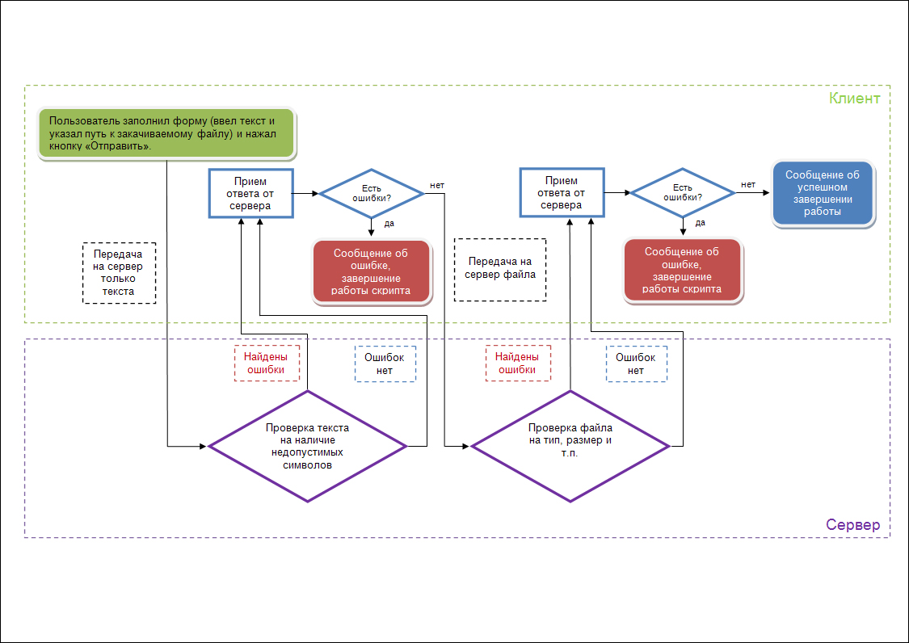

## Задача
Разработать веб-страницу, позволяющую обмениваться данными и закачивать файлы на сервер без перезагрузки страницы.
## Средства

**Frontend** (клиентская часть) – библиотека [jQuery](http://code.google.com/p/jqueryjs/downloads/detail?name=jquery-1.1.4.pack.js) версии 1.1.4 и плагин к ней [ajaxUpload](http://fivethreeo.dynalias.org/media/ajaxupload.js);

**Backend** (серверная часть) – Apache (любой версии), PHP 5.2.3, MySQL. В PHP 5.2.0 появились встроенные [средства](http://php.net/json) для работы с данными в формате [JSON](http://json.org), которые используются в этом примере, если на вашем хостинге установлена более старая версия PHP, то эти функции придется написать самостоятельно.
<!--more-->

## Решение

Блок-схема работы скрипта изображена на рисунке (большая картинка по клику). Пунктиром обозначен момент обмена данными между клиентом и сервером.

**Теперь та же логика, только словами:**

**1.** Сначала пользователь заполняет форму и жмет кнопку "Отправить", затем клиентский скрипт (frontend) передает серверному (backend) текст из формы (передается только текст, без файла, логика простая – зачем передавать файл, если уже в тексте может быть ошибка?).

**2.** Серверный скрипт проверяет текст на наличие ошибок и возвращает результат клиентскому скрипту (в этом случае в формате html).

**3.** Клиентский скрипт обрабатывает ответ от сервера, если в ответе передана ошибка, то выводится соответствующее сообщение и скрипт завершает работу, если ошибок нет, то клиентский скрипт отдает серверному файл, выбранный пользователем.

**4.** Серверный скрипт проверяет корректность файла (размер, тип и т.п.) и отдает ответ клиентскому скрипту (на этот раз в формате JSON).

**5.** Клиентский скрипт обрабатывает полученный ответ и выводит на экран соответствующий результат.

## Исходники и комментарии

В конце статьи будут даны ссылки на полные исходные коды всех файлов. Ниже приведены комментарии к самым важным участкам кода.

**Форма запроса (html, файл add.php)**

В тэгах head подключаем библиотеку jQuery, плагин ajaxUpload и файл с нашим frontend'ом:




Далее рисуем форму, для отправки текста и файла:

<form enctype="multipart/form-data" method=post name=jklm>
<input name=m1 value=""> 
<input name=m2 value=""> 
<input type="file" name="img">
<input type=button value="Добавить сообщение" onclick="javascript:ajax(this.form.m1.value, this.form.m2.value, this.form);" class=subm>
</form>


M1 и m2 – это два текстовых поля, данные из которых будут записаны в БД на сервере, img – поле для выбора закачиваемого файла, в данном примере рассмотен вариант с закачкой картинки. 

В инпуте типа button, на событие onclick установлена функция, отправляющая данные на сервер. Этой функции передается содержимое текстовых полей и название формы. Сама функция будет описана ниже.

Далее рисуем два слоя, в одном будет выводиться сообщение вида "Подождите идет загрузка", во втором – все остальные сообщения, в том числе и сообщение об успешном завершении работы скрипта:




Картинка loading.gif должна лежать в той же папке, что и текущий файл (или пропишите в тэге img соответствующий путь).

Все, больше ничего важного в форме запроса нет, остальной код в этом файле – украшательства, не влияющие на работу примера.

**_Frontend_ (Javascript, файл scriptik.js)**

Здесь описаны только функции из файла scriptik.js, отвечающие за передачу/прием данных от сервера, остальные функции носят чисто украшательский характер и их описание выходит за рамки этой статьи.

Передаем backend файлу insert.php данные из текстовых полей:

$.ajax(
{
type: "POST",
url: "insert.php",
data: "x1=" + m1 + "&x2=" + m2,


Обрабатываем ответ сервера. Логика работы серверного скрипта такая: если в переданном клиентом тексте были найдены ошибки, то, в зависимости от ошибки, будет возвращено какое-либо отрицательное число. Если в переданном тексте ошибок нет, то в ответе от сервера придет положительное число – id записи в БД, с которым сохранился этот текст:

success: function(data){
if(data <= -1)show_error_message(data);
else {     							
if(formname.img.value != ""){
$.ajaxUpload({
url:'imageupload.php?k=' + data,
secureuri:false,
uploadform: formname,
dataType: 'json',		    


То есть, если мы получили отрицательный результат, то выводим сообщение об ошибке, если получили положительный результат, то приступаем к закачке файла на сервер. _Imageupload.php_ – backend, отвечающий за закачку файла и его соответствие некоторым требованиям. Скрипту _imageupload.php_ методом `GET` передается id, под которым на сервере был сохранен переданный текст, чтобы с тем же id сохранить и файл.

Опять обрабатываем ответ сервера, теперь уже ответ приходит в формате _JSON_, по этому к переменным, пришедшим в ответе можно получить доступ используя объект вида result.var1, result.var2 и т.д.


success: function (img_upload, status){
 $("div#loading").hide();
 if(img_upload.result == "IMG_UPLOAD_OK")$("div.m").html("Сообщение успешно добавлено");
 else $("div.m").html("Сообщение успешно добавлено, но картинку закачать не удалось.");
 $('div.m').animate({height: 'show'}, 500);
},
error: function (data, status, e){
  $("div.m").html("Ошибка добавления данных. " + e);


img_upload – это объект, в котором сохраняется результат. Сервер передает клиенту две переменные: img_upload.result – информация о том закачалась картинка или нет, img_upload.name – имя, под которым картинка сохранена на сервере.

**_Backend_ (PHP, файлы insert.php и imageupload.php)**

Здесь также описаны только функции для взаимодействия сервера с клиентом, описания вспомогательных функций опущены.

<b>insert.php – проверка на корректность, запись в БД переданного клиентом текста и передача ответа клиенту.</b>

Для безопасности проверяем пришел запрос через XMLHttpRequest или нет:

<?php
if($_SERVER['HTTP_X_REQUESTED_WITH'] == 'XMLHttpRequest'){
?>


Пишем данные в базу и отдаем ответ клиенту:

<?php
if(mysql_query("INSERT INTO messages (m1, m2, date) VALUES ('" . htmlspecialchars($_POST["x1"]) . "', '" . htmlspecialchars($_POST["x2"]) . "', NOW())")){
 $last_id = mysql_insert_id();
 echo $last_id;
}	
else echo "-2";// Ошибка подключения к БД
?>


**_imageupload.php_ – проверка на корректность закачанного файла, копирование файла в нужную папку и передача ответа клиенту.**


<?php
// Проверяем переданный id записи на то, чтобы в нем содержались только цифры
$id = $_GET['k'];
$id = preg_replace("/\D/", "", $id);
if(intval($id)!= $id){
    $arr = array ('result'=>"IMG_UPLOAD_ERROR_3:" . intval($id) . ":" . $id);
    exit (json_encode($arr));
}
$id = intval($id);

// Проверяем, что закачана картинка, если закачана не картинка, то возвращаем ошибку
if(is_uploaded_file($_FILES['img']['tmp_name'])){
if($_FILES['img']['type'] != "image/bmp" && $_FILES['img']['type'] != "image/jpeg" && $_FILES['img']['type'] != "image/gif" && $_FILES['img']['type'] != "image/png" && $_FILES['img']['type'] != "image/pjpeg"){
    $arr = array ('result'=>"IMG_UPLOAD_ERROR_WRONG_FILE_TYPE");
    exit (json_encode($arr));
}
// Проверяем размер файла
if($_FILES['img']['size'] >= 100000){
    $arr = array ('result'=>"IMG_UPLOAD_ERROR_IMAGE_TO_BIG");
    exit (json_encode($arr));
}
$name = $_FILES['img']['name'];
$dot = strrpos($name, ".");
$dot = strlen($name) - $dot;
$dot = -$dot;
$ext = substr($name, $dot);
// Перемещаем закачанный файл из временной папки и возвращаем результат frontend'у
if(move_uploaded_file($_FILES['img']['tmp_name'], $_SERVER['DOCUMENT_ROOT'] . "/uploadimages/" . $id . $ext)){
    $arr = array ('result'=>'IMG_UPLOAD_OK','name'=> $id . $ext);
    echo json_encode($arr);
}	else {
    $arr = array ('result'=>"IMG_UPLOAD_ERROR_1: " . $_FILES['img']['tmp_name']);
    exit (json_encode($arr));    	
} else {
    $arr = array ('result'=>"IMG_UPLOAD_ERROR_2");
    exit (json_encode($arr));    	
}
?>


Вот собственно и все. Готов ответить на любые вопросы.

Все исходники в аттаче, не забудьте в файле _db_connect.php_ прописать свои настройки для доступа к БД, а также, перед началом работы создать базу данных из sql-файла, который лежит в архиве.