Это продожение статьи. Начало тут: [Часть 1]().

В первый день мы должны были&nbsp;прилететь из Москвы в Бангкок, транзитом через Ашхабад, затем сразу же из Бангкока, уже другой авиакомпанией, вылететь в Пномпень, а оттуда на такси добраться до Сиануквилля.

Начало путешествия выдалось не очень радостным. Сначала Туркмены&nbsp;(авиаперевозчик &quot;Туркменские авиалинии&quot;) на полтора часа задержал вылет второго самолета (из Ашхабада), по этой причине мы еле-еле успели на рейс Бангкок &ndash; Пномпень, прилетели за полчаса до окончания регистрации. Затем Пномпень встретил нас проливным дождем и ушлыми таксистами, которые не хотели везти нас в Сиануквилль меньше чем за 100 баксов. В конце концов мы уехали из аэропорта за 60 долларов, а обратный путь (через три дня)&nbsp;стоил нам всего 35 убитых енотов. Правда стоит учесть, что расстояние от Пномпеня до Сиануквилля 300 километров и в Москве такой переезд стоил бы в разы дороже.
<!--more-->
Пномпень. Первая фотка. Тот самый дождик:
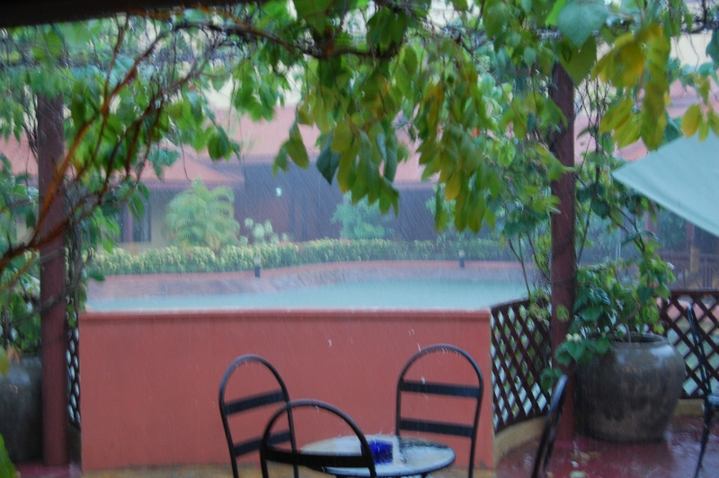

Это местная заправка:
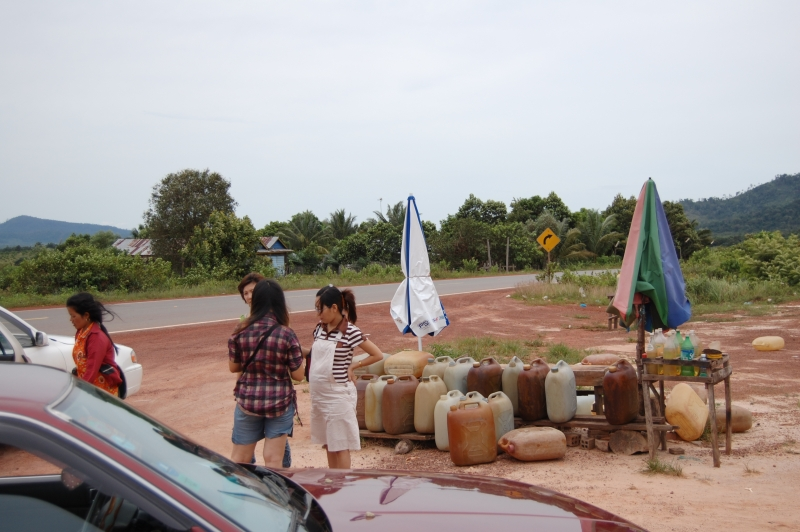

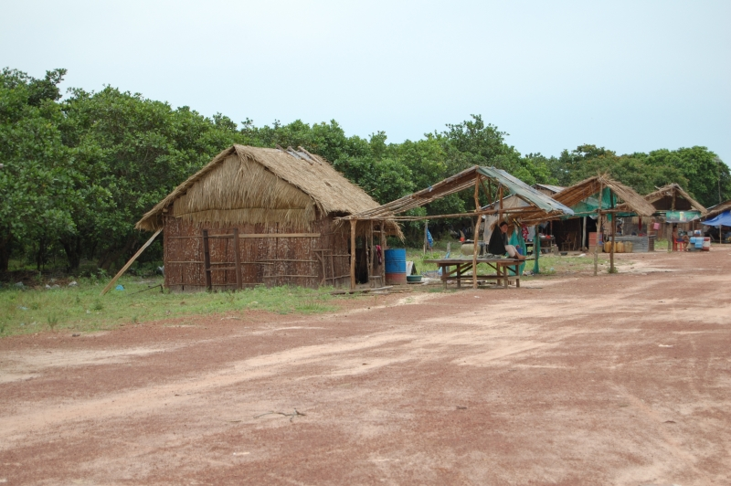

Слева внизу ушлый таксист, который развел нас на 60 баксов за трёхсоткилометровую поездку:
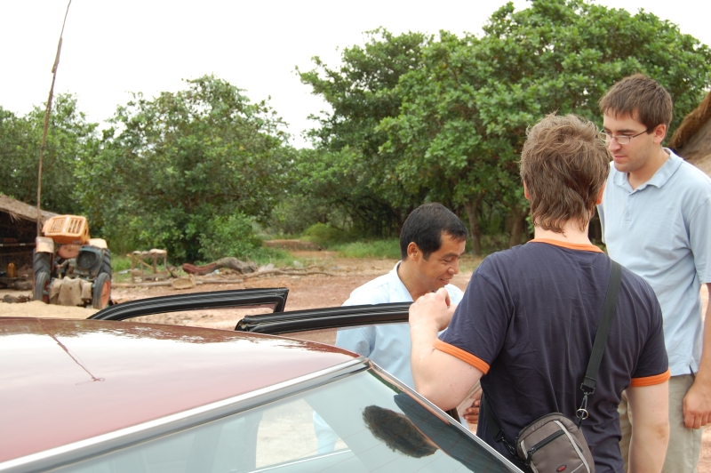

Это уже Сиануквилль. Я с кокосом (я тот что не зелёный):
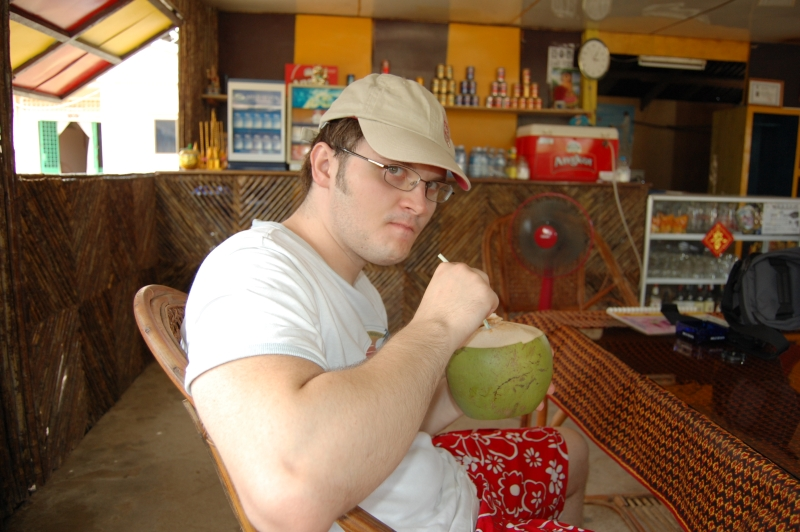

Пара пейзажей:
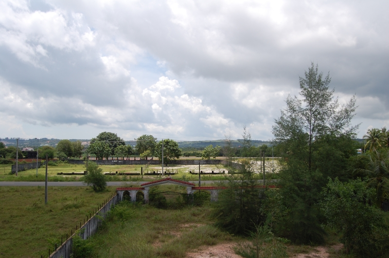

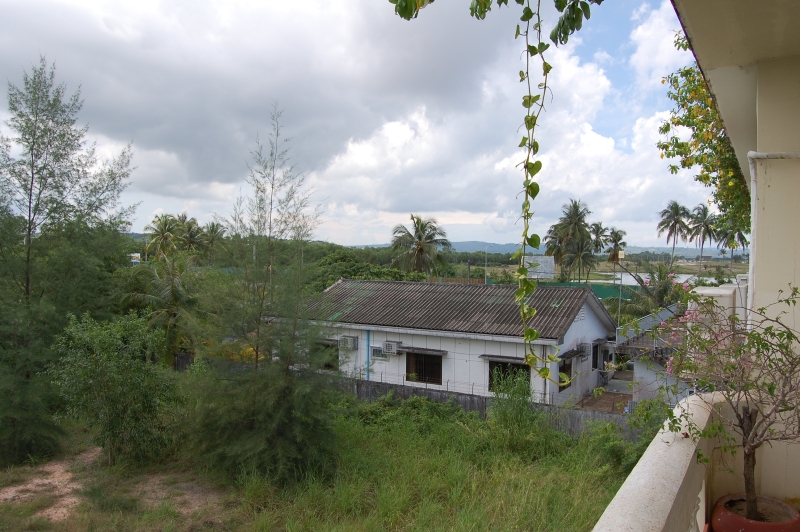

Сиануквилль таки не город, а просто большая деревня. Вечером развлечений практически нет, работает только пара баров, в которых тусят в основном местные. Туристов, по крайней мере в это время было очень-очень мало. Кстати, за всю поездку по Камбодже (7 дней), мы встретили только одну группу из трех русских туристов. В Тае их, то есть нас, русских, значительно больше.
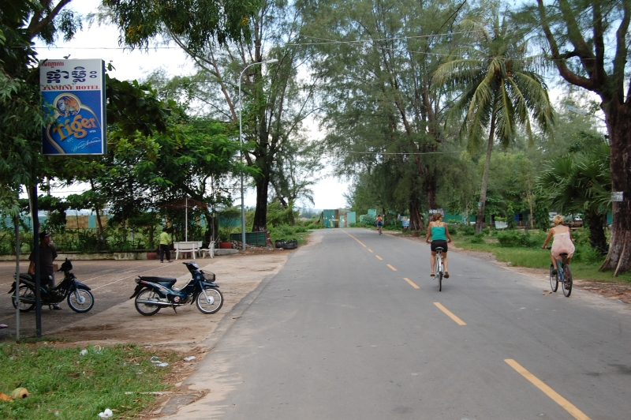

Тук-тук, местное такси для туристов. Во всех городах, что мы посетили тук-туки выглядят по разному, но все тук-тукеры как один заламываютя нереальные цены на поездку, порядка 1 доллара с человека за пару километров. В Бангкоке был случай, когда от отеля до некоторой точки мы на комфортном такси с кондиционером по счетчику доехали за 35 бат, а обратно на тук-туке за сотню, причем наглый тук-тукер сначала заломил цену в 150 бат! В общем гораздо дешевле снять скутер с коробкой автоматом за 200 бат в сутки и кататься сколько угодно в свое удовольствие.
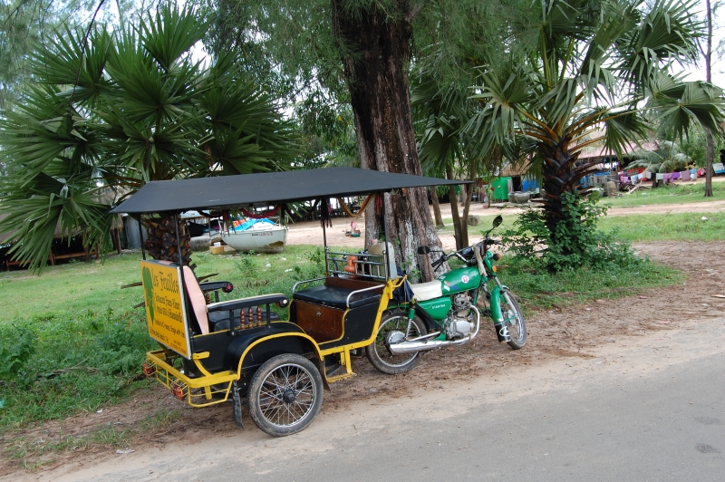

В Камбодже и в Таиланде готовят невероятно вкусный и острый суп Том Ям (в разных меню встречал названия &quot;Tom Yam&quot;, &quot;Tom Yum&quot; и даже &quot;Tong Yam&quot;).
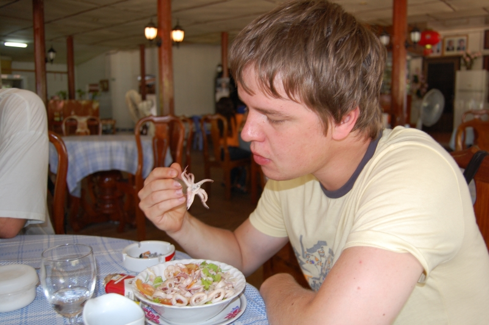

В Камбодже выращивают более 20 сортов бананов. Они маленькие очень сладкие, ароматные и не идут ни в какое сравнение с теми сортами, что продаются здесь, в России. Я даже где-то читал, что те сорта бананов что завозятся к нам являются кормовыми и отдаются в пищу крупному рогатому скорту, а не людям.
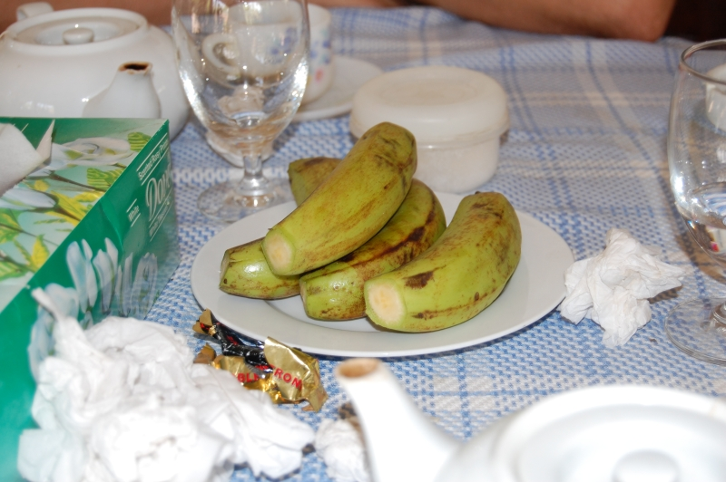

Это центр Сиануквилля: круг, в котором стоит памятник львам, символизирующий что-то там, а от круга в разные стороны уходят, если мне не изменяет память, 5 дорог. Весь город реально объехать на байке или тук-туке максимум за 30-40 минут.
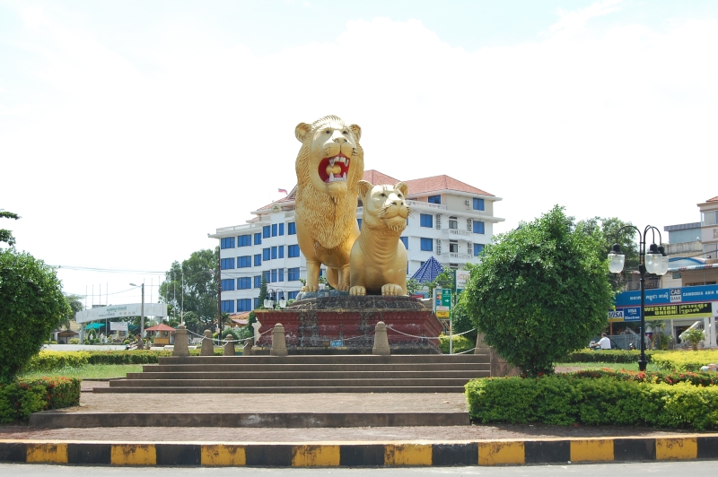

Это не то чем кажется на первый взгляд :))
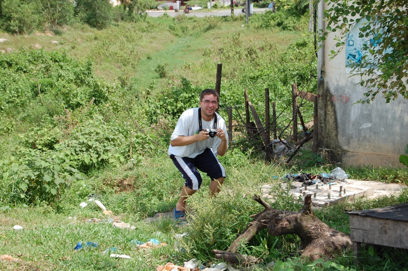

В Камбодже тоже водятся реальные пацаны :))
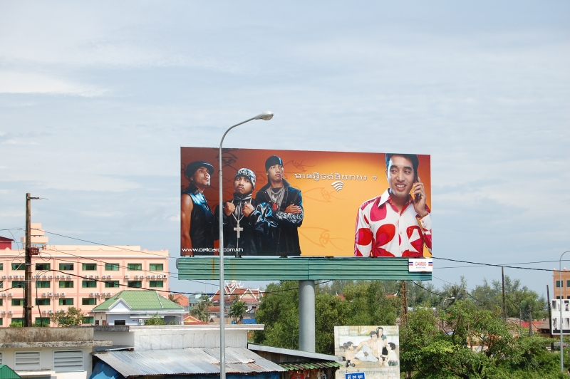

А это рынок в Сиануквилле. Такого зрелища я нигде не видел! На 2-2,5 метровых деревянных столбах держится крыша, сделанная из какой-то ткани, которая в некоторых местах провисает так, что приходилось не мало пригинаться, чтобы не зацепить её головой. Расстояния между рядами не больше метра, при этом здесь снует куча народа плюс каким-то образом умудряются въезжать местные на скутерах. Здесь продается и одежда, и еда, и овощи с фруктами, и какие-то садовые инструменты, тут же расположены некие подобия кафешек, в которых местные жители уплетают не очень аппетитного вида пищу. Кстати, одежду камбоджийцы шьют очень маленького размера. Шорты размером XXL расползались на мне через полчаса носки, в Таиланде туристов больше и там есть одежда человеческих размеров... Правда и её там иногда приходится поискать.
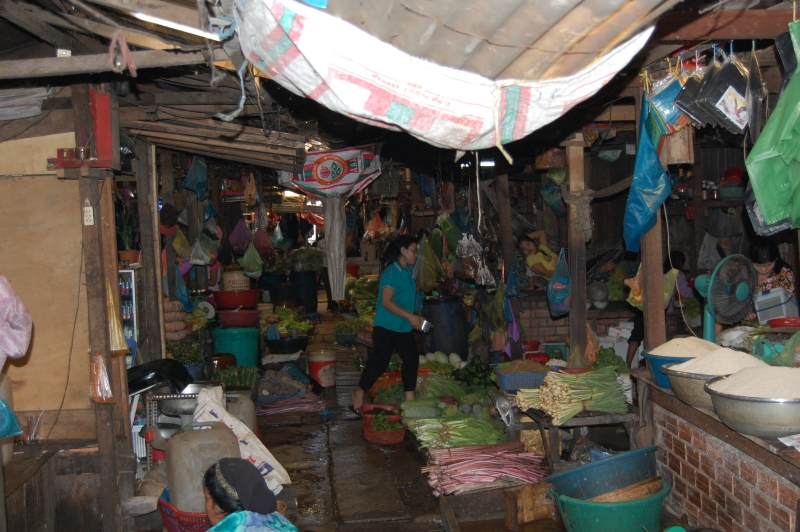

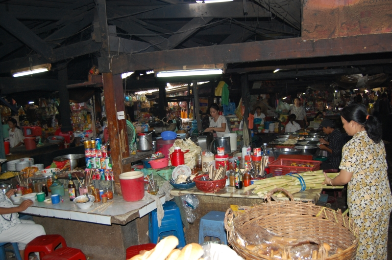

А это не просто стеклянный ящик забитый деньгами, это обменный пункт! Таких на этом рынке десятки.
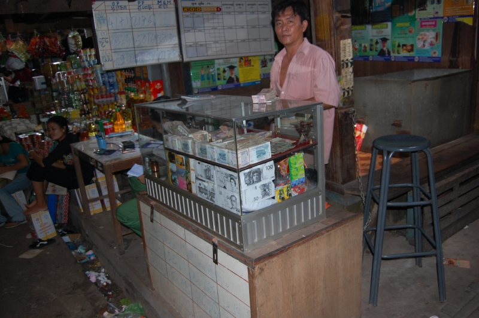

Камбоджийцы очень приветливые и улыбчивые люди. Мы просто гуляли по городу и начался проливной дождь, чтобы спрятаться от него мы заскочили под крышу первого попавшегося магазина. Не прошло и минуты как к нам подскочили местные, вероятно сотрудники магазина, и принесли нам стулья, чтобы мы посидели и отдохнули. Очень неожиданно, по моему представить такую ситуацию в России просто невозможно.

А это местный порт:
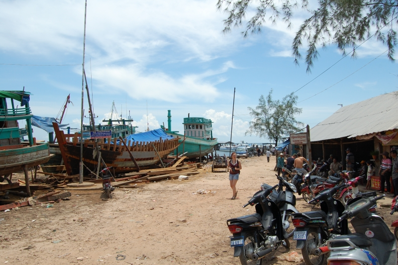

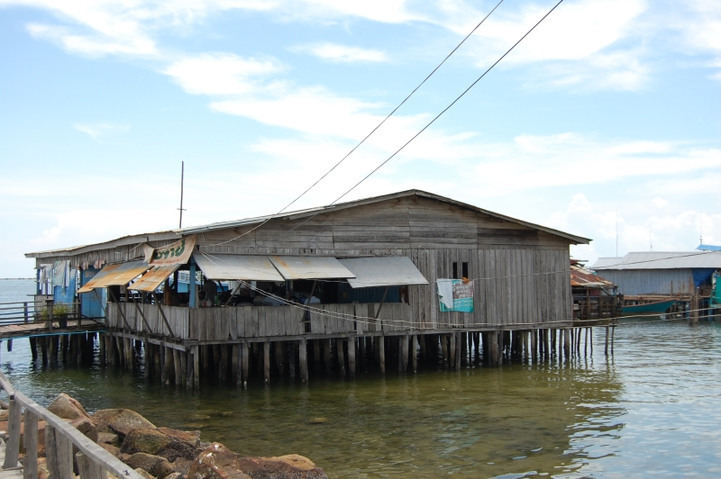

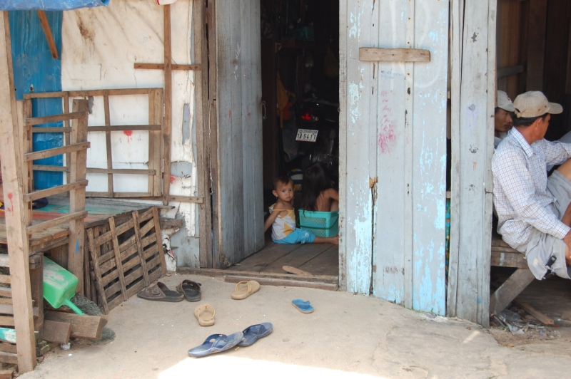

Гостиницы в Сиануквилле оставляют желать лучшего. Такие ящерицы, как на следующей фотографии, ползают по стенам десятками, правда к людям они не пристают... Скорее наоборот, это мы все пытались их поймать, но все попытки оказались неудачными.
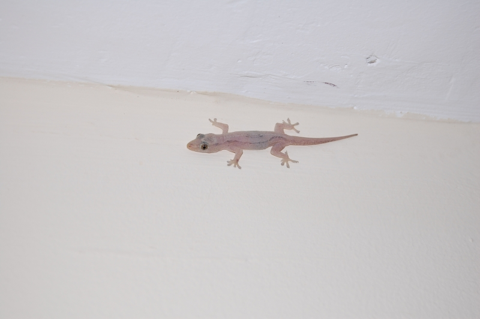

А это уже дорога из Сиануквилля в Пномпень. Как я уже писал выше, этот проезд нам стоил 35 уе с четверых человек, что почти вдвое дешевле чем поездка Пномпень-Сиануквилль, но зато по прибытии в город мы столкнулись с одной небольшой неприятностью. Машину мы заказывали в отеле, где мужик не ресепшене неплохо шпрехал по английски, с ним мы и договорились, что нас довезут до нужного отеля в Пномпене, однако таксёр привез нас на рынок и жестами попросил освободить машину. Выяснилось что по английски он ни бум-бум и куда везти нас не знает. Правда мы быстро нашли англоговорящего тук-тукера, который привез нас в нормальный отель (без ящериц), а потом еще и покатал по городу, показал достопримечательности.
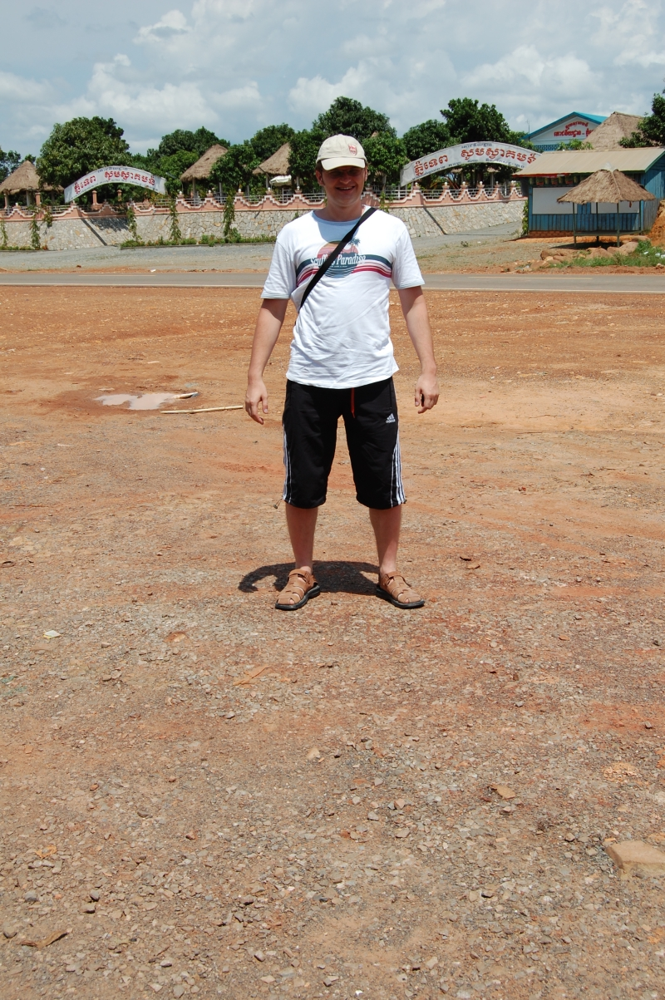

Продолжение статьи: [Часть 3](), [Часть 4](), [Часть 5](), [Часть 6](), [Часть 7]().
