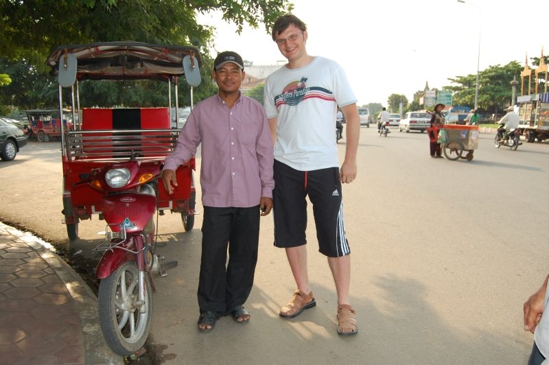
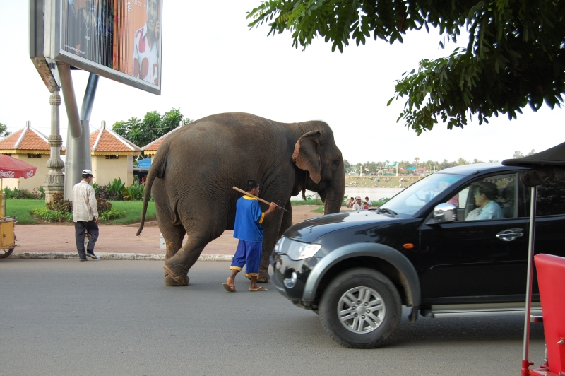
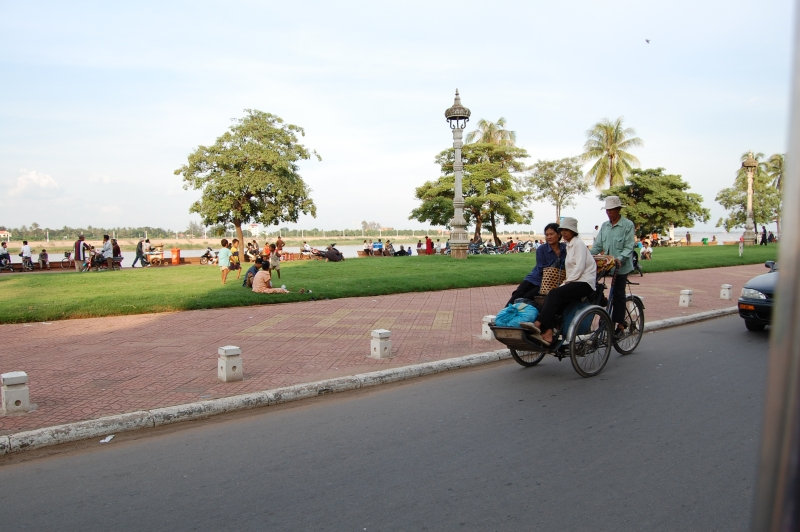
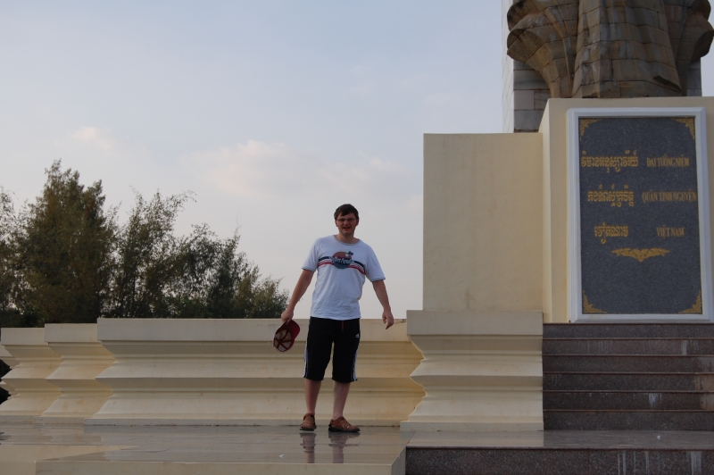
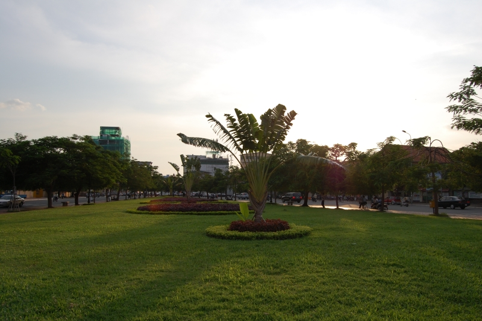
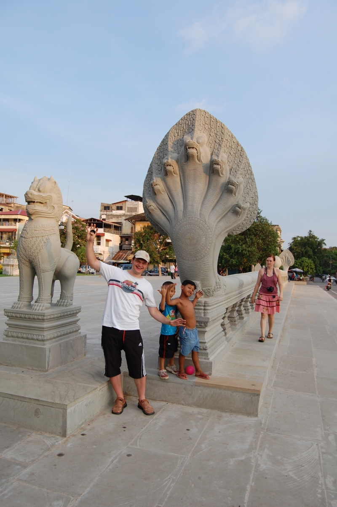
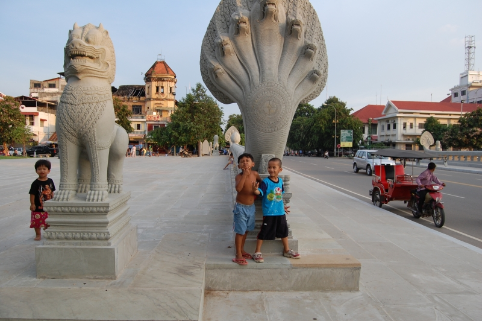
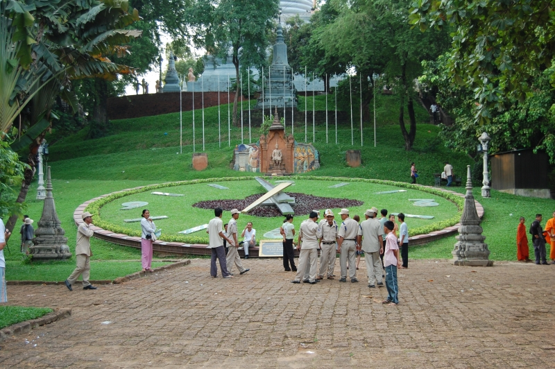
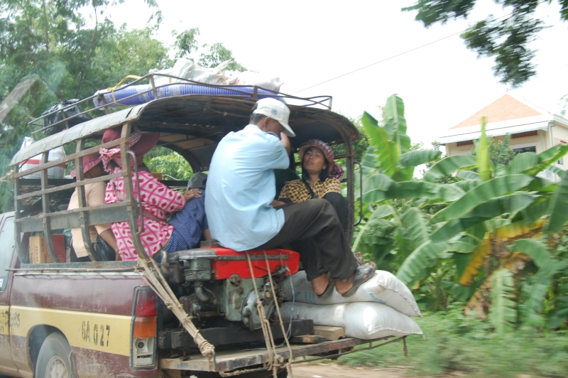
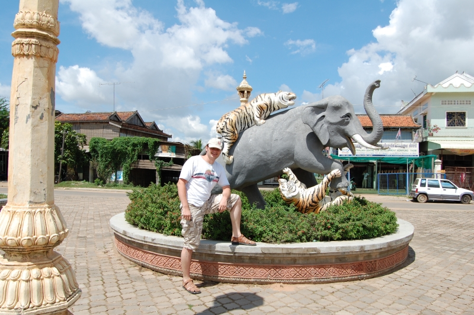

Это продолжение статьи. Начало тут: [Часть 1](), [Часть 2]().

Это я с шустрым тук-тукером, который выручил нас по приезде в Пномпень

<!--more-->
Удивительное рядом. Достаточно оживленную дорогу переходил слон. Все машины остановилсь, пропустили носатого и потом поехали дальше.

Это аналог тук-тука, только на человеческой тяге. Забыл как эта штука называтся, вспомню - напишу.

Решил я сфоткаться возле змеи, как тут же набежала туча местной ребятни и стла позировать вместе со мной. Смешно.

Гигантские часы. Для того чтобы подняться на горку за этими часами нужно было заплатить один доллар местному человеку в униформе похожую на полицейскую. Я дал одному такому пятерку (а в Камбодже, в отличии от остальных стран из этого путешествия свободно принимают как американские доллары, так и местные реалы), а этот негодяй со словами &quot;я пошел за сдачей&quot; скрылся в неизвестном направлении :)) Вытрясти с других &quot;полицейских&quot; свою сдачу мне не удалось... Ну и ладно...

А это уже дорога в СеамРип.

Продолжение статьи: [Часть 4](), [Часть 5](), [Часть 6](), [Часть 7]().
