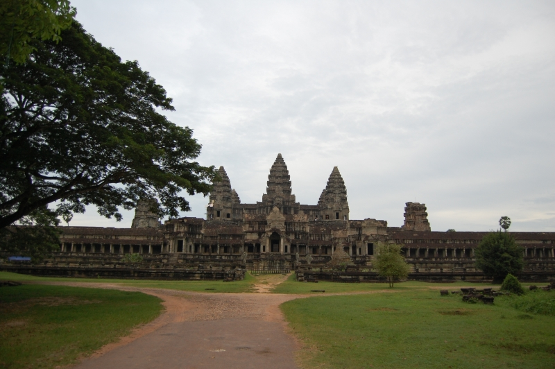
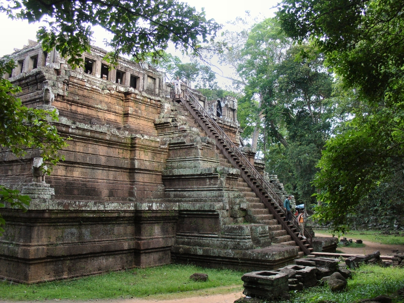

Это продолжение статьи. Начало тут: [Часть 1](), [Часть 2](), [Часть 3]().

СеамРип (SeamReap) &ndash; исторический центр Камбоджи. Недалеко от города расположены руины старого замка &ndash; Ангор Вата (Ват означает монастырь). И путеводитель, и люди на ресепшине гостиницы рекомендовали съездить посмотреть восход и закат в Ангор Вате, говорили, что это очень красивое зрелище. С восходом нам не повезло &ndash; слишком облачным было утро, закат посмотрели, но воcторга он тоже не вызвал. А вот днем я сделал несколько, на мой взгляд, очень удачных сочных и красочных фотографий.

Удачным решением было то, что мы сняли такси на целый день (всего за 35 долларов с 5 утра до 6 вечера) и таксист возил нас одних туда куда мы захотим. Из-за этого мы всего пару раз наткнулись на группы туристов, которые как муравьи покрывали все развалины Ангор Вата и фотки с ними выходили не самым удачным образом. Места для посещения мы выбирали по бесплатному путеводителю, которых, кстати, было огромное колчиество во всех городах, которые мы объехали.

<!--more-->

Это я фоткаю Андрюху с вершины башни:

А это Андрюха фоткает меня из подножия башни:

Закат нам рекомендовали смотреть с этого места. Видимо не только нам. Вездесущие японцы роем покрыли всю башню, на которой не было ни одного свободного места. Кстати, ступеньки, по которым народ поднимается на башню имют высоту сантиметров 20 и ширину сантиметров 15, за 10 веков эти ступени так истесались, что ходить по ним было страшновато, но при этом народ толпой валил и вверх и вниз, плюс среди туристов было много пожилых людей, которые смело покоряли эту вершину... Представляю что было бы, если бы кто-нибудь оступился и полетел вниз...
Продолжение статьи: [Часть 5](), [Часть 6](), [Часть 7]().