Это продолжение статьи. Начало тут: [Часть 1](), [Часть 2](), [Часть 3](), [Часть 4]().

Из СеамРипа мы отправились в Таиланд, на остров Самуй. От отеля на такси по очччень разбитой дороге (таких я больше нигде не видел) доехали до пограничного города Пойпет (Poipet), перешли границу (процедура один в один такая же как и в аэропорту), затем на тук-туке доехали до ближайшего тайского города Араняпратета дальше на автобусе до Бангкока (билет по-моему стоил по 160 бат, это примерно 5 долларов) и из Бангкока на остров Самуй.
<!--more-->

В Таиланде пришлось свыкаться с двумя вещами: во-первых доллары здесь, в отличии от Камбоджи, не берут, приходилось их менять на баты, во-вторых привыкнув к ценам в долларах приходилось постоянно в уме пересчитывать сколько стоит та или иная услуга. 

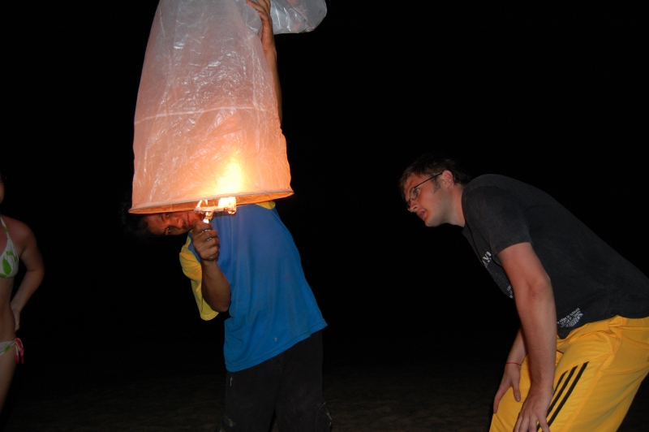

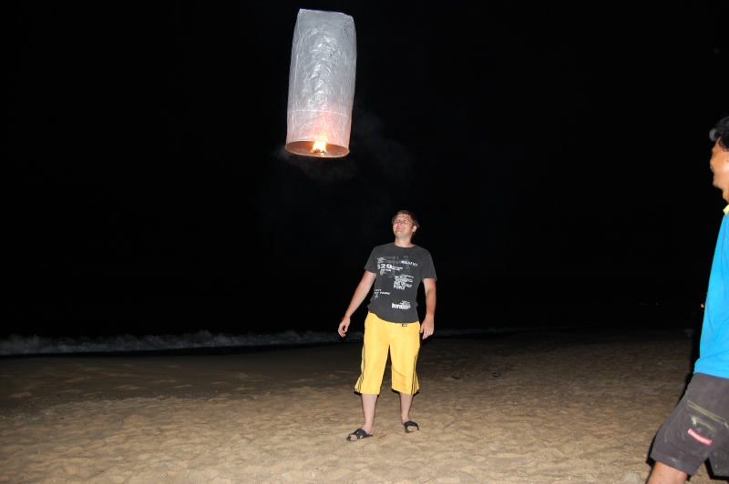

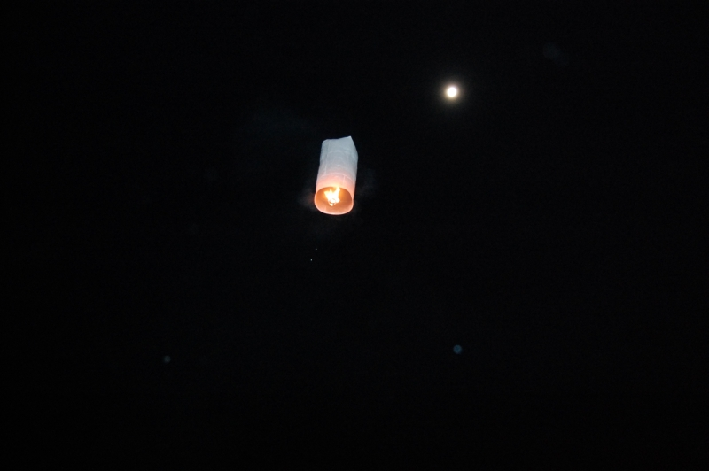

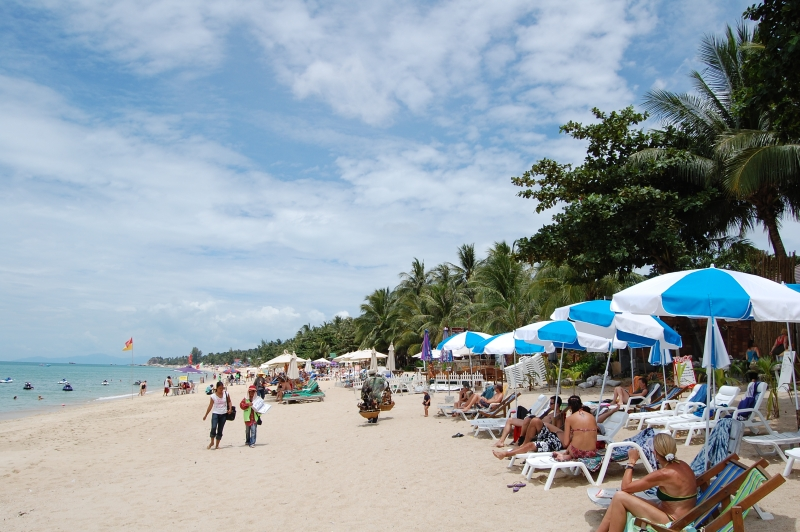

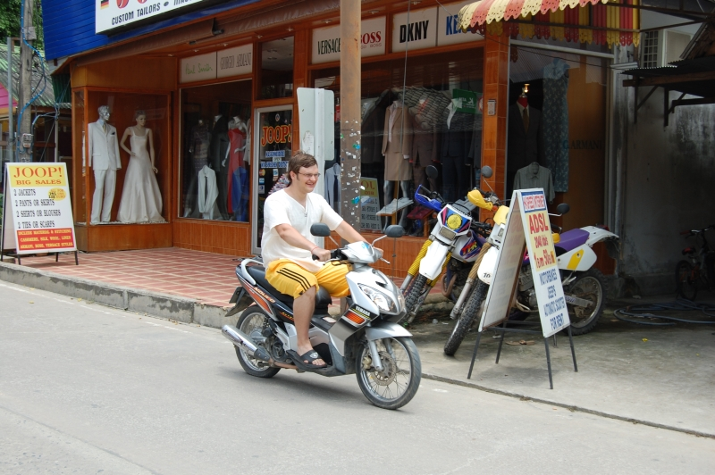

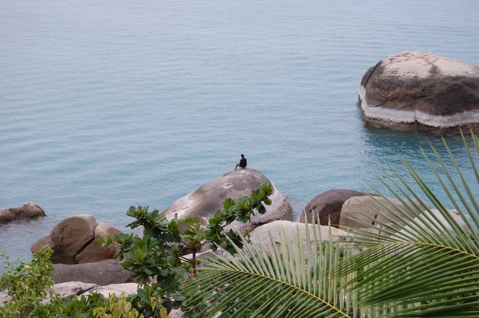

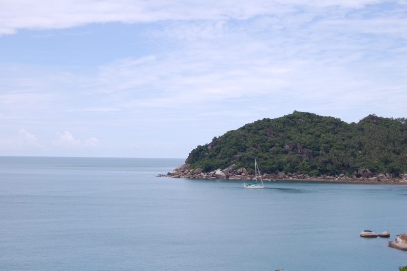

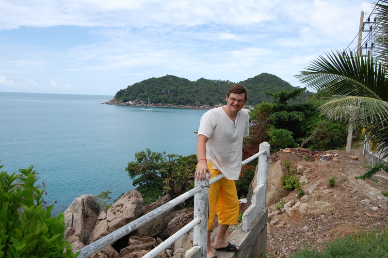

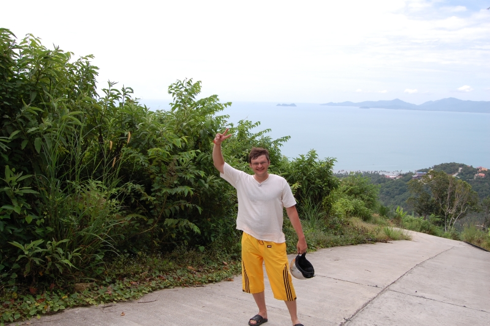

Внизу фотографии не волосатая задница, а голова слона, на котором я еду.
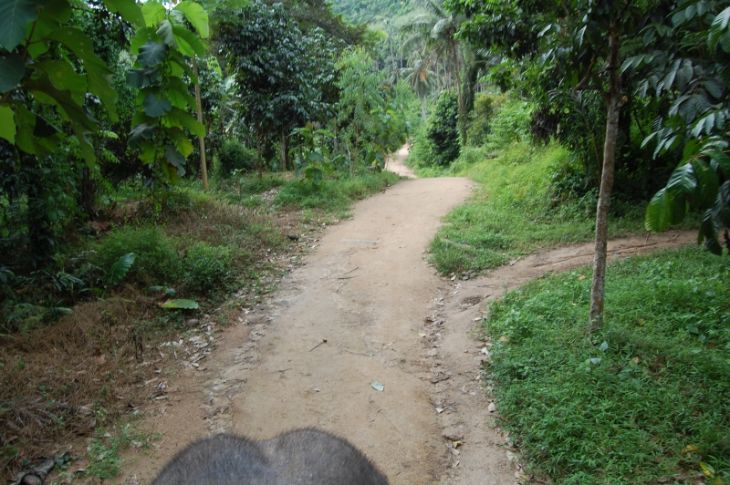

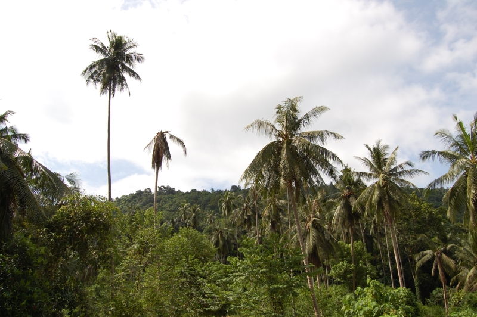

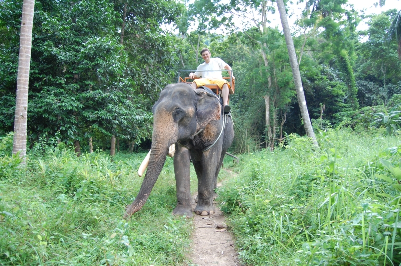

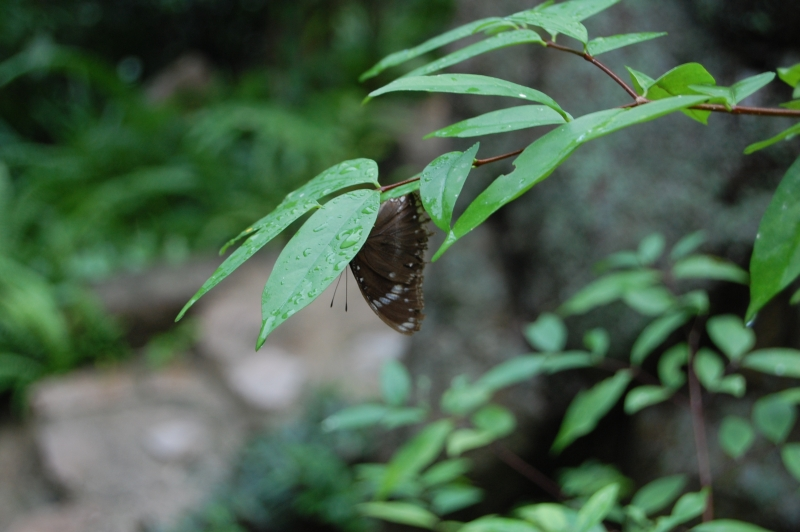

<a target="_blank" href="http://fullmoon-party.com">Фулмун пати</a>. Я, какой-то француз и Андрюха
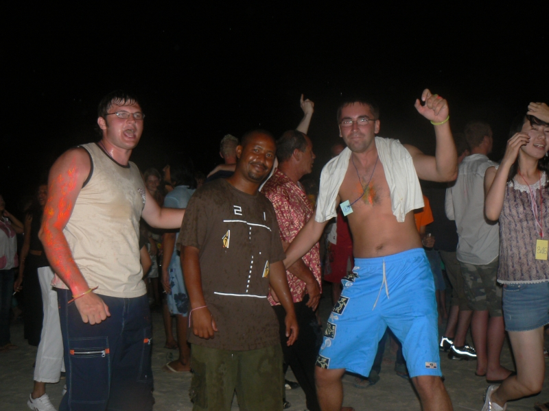

А это видео наших прыжков с банжи. Второе видео смотреть со звуком (присутствует ненормативная лексика)! На 40 секунде там начинается самое интересное :))

7Мб
<object type="application/x-shockwave-flash" width="425" height="350" wmode="transparent"
    data="http://romka.eu/swf/flvplayer.swf?file=http://romka.eu/files/flv/roma-bangy1.flv&autostart=false">
    <param name="movie" value="http://romka.eu/swf/flvplayer.swf?file=http://romka.eu/files/flv/roma-bangy1.flv&autostart=false" />
    <param name="wmode" value="transparent" />
</object> 10Мб
<object type="application/x-shockwave-flash" width="425" height="350" wmode="transparent"
    data="http://romka.eu/swf/flvplayer.swf?file=http://romka.eu/files/flv/andruha-bangy1.flv&autostart=false">
    <param name="movie" value="http://romka.eu/swf/flvplayer.swf?file=http://romka.eu/files/flv/andruha-bangy1.flv&autostart=false" />
    <param name="wmode" value="transparent" />
</object>

 

 

Продолжение статьи: [Часть 6](), [Часть 7]().