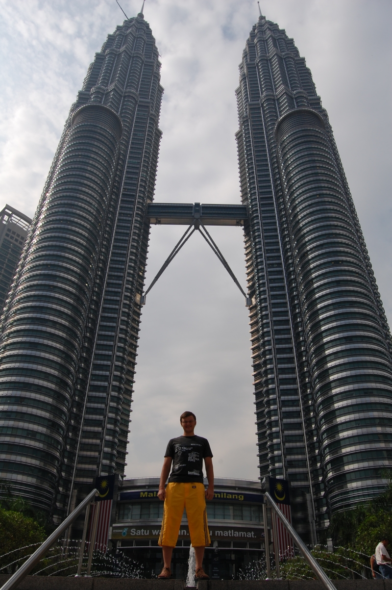

Это продолжение статьи. Начало тут:  [Часть 1](), [Часть 2](), [Часть 3](), [Часть 4](), [Часть 5]().

Куала-лумпур.

Эта фотка сделана из самолета, по этому качество не очень, но зато на ней видны две достопримечательности города. В центре фотографии расположены башни близнецы Петронас (высота 470 метров), правее центра &ndash; телебашня Менара (вообще слово &quot;менара&quot; переводится как &quot;башня&quot;, но здесь это именно название).

<!--more-->
Каждое утро в 8 утра в холле Петронаса выдается 1200 бесплатных билетов на посещение моста, соединяющего две башни. На фотке очередь за билетами.

Продолжение статьи: [Часть 7]().
