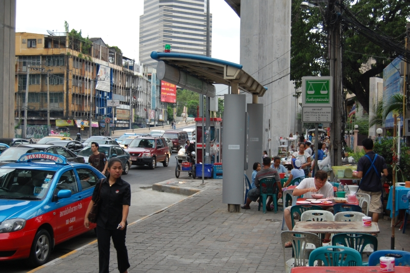
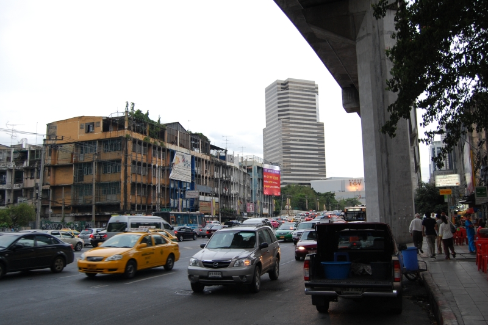
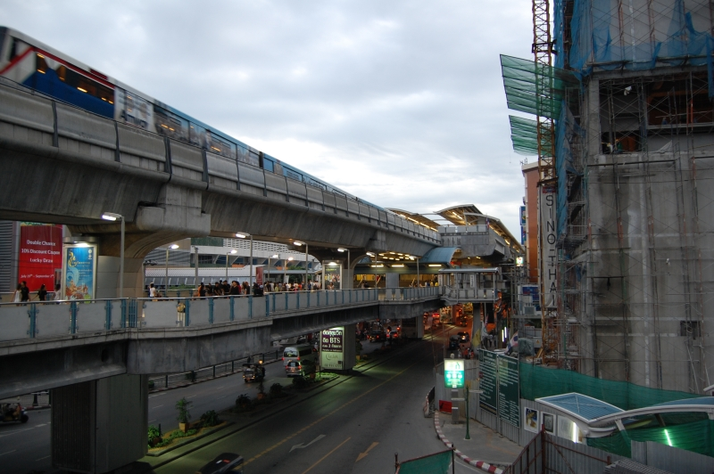
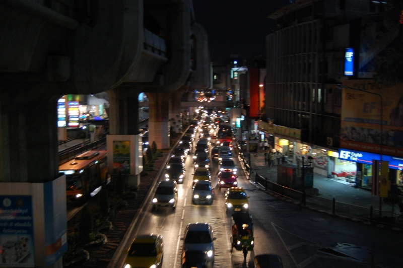

Это продолжение статьи. Начало тут: [Часть 1](), [Часть 2](), [Часть 3](), [Часть 4](), [Часть 5](), [Часть 6]().

Бангкок.

Это я ем Том Ям в кафешке для местных. Ржавые кривые столы и страшного вида посуда не портят впечатления от вкуса супа. Это был самый вкусный Том Ям за все путешествие, в кафешках для туристов такого не варят.

<!--more-->
Бангкок &ndash; город контрастов. Высотка и полуразвалившаяся трущеба.

Жизнь в городе кипит на трех этажах.

