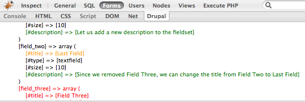



Многие веб-разработчики пользуются [Firebug](http://getfirebug.com)'ом — замечательным расширением браузера [Firefox](http://firefox.com), которое позволяет легко и быстро проводить отладку css и html-кода. 

Буквально на днях, 28 августа, вышел в свет новый продукт, расширяющий возможности Firebug'a, который придется по вкусу Drupal-специалистам — модуль [Drupal For Firebug](http://drupal.org/project/drupalforfirebug). После установки этого модуля, а также [дополнительного расширения для Firefox](https://addons.mozilla.org/en-US/firefox/addon/8370) разработчики получают доступ к очень удобной консоли, в которой выводится:
- отладочная информация, которую программисты могут добавлять в свои модули при помощи функции firep($item, $optional_title);
- лог SQL-запросов (в случае если включен и настроен модуль devel);
- информация о параметрах всех форм;
- информация о текущем пользователе;
- информация об открытом документе (ноде);
- информация о представлениях (Views);
- а также расширение дает возможность исполнять php-код.

Модуль доступен как для пятого, так и для шестого Друпала. Рекомендую всем разработчикам, использующим Друпал.
<!--more-->
