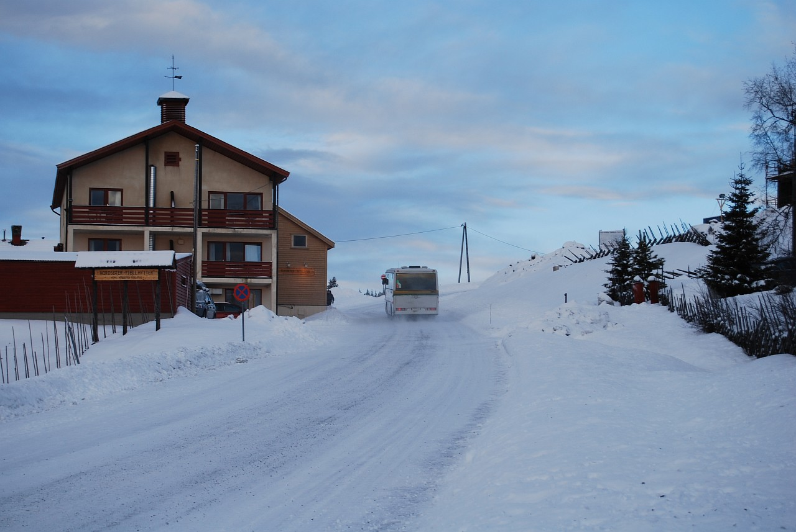

Это продолжение статьи. Начало здесь: [Часть 1]().

Пункт первый в нашем новогоднем путешествии – Нордсетер, деревушка неподалеку (это если на авто) от Лиллихаммера. Погода здесь была сказочная – пушистый снег, мягкие сугробы, легкий морозец и солнечная погода. Настроение было просто супер!

<!--more-->

Дороги в горах заснеженные, разметки не видно, освещения почти нигде нет, по этому везде вдоль дорог установлены такие как на следующем фото бамбуковые трости со светоотражающими наклейками – вполне удачная замена обычной разметке.

Огорчение вызывало лишь два момента:
1. слишком маленький коттедж, расчитанный скорее на семью из двух взрослых и одного ребенка, чем на пятерых взрослых людей; 
2. отвратительная еда. Кафешек поблизости не было в принципе, расчет был сделан на то, что туристы будут закупаться едой в местных магазинах и готовить себе самостоятельно, однако и в магазинах брать было почти нечего. Хлеб здесь невкусный, мяса оччень мало и оно оччень дорогое (нарезка ветчины из 5 тонких кусочков стоила 29 крон, это около 150 рублей). Купили с ребятами пару пачек пельменей (оочень обрадовались когда их нашли, думали, что нас ждет человеческий ужин), но и они оказались ужасными, без грамма мяса... с каким-то жутким соевым вкусом... В общем, найденный на второй день Макдональдс нас один раз выручил... Оставшиеся пару дней, проведенных в Нордсетере питались жареной картошкой и пиццей...

Кроме того ни в Нордсетере, ни в Лиллихаммере мы не смогли найти напитков крепче пива, но это проблемой не было.

Катались мы в нашем путешествии на Toyota Prius (гибрид, 5 литров бензина на 100 километров, 700 евро за 10 дней). Очень удачная машина для путешествия. В машине установлен большой тачскрин, для управления всеми девайсами и, теоретически, для просмотра фильмов, но у нас он не работал. На третий день мы, проезжая мимо аэропорта, заглянули в Hertz, где в течении 20 минут машину нам без проблем обменяли на такую же, только полностью исправную.

Дорога из Нордсетера в Лиллихаммер

Норвежцы не представляют свою жизнь без лыж. Уже первого января в 9 утра на дорожках и горках было полно лыжников. Специально для них по всему Лиллихаммеру расположены такие парковки

Все города, которые мы посетили за свое путешествие (Осло, Гётеборг, Копенгаген, Оденсе и Лиллихаммер) отличаются от Москвы своей безлюдностью. Это одна из центральных улиц Лиллихаммера около 8 вечера.

Забор из старых лыж

Это я с "дежурными" лыжами. Все туристы, которы добираются до этой смотровой площадки (она находится на вершине лыжного трамплина), фотографируются с ними :))

А вот и сам трамплин, вид снизу

Просто пара пейзажей

По жизни я человек очень везучий, правда моё везение, зачастую, распространяется не на меня, а на окружающих меня людей. Вот и сейчас, стоило буквально на полчаса покинуть компанию, как ребята тут же улетели в кювет. Повезло, что норвеги народ отзывчивый, без лишних просьб остановилось несколько машин и один из водителей помог вытянуть наш автомобиль. Но самым интересным фактом является то, что первыми кто остановился помочь, оказались, проезжавшие мимо, русские туристы! Правда и в их арендованном авто не оказалось буксировочного торса  по этому помогли они нам только морально, но и на этом спасибо :))

Дядька выгуливает собаку

Это я. Там, вдали

Горные лыжи, оказались развлеченим более сложным, чем они выглядели со стороны, по этому весь первый день мне, как новичку, пришлось провести на трассе номер 7 (метров 200 в длину и градусов 15 уклон), на которой кроме меня и Андрюхи катались только норвежские дети лет пяти :)) Зато на второй день мы уже осилили трассу номер два (2 километра и даже пара "красных" участков). Ощущения непередаваемые!

А это деревня-музей, которая призвана показать жизнь древних норвегов

В этом описании приведены не все фотографии, остальные можно посмотреть в фотогалерее, в разделе ["Новый год 2008"]().

Это вторая часть статьи. Продолжение здесь: [Часть 3](), [Часть 4](), [Часть 5]().

