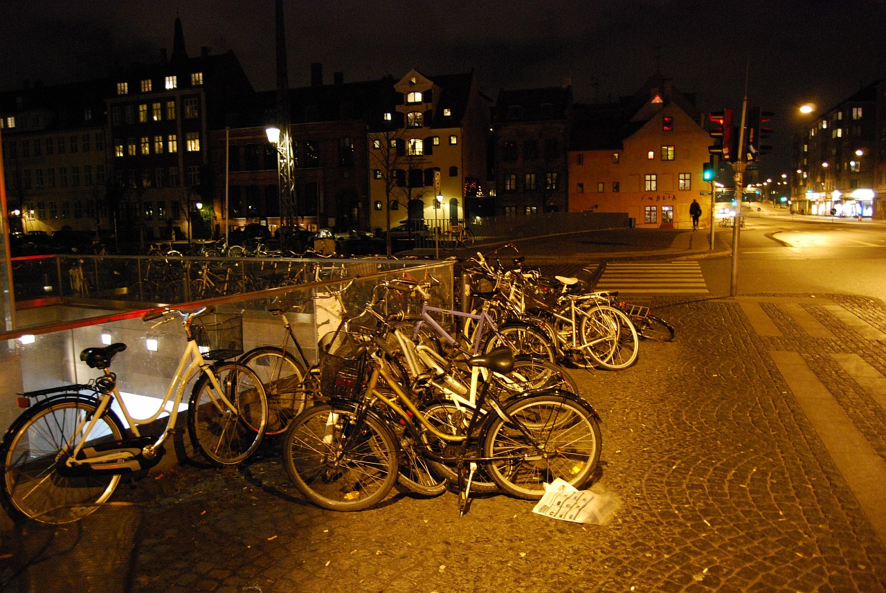
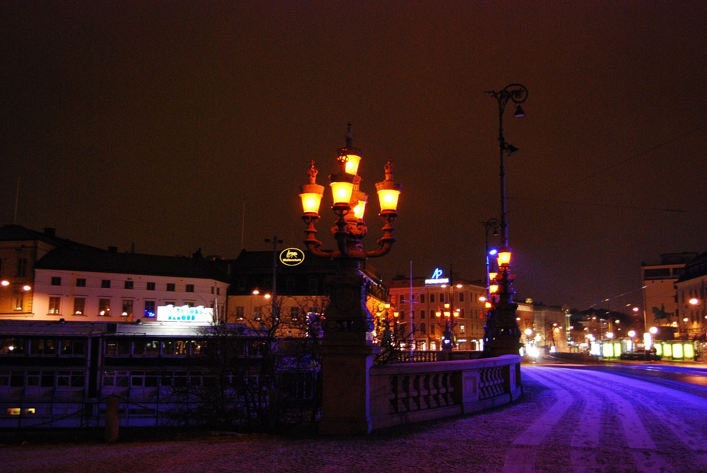
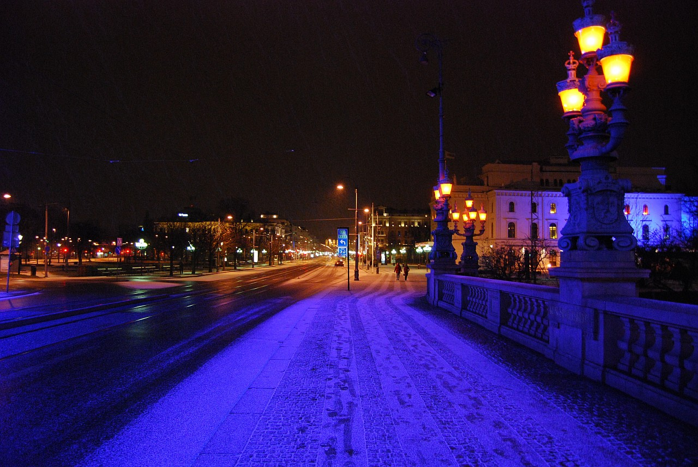
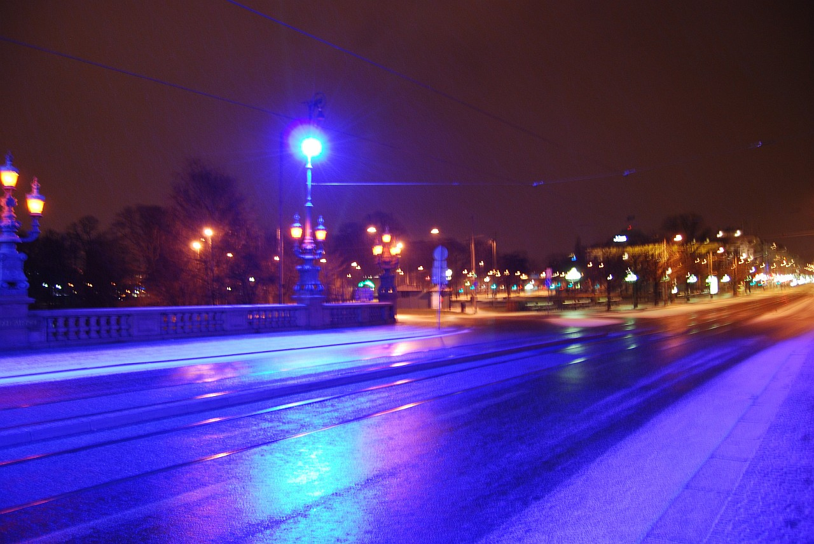
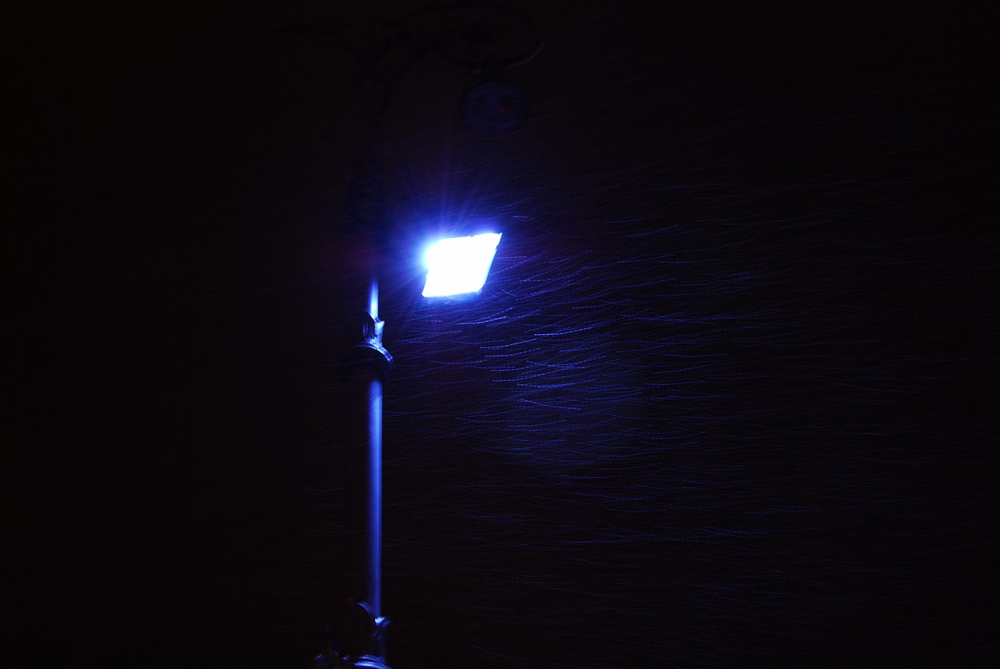
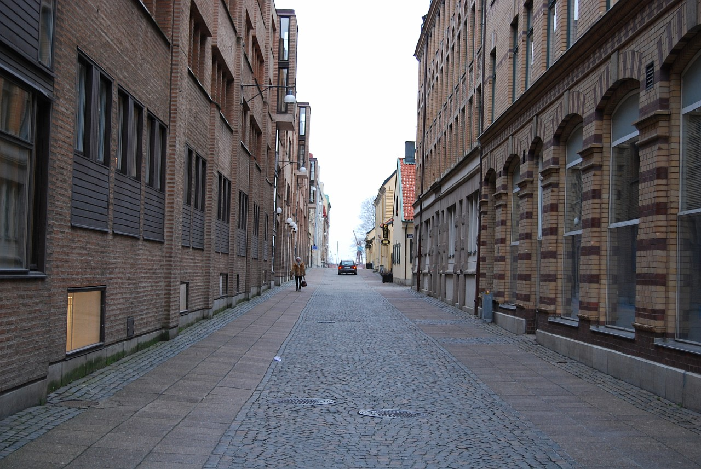
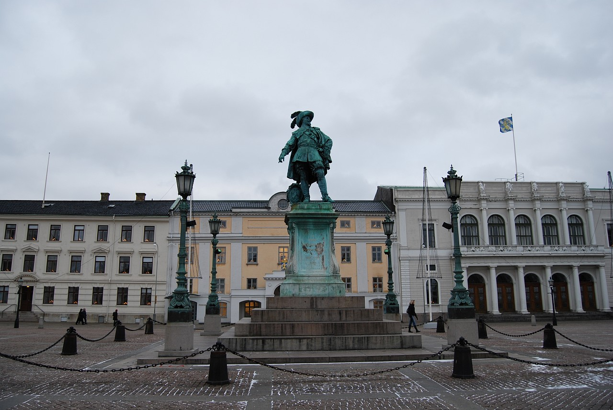
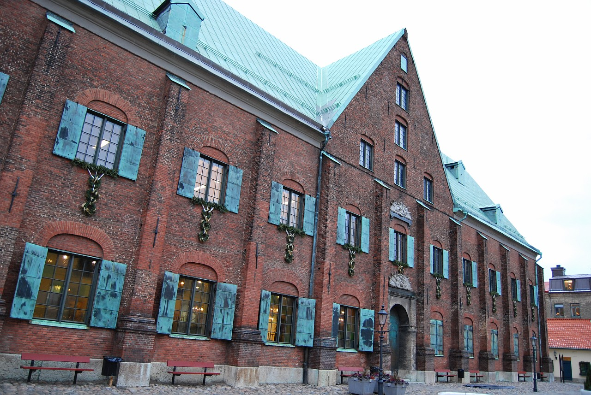
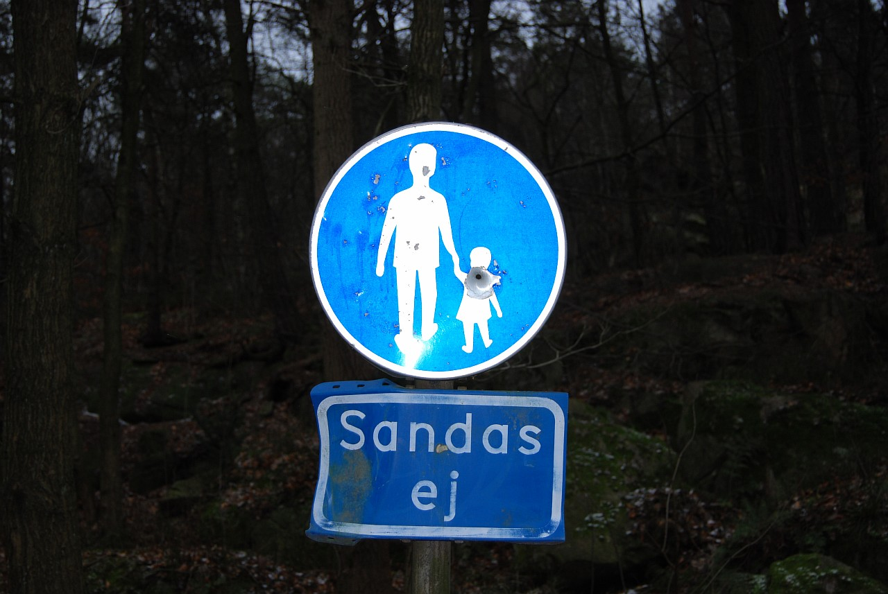
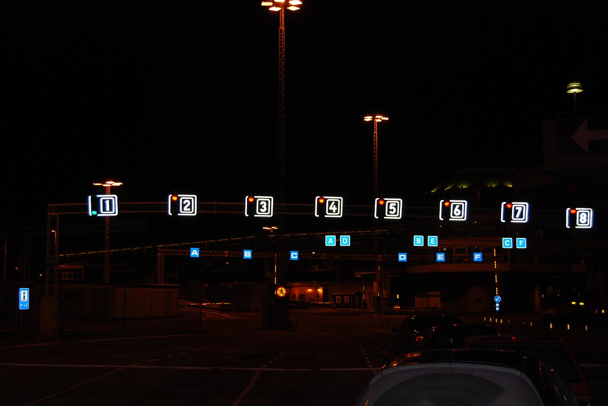

Это продолжение статьи. Начало здесь: [Часть 1](), [Часть 2]().

Из Норвегии мы отправились в Швецию, в Гётеборг. Из настоящей зимней сказки попали в обстановку, напоминающую Москву в ноябре: температура от -1 до +1, но при этом жутко холодный ветер, из-за которого долго находиться на улице было неприятно. По этому большинство достопримечательностей мы рассматривали из окна авто. Однако Гётеборг очень красивый город, и кроме как погодой Москву больше ничем не напоминает: чистые красивые пустые улицы, большое количество велосипедистов и, как следствие, небольшое количество автомобилей. Кстати, любой человек совершенно бесплатно там может взять велик на прокат: на специальной парковке, список которых можно найти на любой туристической карте, при помощи монетки в 20 крон велосипед отстегивается от "стойки", потом его можно использовать сколько угодно времени и если вернуть обратно на любую из парковок, то можно получить обратно свои 20 крон.

В общем, Гётеборг - это город, который обязательно стоит посетить весной или летом, но не зимой. Кстати, в путеводителе было написано что-то типа "между Гётеборгом и Стокгольмом отношения примерно такие же как и между Москвой и Санкт-Петербургом" :))
<!--more-->
Приехали мы в Гётеборг вечером, погуляли по нему немного, провели ночь, на следующий день исследовали пару достопримечательностей и поехали в Копенгаген.

Несколько фотографий сделанных в первый вечер

Пара кислотных фоток

А это уже день

Памятник королю Гюставу II Адольфу, основателю Гётеборга

Крунхюсет - старейшее здание Гётеборга

Осторожно ежи!

А это уже везд на паром, который перевез нас из Швеции в Данию

В этом описании приведены не все фотографии, остальные можно посмотреть в фотогалерее, в разделе ["Новый год 2008"]().

Это третья часть статьи. Продолжение здесь: [Часть 4](), [Часть 5]().