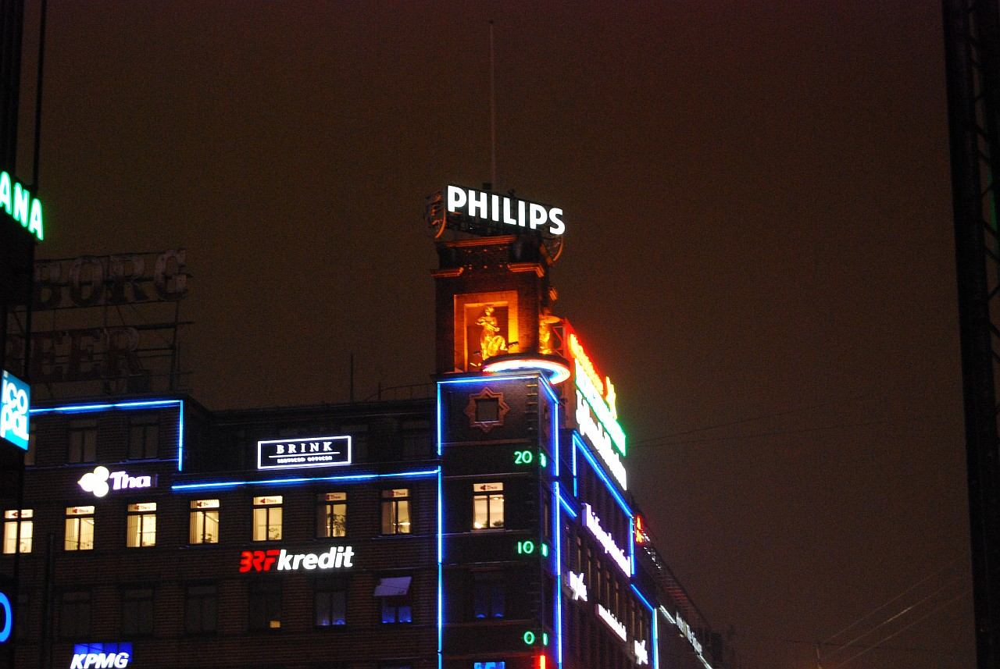
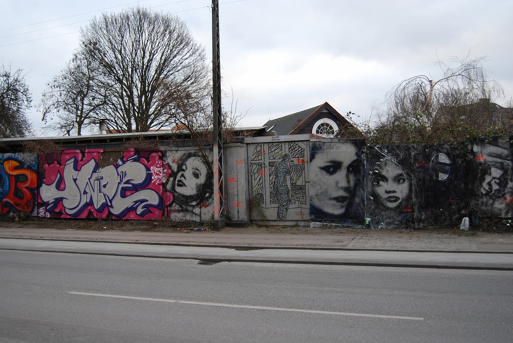
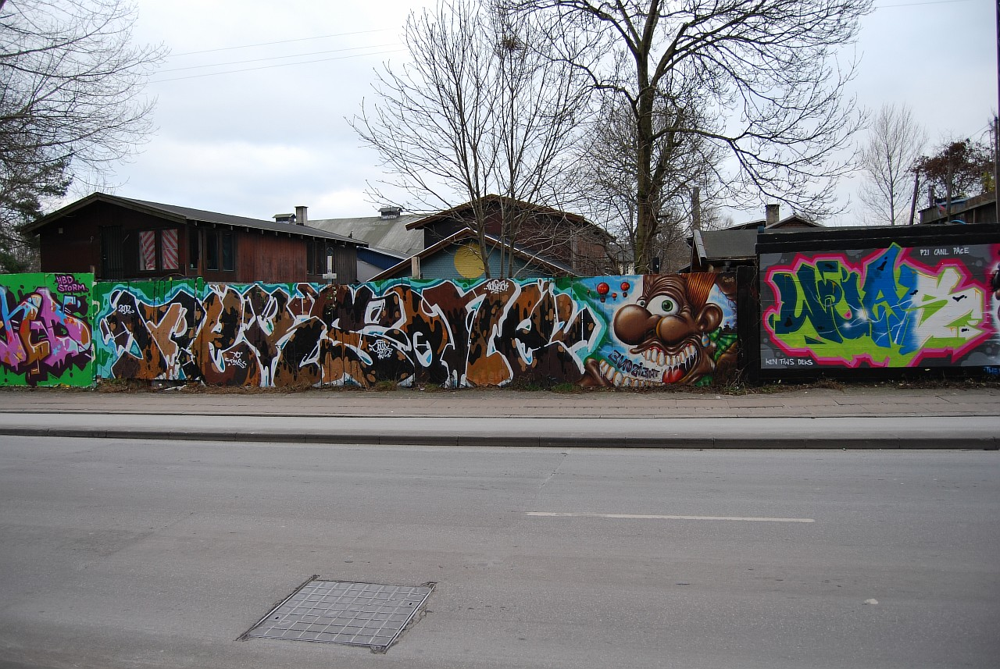
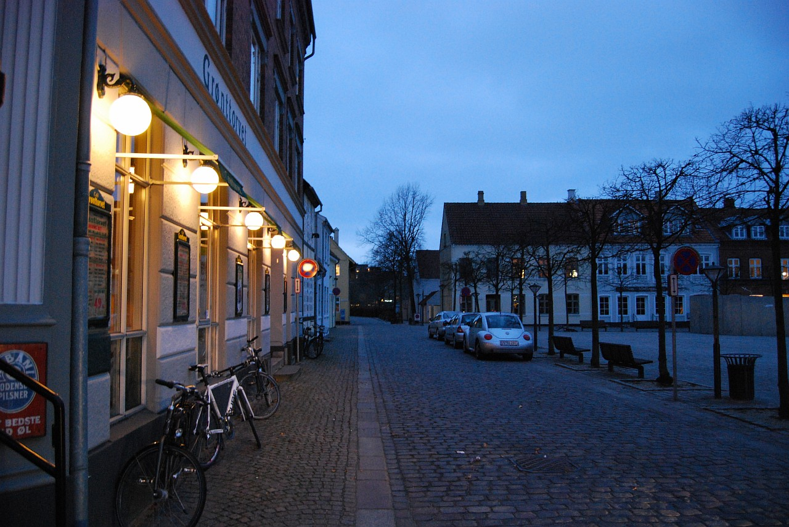
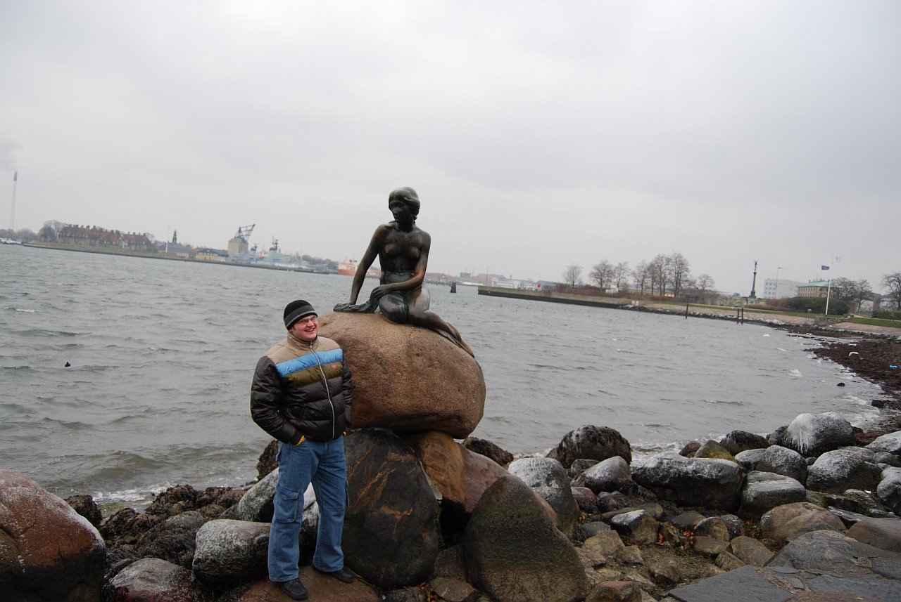
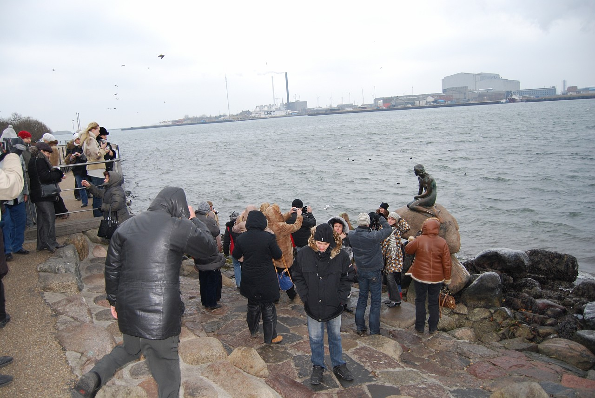
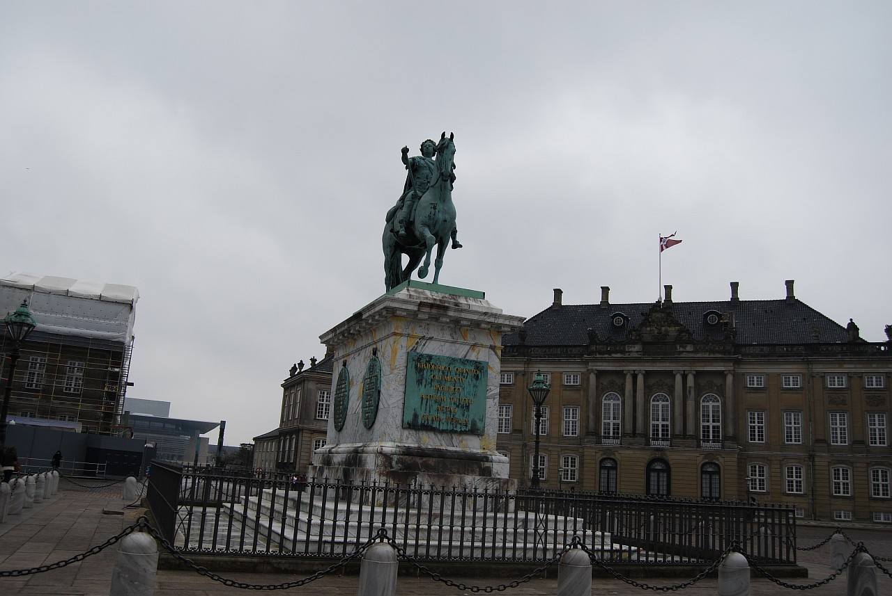
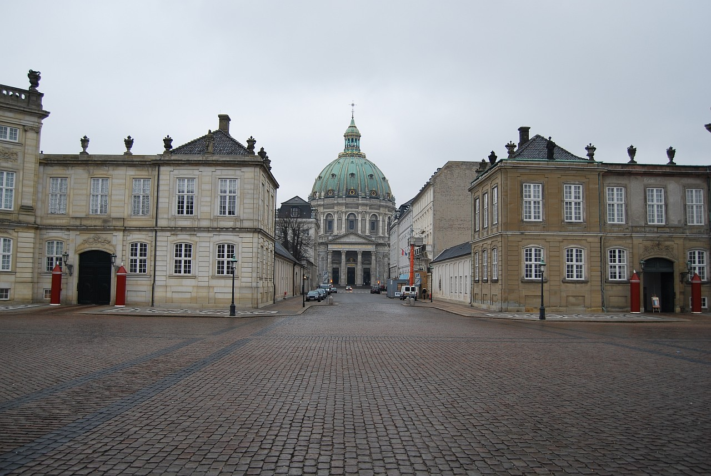
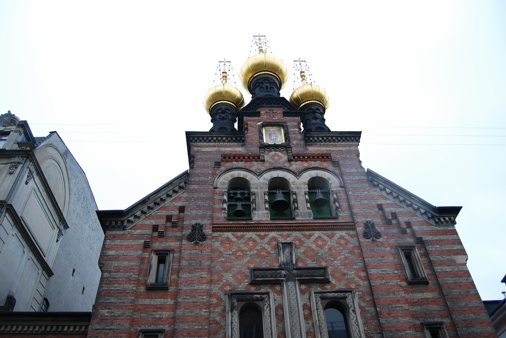
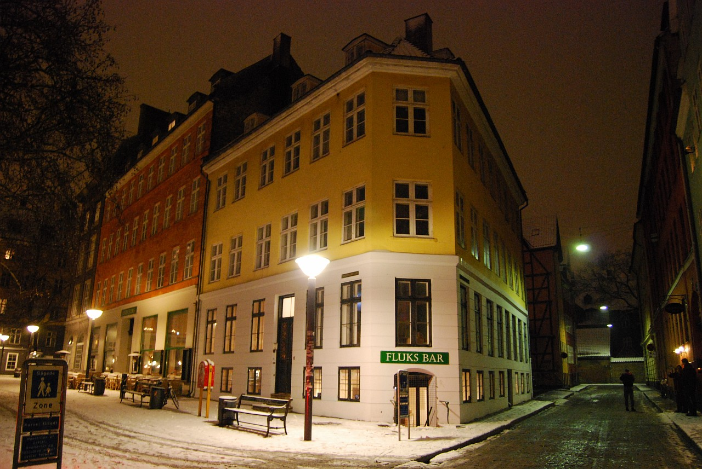

Это продолжение статьи. Начало здесь: [Часть 1](), [Часть 2](), [Часть 3]().

В Копенгагене погода была еще более невыносимой чем  в [Гётеборге](), но путеводитель обещал, что здесь мы найдем много интересных достопримечательностей (одна из них – известный музей современного искусства ["Аркен"](http://en.wikipedia.org/wiki/Arken_Museum_of_Modern_Art), в который мы очень хотели попасть, но он оказался закрытым до 26 января :(), по этому пришлось оставить мысли о "посидеть в соседнем баре", которые, кстати, оказались очень и очень приличными, и начать исследовать город.

Этот объект на карте был отмечен как "здание с термометром" :)) Название показалось очень глупым (у нас-то градусники-часы-барометры на каждом углу висят), по этому внимания на него мы особого не обращали, хотя, как оказалось, проезжали мимо него мы много раз. А честь быть опубликованным в путеводителе это здание заслужило тем, что на его верхушке расположены две скульптуры: девочка на велосипеде и девочка под зонтиком и, в зависимости от погоды, на самом видном месте появляется скульптура наиболее точно ей соответствующая. Нас постоянно преследовали противный мелкий снег и холодный ветер, видимо по этому ни одна из скульптур точно погоде не соответствовала и видны были обе :)

<!--more-->
Район "Кристиания", он же "Свободное государство Кристиания". Здесь в 1971 году начали селиться бездомные хиппи, местные власти справиться с ними не смогли и оставили в покое. Теперь здесь район свободный от внешних законов, вечером там шляется куча подозрительного народа, а в лавках/киосках кроме местной атрибутики можно прикупить легких наркотиков. В общем, судя по описанию в путеводителе, не самый благоприятный район для вечерних прогулок, по этому мы посетили его днем, вот пара фоток:

В один из дней мы побывали на родине Г.Х Андерсена, в городе Оденсе (остров Фюн), но дорога заняла слишком времени, которого у нас было слишком мало (2,5 дня и две ночи на всю Данию), по этому ни в один из музеев мы не успели :(

А это опять Копенгаген. Все-таки у самостоятельных путешествий есть ряд неоспоримых преимуществ перед стадными заездами. Внизу две фотографии "Русалочки" – самой фотографируемой датчанки в мире, сделанные с перерывом в 10 минут. За эти 10 минут успели приехать два автобуса с нашими туристами, которые облепили памятник, сделали по паре фотографий (хотя Русалочку в этой толпе будет найти непросто) и исчезли также стремительно как и появились.

А это фотографии площади и дворца Амалиенборг, который служит королевской резиденцией.

Православная церковь Св. Александра Невского

Копенгаген вечером

Это четвертая часть статьи. Окончание здесь: [Часть 5]().
