После возвращения в Норвегию стало очевидно, что из всех трех стран, которые мы посетили за время этого путешествия, Норвегия – самый удачный выбор для зимних каникул. В Швецию и Данию имеет смысл ехать весной или летом, а зимой там делать практически нечего – слишком холодно, серо и депрессивно как-то... В Норвегии наоборот: улицы завалены снегом, народ в центре города катается на коньках на бесплатном катке, воздух чистый и свежий, а легкий мороз придает энергии и повышает настроение... В Копенгагене почему-то от этого мороза хотелось поскорее спрятаться в авто.

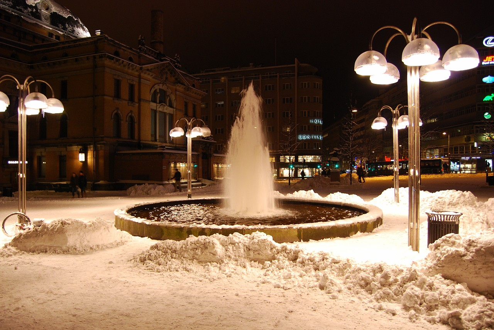
<!--more-->
Это окончание статьи. Начало тут:  [Часть 1](), [Часть 2](), [Часть 3](), [Часть 4]().

После возвращения в Норвегию стало очевидно, что из всех трех стран, которые мы посетили за время этого путешествия, Норвегия – самый удачный выбор для зимних каникул. В Швецию и Данию имеет смысл ехать весной или летом, а зимой там делать практически нечего – слишком холодно, серо и депрессивно как-то... В Норвегии наоборот: улицы завалены снегом, народ в центре города катается на коньках на бесплатном катке, воздух чистый и свежий, а легкий мороз придает энергии и повышает настроение... В Копенгагене почему-то от этого мороза хотелось поскорее спрятаться в авто.

Стоит отметить, что Осло – достаточно дорогой город, мы с трудом <a href=http://romka.eu/oslo target=_blank>нашли здесь</a> отель с номерами по цене 120/150 евро за сингл/дабл, например, в Копенгагене реально найти номер и за 70 евро.

Осло, центральная улица – Карл Юхан Гате
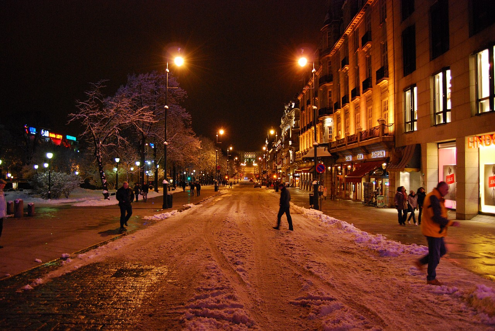

Замок Акерхус вечером, вид снизу
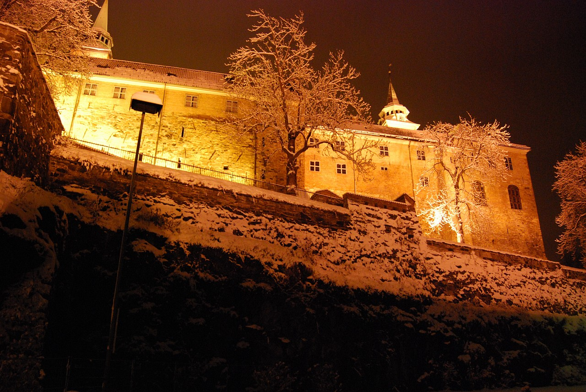

Я, с каким-то местным дядькой, читаю газету
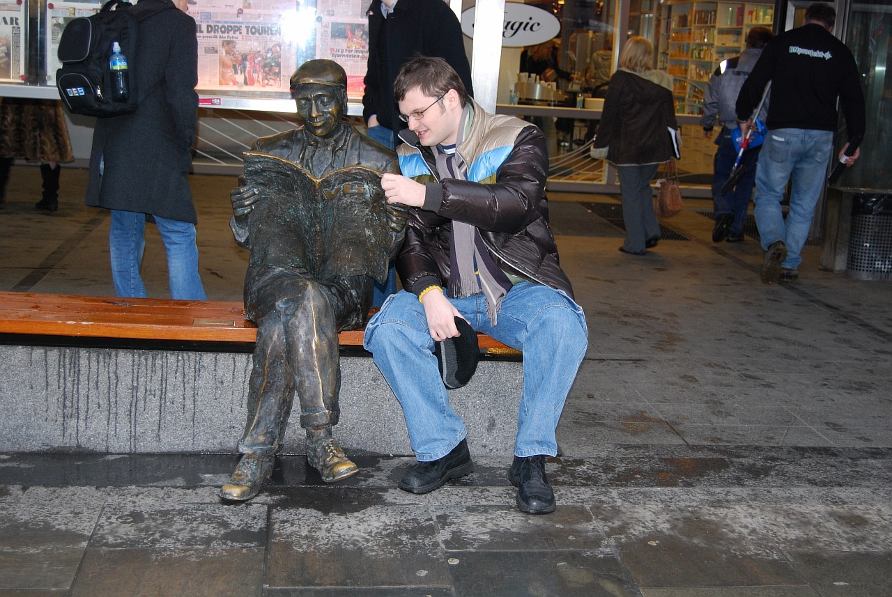

А это обычный "Биллаккспесиалистен Ст. Ханшаугенс Фарвехандел" 
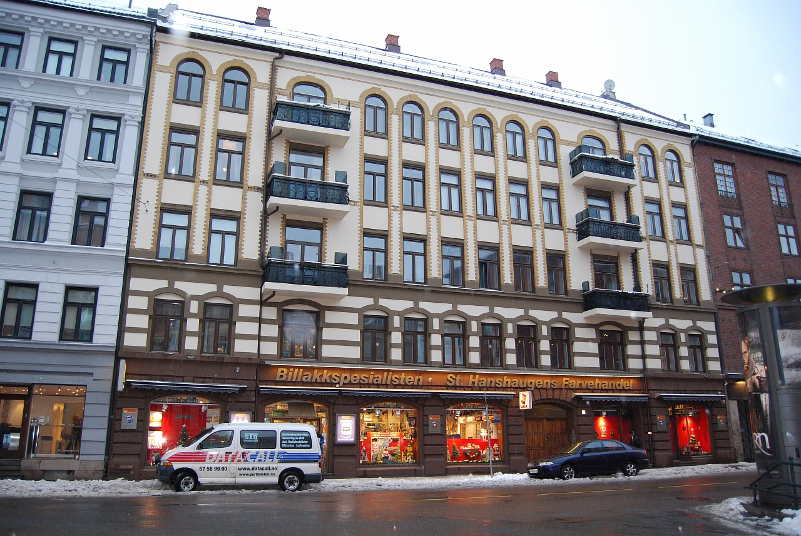

Фрогнер-парк, скульптура "Радость материнства". В этом парке собрано 300 скульптур, олицетворяющих жизнь человека от рождения и до старости. Еще несколько фотографий из этого парка я разместил в <a href=http://romka.eu/gallery/new-year-2008?page=7 target=_blank>фотоальбоме</a>. Честно говоря, зимой все эти скульптуры смотрелись как-то тускло...
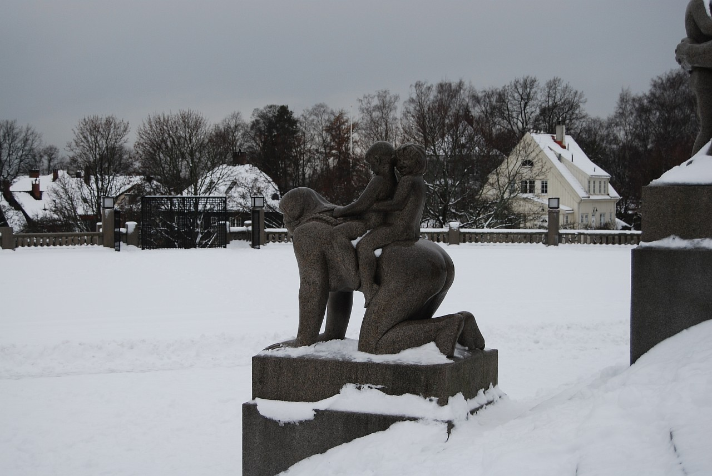

А это уже замок Акерхус
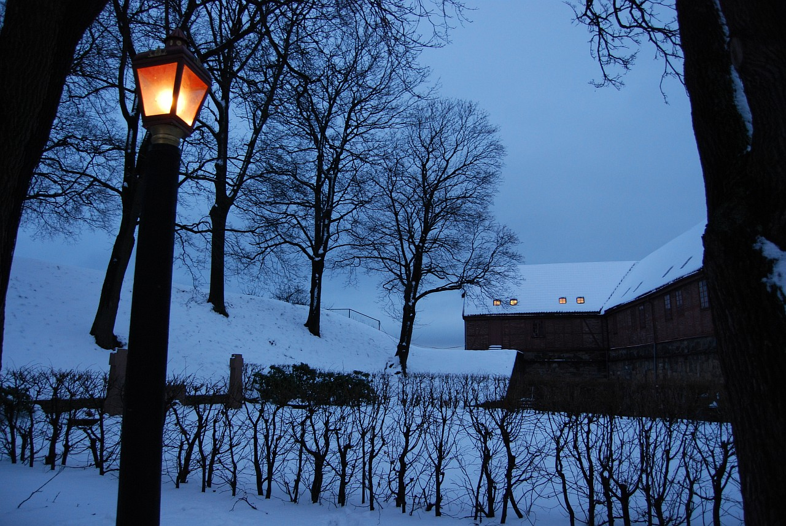

Вид на Осло из замка
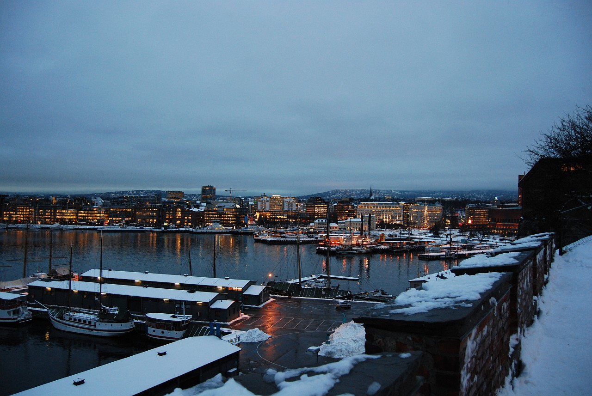

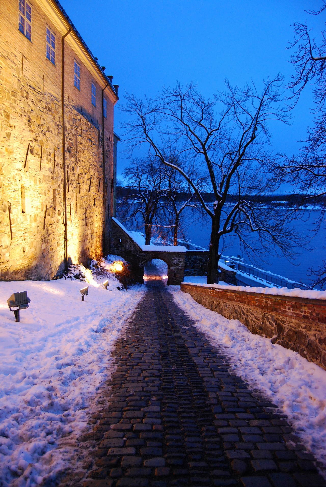

Вид на Осло-фьерд со стены замка Акерхус
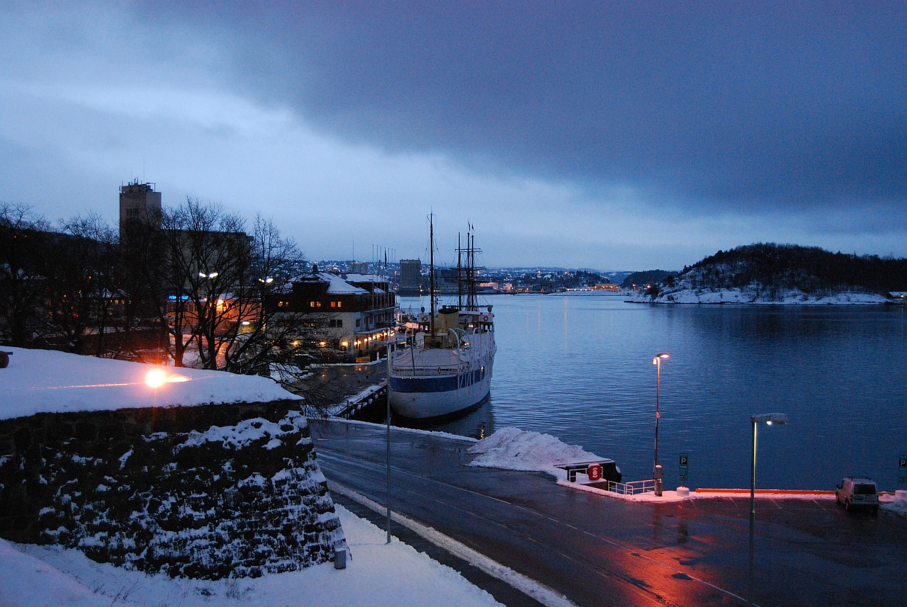

Знак. Одноногим в бак залезать запрещено!
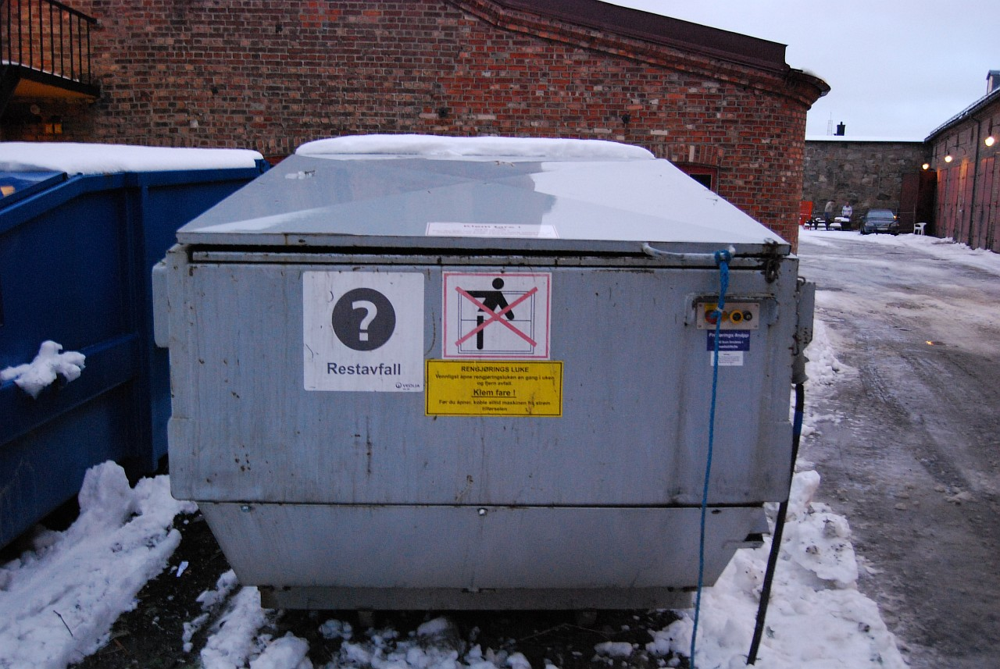

Вид на королевскую резиденцию. Удивительно, что посреди этой площади (на фото справа) находится гигантский сугроб... Несолидно как-то для королевской-то резиденции...
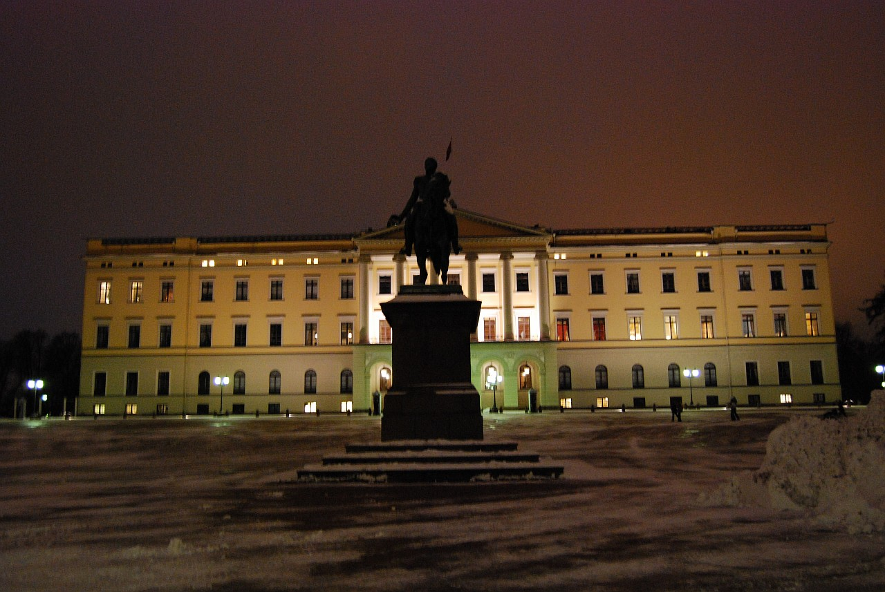

Ну вот и все, путешествие закончилось. Следующим утром мы вылетели в Москву, на встречу пробкам, суете и мерзкой погоде... С нетерпением жду следующего отпуска :))

Остальные фотографии можно из этого путешествия посмотреть [здесь]().