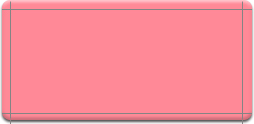

## Инструкция по установке и настройке [плагина Tagnetic]()
Tagnetic — плагин для библиотеки jQuery, который переделывает стандартное облако тэгов в холодильник с налепленными на него магнитами-тэгами. Скрипт полностью работает на стороне клиента и в случае если в браузере отключена поддержка Java-script, то пользователю будет показано стандартное облако тэгов. Демонстрацию работы скрипта можно увидеть [здесь](/old-site/examples/tagnetic/index.html) и [здесь](/old-site/examples/tagnetic/index-400.html).

Для работы необходимо [скачать плагин Tagnetic](/old-site/examples/tagnetic/tagnetic.zip) и библиотеку [jQuery](http://jquery.com) (она уже есть в архиве с плагином), скопировать их на сервер и подключить в html-коде страницы:
```
<script src="jquery.js" type="text/javascript" charset="utf-8"></script>
<script src="jquery.tagnetic.packed.js" type="text/javascript" charset="utf-8"></script>
<script src="jquery.tagnetic.settings.js" type="text/javascript" charset="utf-8"></script>
```
После этих действий в файле _jquery.tagnetic.settings.js_ нужно сделать несколько важных настроек, от которых зависит внешний вид холодильника.

В первую очередь необходимо указать плагину где и в каком виде в html-коде расположено облако тэгов. Обычно облако тэгов представляет из себя код вроде:
```
// вариант 1
<ul class="tags_cloud">
 <li class="tag level3"><a href="#">tag 1</a>
 <li class="tag level2"><a href="#">tag 2</a>
 <li class="tag level1"><a href="#">tag 3</a>

```
или
```// вариант 2
<div id="tags_cloud">
 <div class="tag level3"><a href="#">tag 1</a></div>
 <div class="tag level2"><a href="#">tag 2</a></div>
 <div class="tag level1"><a href="#">tag 3</a></div>
</div>
```
или
```
// вариант 3
<div class="tags_cloud">
 <a href="#" class="level 3">tag 1</a>
 <a href="#" class="level 2">tag 2</a>
 <a href="#" class="level 1">tag 3</a>
</div>
```

Во всех трех вариантах есть "контейнеры для облака тэгов", в первом случае — это тэг ul, во втором и третьем — тэги div. В первом и втором вариантах также есть "контейнеры для тэгов", в первом случае — это тэги &lt;li>&lt;/li>, во втором — &lt;div>&lt;/div>. В третьем варианте контейнера для тэгов нет.

Информацию о контейнерах необходимо разместить в настройках плагина (файл _jquery.tagnetic.settings.js_) в переменных container (контейнер для облака тэгов) и tag (контейнер для тэгов). Для первого примера контейнером является тэг ul с классом tags_cloud, для второго — тэг div с id tags_cloud, по этому в первом примере переменная container будет иметь вид "ul.tags_cloud", во втором — "div#tags_cloud".

Переменная tag для первого примера будет иметь вид "li", для второго — "div", для третьего — "none" (так как контейнеров для тэгов в этом варианте нет).

Код, который необходимо разместить в файле _jquery.tagnetic.settings.js_ для первого варианта:
```
$(document).ready(function() {  
$.tagnetic({container: "ul.tags_cloud", tag: "li"});  
});
```
Думаю, нетрудно понять, как будет выглядеть этот же код для второго и третьего вариантов.

На данный момент скрипт знает где искать тэги и теперь ему нужно объяснить как эти тэги необходимо отобразить. Плагин поддерживает систему скинов, благодаря которой любой желающий может до неузнаваемости изменить его вид. Сейчас вместе с Тагнетиком поставляется 3 скина, расчитанных под разную ширину холодильника. За отображение холодильника отвечают 3 переменные: div_width — ширина слоя, skin — используемый скин и path_to_skins — путь к папке со скинами относительно корня сайта.

Если плагин и папка со скинами расположена в корне сайта и мы хтим использовать шестисотпиксельный скин, то указанные выше переменные будут иметь значения: div_width: 600, path_to_skins: "", skin: 'refrigerator-600' и код в файле _jquery.tagnetic.settings.js_ примет вид:

```
$(document).ready(function() {  
  $.tagnetic({container: "ul.tags_cloud", tag: "li", div_width: 600, path_to_skins: "", skin: 'refrigerator-600'});  
});
```

Это все настройки, которые необходимо выполнить, для того чтобы включить холодильник тэгов с одним из стандартных скинов. В <a href="http://romka.eu/examples/tagnetic/tagnetic.zip">архиве</a> с плагином находятся файлы index.html и index-400.html, которые демонстрируют его работу и настройки.

## Дополнительные настройки

- Для того чтобы интегрировать скрипт с модулем Tagadelic для Drupal 6 необходимо в папке с используемой темой, в файле template.php (если его нет, то его нужно создать) добавить функцию:
```
function phptemplate_preprocess(&$variables) {
  if(arg(0) == "tagadelic") {
    $path = ""; // путь к папке с плагином
    drupal_add_js($path . "jquery.tagnetic.js");
    drupal_add_js($path . "jquery.onImagesLoad.js");
    drupal_add_js($path . "jquery.tagnetic.settings.js");
    drupal_add_css($path . "tags.css", "theme"); 
  }
}
```
Настройки для jquery.tagnetic.settings.js:
```
$(document).ready(function() {  
  $.tagnetic({div_width: 850, skin: "refrigerator-850", handle: "handle.jpg", handle_width: 280, handle_line: 15, container: "div.tagadelic", tag: "none", path_to_skins: "/sites/all/themes/deco/"});  
});
```
Теперь на странице example.com/tagadelic вместо стандартного облака тэгов будет показан холодильник.

- Для того чтобы отобразить ручку холодильника необходимо заполнить еще три переменные: handle — путь к картинке-ручке (по умолчанию 'none'), handle_width — ширина ручки в пикселях, handle_line — номер линии, в которой ручка будет выведена.

- Для того чтобы добавить свой вариант прямоугольного магнита, необходимо его нарисовать и нарезать по такой схеме:


Далее каждый кусок сохранить под именем:
 - левый верхний угол — square-l-t-N.png
 - средняя верхняя граница — square-m-t-N.png
 - правый верхний угол — square-r-t-N.png
 - левая средняя граница — square-l-m-N.png
 - центральная ячейка — square-m-m-N.png
 - правая средняя граница — square-r-m-N.png
 - левый нижний угол — square-l-b-N.png
 - средняя нижняя граница — square-m-b-N.png
 - правый нижний угол — square-r-b-N.png

Здесь l — лево, m — середина, r — право, t — верх, b — низ. Вместо N нужно подставить порядковый номер магнита. Все картинки необходимо сохранить в папке "skins/имя_скина/squares", после этого в настройках скрипта нужно будет в переменной squares указать новое количество магнитов. Примоугольные магниты тянутся до любой ширины и высоты.

- Для того чтобы создать новый овальный магнит, его необходимо нарисовать и сохранить в папке "skins/имя_скина/ellipses" под именем "ellipse-N.png". Овальные магниты не масштабируются, для них обязательно нужно указать размеры, а также максимальные размеры текста, который  в этом магните уместится. Для этого необходимо в настройках дополнить переменные: ellipse_width: "70,50", ellipse_height: "29,21", ellipse_text_width: "60,35", ellipse_text_height: "19,18". Эти переменные означают, что первый овальный магнит имеет  размеры 70 на 29 пикселей и в него уместится текст размерами до 60 на 19 пикселей. Чтобы добавить информацию о третьем магните необходимо дополнить переменные следующим образом: ellipse_width: "70,50,А", ellipse_height: "29,21,Б", ellipse_text_width: "60,35,В", ellipse_text_height: "19,18,Г".
- Для того чтобы заменить фон холодильника, необходимо в папку с нужным скином положить файлы с именами background-top.jpg, background-middle.jpg и background-bottom.jpg. Как они должны выглядеть лучше посмотреть в одном из скинов, которые идут вместе с плагином.
