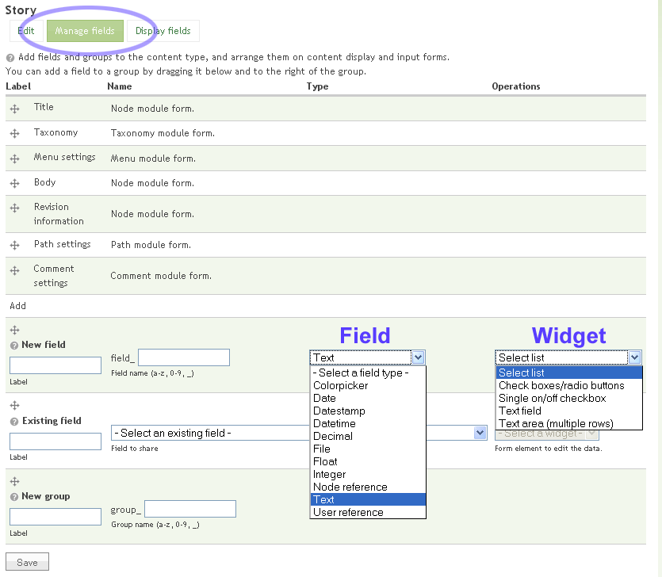
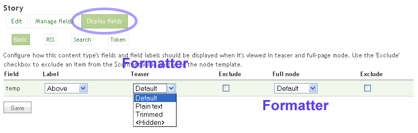
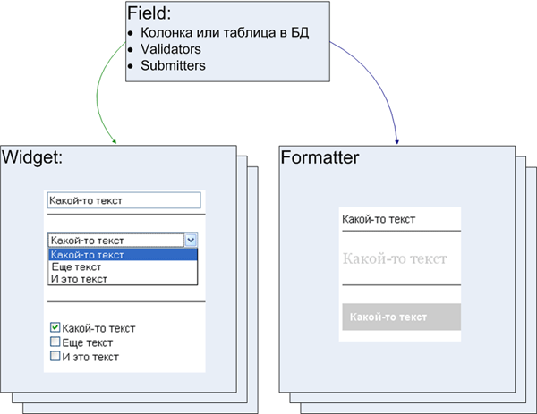

На прошедшем в Киеве [Друпал Кемпе](http://camp09.drupal.ua/ru/blog) я делал доклад, в котором приводил пример разработки плагина для Drupal-модуля CCK. В этой заметке я приведу краткий конспект своего доклада.

Любой создаваемый средствами [CMS Drupal](http://drupal.org) тип контента по умолчанию состоит из двух полей — "Тема" и "Тело сообщения", а также из нескольких полей служебной информации (автор, дата публикации и т.п.). Модуль [Content Construction Kit (CCK)](http://drupal.org/project/cck) представляет из себя графический интерфейс, позволяющий добавить к любому типу контента (в том числе и созданному сторонними модулями) любое количество дополнительных полей, например, поля для размещения картинок, аудио- и видеофайлов и т.п. Каждое из таких полей является плагином для CCK.

Далее в этом тексте пойдет речь о разработке подобного плагина. Материал ориентирован на людей, умеющих программировать на PHP, имеющих представление о модульной системе Друпала и опыт разработки модулей для него. Если вы интересуетесь основами программирования под Друпал, то прочитайте мою статью на эту тему, которая будет опубликована в ближайшем номере журанала [PC Magazine/RE](http://pcmag.ru).
<!--more-->
## Описание CCK

При разработке плагина для CCK в первую очередь важно понимать структуру и логику работы этого модуля. Три основные сущности, которыми оперирует модуль Content — ядро CCK:

- **Field** — backend, набор функций для проверки переданных пользователем данных, записи и чтения их из БД.
- **Widget** — frontend для пользователя публикующего документ. То есть виджет — это элемент формы, который будет выводиться в форме добавления материала
- **Formatter** — frontend для читателя, функция темизации определяющая то, как будут выводиться на экран данные, введенные через наш виджет.


Иными словами, field отвечает за хранение и обработку данных, widget отвечает за ввод данных, а formatter за вывод данных на экран.

Ниже приведены скриншоты, на которых изображена форма добавления CCK-поля и отмечены элементы, отвечающие за создание каждой из перечисленных сущностей.




Каждое поле (field) может иметь неограниченное количество виджетов и форматтеров, например текстовые данные могут заноситься в базу через текстовое поле, чекбоксы или комбобокс, бэкэнду абсолютно все равно то, каким образом данные были введены пользователем, важен только тип передаваемых данных. 



Те кто имеет опыт работы с модулем CCK, наверняка обращали внимание на то, что formatter и widget поля можно изменить в любой момент, а вот field задается один раз при создании нового поля и изменен быть не может. Это ограничение логично, так как со сменой field поменяется стуктутра таблицы, в которой хранятся данные и невозможно будет определить то, что делать и как преобразовать данные, которые уже сохранены в базе с использованием текущего поля.

При разработке собственного плагина для CCK программист может создать функции, реализующие собственные filed, widget и formatter, а может, например, использовать существующий field, реализованный сторонним модулем, и разработать только свои widget и formatter. Примером такого симбиоза являются модули [FileField](http://drupal.org/project/filefield) и [ImageField](http://drupal.org/project/imagefield). Первый реализует функции, позволяющие закачивать файлы на сервер и хранить их, используя системные таблицы Друпала, а второй добавляет дополнительные проверки, закачиваемых файлов.

Также программисты могут использовать field и widget реализованные сторонними модулями и разработать только свой formatter.

Англоязычную документацию, описывающую API CCK, можно найти по адресу http://drupal.org/node/342987. Далее я приведу описание самых часто используемых при разработке плагинов для CCK хуков. Для примера я разработал небольшой модуль, реализующий текстовое поле. Этот модуль не имеет никакой практической пользы, так как значительно уступает по возможностям модулю Text, входящему в стандартную поставку CCK, но на его примере легко понять логику разработки плагинов для CCK.

## Хуки field
- [hook_field_info](http://drupal.org/node/417654) — отвечает за регистрацию (объявление) нового поля.
```
<?php
function cck_field_test_field_info() {
  return array(
    'test_text' => array(
      'label' => t('Test text group'),
      'description' => t('Test text CCK field'),
    ),
  );
}
?>
```
Этот хук должен возвращать ассоциативный массив, ключами которого являются системные имена создаваемых полей (эти имена должны состоять только из латинских букв, цифр и знаков подчеркивания), элементами этого массива должны быть вложенные массивы, содержащие параметры создаваемого поля. В приведенном примере я создаю одно поле с системным именем test_text.

- [hook_field](http://drupal.org/node/342996) — отвечает за реализацию поведения поля. Пример описываемый в этой статье очень прост, по этому это хук в нем не используется, но в более сложных случаях здесь могут быть описаны функции валидаторы, сабмиттеры и другие.
- хук [hook_field_settings](http://drupal.org/node/354365) определяет глобальные настройки для всех полей этого типа. Эти настройки будут выводиться в филдсете Global settings при создании и редактировании поля. Хук должен возвращать ассоциативный массив, содержащий форму в формате [Forms API](http://api.drupal.org/api/file/developer/topics/forms_api_reference.html/6) Друпала. Кроме того, в нашем случае здесь определяется колонка/колонки в базе данных, в которой будут храниться данные, введенные через созданное поле. Если вы хотите самостоятельно обрабатывать сохранение данных в поле, то вам необходимо воспользоваться хуком hook_field.
```
function cck_field_test_field_settings($op, $field) {
  switch ($op) {
	case 'database columns':
		// поля в бд, которые необходимы для хранения данных из создаваемого оля
      	return array('test_field_data' => array('type' => 'varchar', 'length' => 64, 'not null' => FALSE, 'sortable' => TRUE));  
	case 'form':
		// форма глобальных настроек поля
    	$form = array();
    	$form['test_num_setting'] = array(
		  '#type' => 'textfield',
		  '#title' => t('Test num setting'),
		  '#default_value' => $field['test_num_setting'] === '' ? 123 : (int) $field['test_num_setting'],
		  '#size' => 60,
		  '#maxlength' => 128,
		);
    	return $form;    
    	break;
    case 'validate':
		if(!is_numeric($field["test_num_setting"])) {
			form_set_error("test_num_setting", t('Test num setting mast be numeric'));
		}
    	break;
    case 'save':
    	return array('test_num_setting');
    	break;
    case 'views data':
      $allowed_values = content_allowed_values($field);
      break;
  }
}
```


## Хуки widget
Хуки для создания собственного виджета имеют похожие на хуки field имена и логику использования.

-  В [hook_widget_info](http://drupal.org/node/417884) определяется новый виджет и привязывается к существующему филду.
```
function cck_field_test_widget_info() {
  return array(
    'text_test_field' => array(
      'label' => 'Test Text Field',
      'field types' => array('test_text'),
      'multiple values' => CONTENT_HANDLE_CORE,
      'callbacks' => array(
        'default value' => CONTENT_CALLBACK_DEFAULT,
        ),
    ),
  );
}
```

Этот хук, так же как и хук `hook_field_info`, должен возвращать ассоциативный массив. Ключами массива должны быть системные имена, а значениями — вложенные массивы с параметрами. Одним из важных параметров является "field types", в котором определяется field, к которому привязан создаваемый widget, в нашем случае виджет `text_test_field` привязывается к филду `test_text`.

- [Hook_widget](http://drupal.org/node/344142) отвечает за поведение виджета.
- Самый важный и интересный хук — [hook_elements](http://api.drupal.org/api/function/hook_elements/6). Все перечисленные выше хуки входят в API модуля CCK, а этот хук входит в Forms API Друпала. В нем определяется функция (в нашем примере _text_test_field_process_), которая будет отвечать за то как будет выглядеть создаваемый виджет (в нашем случае _text_test_field_), то есть форма, через которую пользователь будет добавлять контент.
```
function cck_field_test_elements() {
    $elements = array(
    'text_test_field' => array(
      '#input' => TRUE,
      '#columns' => array('test_field_data'),
      '#process' => array('text_test_field_process'),
      '#delta' => 0,
      ),
     );
    return $elements;
}
```

- Хук [hook_widget_settings](http://drupal.org/node/354369) создает форму, через которую будут задаваться локальные настройки для виджета. Возвращаемый результат аналогичен результату, который возвращается хуком `hook_field_settings`.

## Хуки formatter
Разработка форматтеров — это самая простая часть при создании плагина для CCK. Чтобы определить свои форматтеры нужно зарегистрировать их через хук `hook_formatter_info`, после этого для каждого форматтера нужно определить свою функцию темизации. Функции темизации для форматтера должны иметь имена вида `theme__название_модуля__formatter__имя_форматтера_`, кроме того, они, как и любые другие функции темизации, должны быть зарегистрированы через hook_theme модуля.

В нашем примере определяется два форматтера с именами default и advanced:
```
function cck_field_test_field_formatter_info() {
    return array(
        'default' => array(
            'label' => t('Test default formatter'),
            'field types' => array('test_text'),
            'multiple values' => CONTENT_HANDLE_CORE,
        ),
        'advanced' => array(
            'label' => t('Test advanced formatter'),
            'field types' => array('test_text'),
            'multiple values' => CONTENT_HANDLE_CORE,
        ),
    );
}
```
Таким образом, функции темизщации для этих форматтеров могут выглядеть так:
```
function theme_cck_field_test_formatter_default($element) {
    return 'Text of test field >>>'. check_plain($element['#item']['test_field_data']) .' <<<< ';
}

function theme_cck_field_test_formatter_advanced($element) {
    return 'Text of test field. Advanced formatter >>>'. check_plain($element['#item']['test_field_data']) .' <<<< ';
}
```

Вот и все, реализация самой важной и сложной части модуля завершена. Для его работы необходимо реализовать еще несколько второстепенных хуков, для изучения их работы вы можете скачать .

**upd.** А вот и видео с доклада:


Александром Митасовым и видео-партнером [DrupalCamp Kyiv](http://camp09.drupal.ua/ru/blog/video-arharov) 2009 [«Николаевским курьером»](http://nikolaevskiykurier.com/)