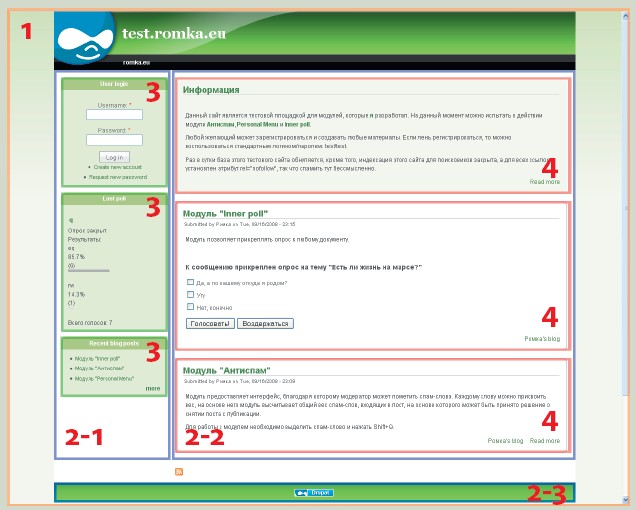

[Drupal](http://drupal.org) часто ругают за однообразность и узнаваемость дизайна, используемого на Drupal-сайтах. То, что за определенным сайтом стоит CMS Drupal, можно определить не только по URL-адресам специфического вида, узнаваемым путям к папкам модулей и главной странице в виде списка последних опубликованных документов, но и по стандартной двух-трехколоночной структуре сайта, наличию стандартных форм авторизации и поиска, облаков тегов, списков новых документов и других часто используемых блоков.

Однако все эти упреки несправедливы. Здесь можно процитировать старый анекдот: «Вы просто не умеете его готовить». На самом деле к Drupal при должном умении можно «прикрутить» дизайн и верстку любой сложности. Можно до неузнаваемости «темизировать», т. е. изменять внешний вид любого HTML-кода, создаваемого Drupal, — все стандартные формы, блоки, документы и списки. Просто для этого нужно понимать, как Drupal генерирует выходные данные (информация об этом была размещена в [моей предыдущей статье]()), и уметь переопределять этот вывод. Примеров таких детально темизированных сайтов много, в одной из врезок вы можете найти ссылки на некоторые из них.

В этой статье я расскажу о трех этапах темизации, охватывающих практически 100% задач, связанных с изменением внешнего вида сайта: разработка общего шаблона для всех страниц сайта и «кастомных» шаблонов для избранных страниц; разработка шаблонов для разных типов документов и списков; изменение внешнего вида форм (поиск, авторизация и любые другие стандартные и создаваемые внешними модулями формы). Но прежде чем переходить к решению задач, познакомимся с основными используемыми терминами и структурой любой «темы оформления».
<!--more-->
## Используемые термины

**Тема оформления** — это набор файлов, отвечающих за внешний вид сайта. Тема оформления определяет HTML-макет страницы, используемые на ней CSS-файлы и JavaScript. Несмотря на то что шаблоны, используемые в темах оформления, позволяют исполнять PHP-код, в них не должно быть кода, не связанного с отображением информации. Тема оформления должна на входе получать готовые массивы данных, а на выходе создавать из них HTML-код. Логика программы реализуется в модулях.

Для создания тем оформления можно использовать различные **шаблонные «движки» (шаблонизаторы)**, такие как [Smarty](http://smarty.net), [PHPTAL](http://phptal.org/) и др., однако по умолчанию в системе может быть применен только **PHPTemplate **— шаблонный «движок», специально разработанный для Drupal. Если надо разработать тему оформления для Drupal с нуля, то рекомендуется использовать именно его, но если на Drupal переносится существующий сайт, для которого уже разработан шаблон на основе одного из альтернативных шаблонизаторов, то можно добавить его, разместив соответствующий «движок» в папке sites/all/themes/engines вашей инсталляции Drupal. Скачать модули, интегрирующие Drupal с внешними шаблонизаторами, можно по ссылке [http://drupal.org/project/Theme+engines](http://drupal.org/project/Theme+engines).

Все страницы разделяются на **регионы** — области страницы, каждая из которых может содержать один или несколько блоков с данными. Например, по умолчанию большинство стандартных тем оформления состоит из пяти регионов: левая и правая колонка, шапка, подвал сайта и регион с основным его содержимым. Такой макет страницы наиболее популярен, поскольку удовлетворяет требованиям большинства пользователей; с его помощью удобно строить новостные сайты и блоги. Однако это не означает, что все сайты, использующие Drupal, должны иметь такую структуру. Разработчик может определять в макете страницы любое количество дополнительных регионов и размещать их в любых самых неожиданных местах.

**Блок** — это набор особым образом сформатированных данных. Внешний вид и содержимое блока определяются создающим его модулем и функциями темизации (подробнее об этих функциях рассказывается [в третьей части предыдущей статьи]()</a>), а расположение — администратором сайта. Используя специальный графический интерфейс, администратор может методом drag-and-drop разместить любой блок системы в любом из доступных регионов. Примером блока может служить форма входа в систему или облако тегов.

Вместо разработки собственной темы оформления можно скачать и установить на своем сайте одну из готовых тем. Многие темы могут быть детально настроены через интерфейс администратора: вы сможете изменить цветовую гамму, число колонок, ширину колонки с основным контентом и логотип сайта, не изменяя код шаблона. Кроме того, всегда можно доработать для себя любую из существующих тем оформления.

Если вас устраивает такой вариант, то вы можете дальше не читать этот текст, а поэкспериментировать с темами оформления, ссылки на которые приведены во врезке. Дальше рассказ пойдет об анатомии темы оформления для «движка» PHPTemplate.

### Полезные ссылки
 - http://drupal.org/node/21951 — терминология, используемая в Drupal.
 - http://drupal.org/node/171194 — анатомия темы в Drupal.
 - http://drupal.org/node/171205 — описание содержимого *.info-файла.
 - http://www.w3.org/TR/CSS21/media.HTML — введение в media-types.
 - http://drupal.org/node/226776, http://api.drupal.org/api/file/modules/system/page.tpl.php — используемые в шаблонах переменные.
 - http://drupal.org/node/190815 — стандартные файлы шаблонов Drupal
 - http://drupal.org/project/zen — тема оформления Zen, с изучения исходных текстов которой стоит начать знакомство с темизацией Drupal.
 - http://api.drupal.org/api/drupal/developer-topics-forms_api_reference.HTML/6 — Forms API, типы полей.
 
## Описание схемы страницы

На картинке ниже приведена общая схема страницы Drupal.
1 — основной шаблон страницы, определяется в файле page.tpl.php;
2-1 — регион «левая колонка» (определяется переменной $left в шаблоне page.tpl.php);
2-2 — регион «основное содержимое страницы» ($content),
2-3 — регион «подвал сайта» ($footer);
3 — блоки, размещенные в левой колонке, определяются шаблонами block.tpl.php или его модификациями (block-region.tpl.php и др.);
4 — документы из «ленты новостей», определяются шаблоном node.tpl.php или его модификациями (например, node-имя_типа_контента.tpl.php).

### Примеры сайтов на Drupal
 - http://zerut.ru — сборник карикатур лучших зарубежных авторов. Здесь темизировано все: списки документов, форма входа, облако тегов и т. д.
 - http://www.chopped-tomatoes.com — Интернет-магазин на Drupal.
 - http://www.csspig.com — галерея сайтов.
 - http://designslices.com — еще один красивый Drupal-сайт.
 - Список 70 самых красивых Drupal-сайтов можно найти на http://mogdesign.eu/blog/70-beautiful-drupal-sites/.
 - [В блоге Дриса Байтаерта](http://buytaert.net/tag/drupal-sites), создателя Drupal, публикуются самые интересные, причем не только с точки зрения дизайна, Drupal-сайты.

Ссылки на другие части этой статьи:
- **Часть 1. Введение**
- [Часть 2. Анатомия темы оформления]()
- [Часть 3. Forms API и темизация]()
- [Часть 4. Темизация Views]()
 
Содержание всех статей: [/blog/2010/my-drupal-articles]()