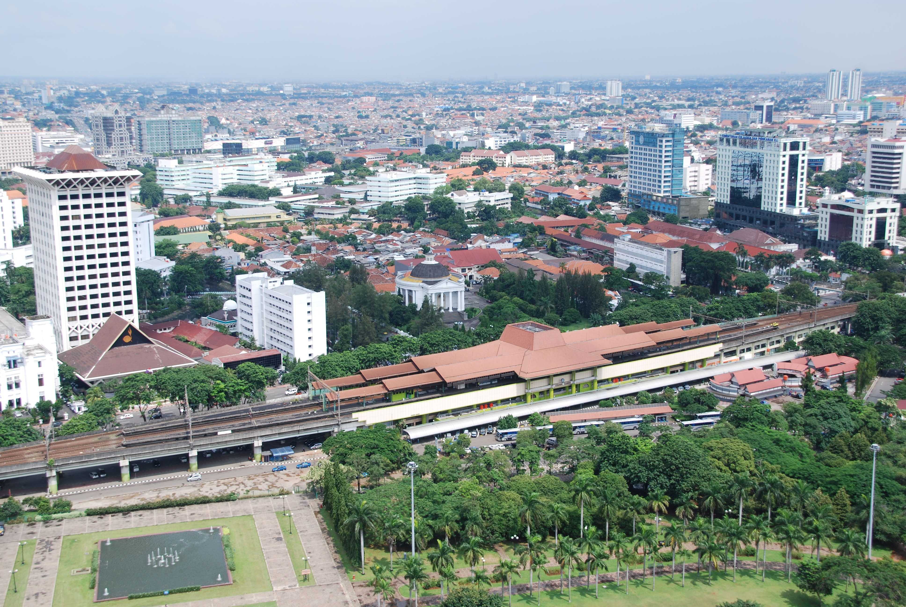

Ура! В этом году таки получилось (хотя и не без труда) вырваться в отпуск! Опять поехали с друзьями в Азию в этот раз  по маршруту: Тайланд, остров Пхукет — Индонезия (ура, я впервые пересек экватор:)), острова Ява (Джакарта, Джокьякарта) и Бали (Денпасар, Легиан бич) — Сингапур — Пхукет.
<iframe width="640" height="480" frameborder="0" scrolling="no" marginheight="0" marginwidth="0" src="//maps.google.com/maps/ms?ie=UTF8&amp;hl=en&amp;msa=0&amp;msid=115913891804259036117.000480d0f76d5c381efc0&amp;ll=0.087891,106.787109&amp;spn=41.265524,56.25&amp;t=p&amp;z=4&amp;output=embed"></iframe>

Вся поездка заняла две недели (ох, как же хотелось побыть там еще хотя бы недельку!) и ниже мои о ней впечатления.

Фотографии из этого путешествия доступны в [фотогалерее]().

На Пхукете я оказался уже в третий раз: первые два раза был там летом 2005 и 2007 года. За последние три года остров очень сильно изменился: теперь там на каждом шагу русские туристы, в каждой второй кафешке меню на русском языке (которые, между прочим, от этого становятся значительно менее понятными), из торговых рядов постоянно доносятся завлекающие выкрики продавцов типа "Давай-давай наливай", которые ну ни как не стимулируют к посещению таких магазинчиков. Куда-то пропали толпы тайцев на мотороллерах, но зато появилось много автомобилистов, что привело к появлению пробок, от которых не спасает даже то, что часть дорог Патонга, района в котором я отдыхал все три раза, сделали односторонними.

Кому-то эти изменения могут показаться положительными, ведь теперь здесь вполне спокойно можно отдыхать не зная английского языка, но, на мой взгляд, Патонг стал чуток скучнее, потерял свою изюминку и стал чем-то похожим на попсовый Шармель Шейх.

Но, в любом случае, все эти изменения совершенно не мешают отлично провести время на этом замечательном острове: яркое, но не палящее солнце (ох, как мне такого солнца будет не хватать через несколько дней на Бали), теплое море, пустые тихие пляжи (ну это, разумеется, если отъехать на мотороллере или тук-тукере на пяток километров от основных туристических троп в сторону Карона, например), что еще надо человеку день назад мерзнувшему в холодной серой Москве?! Ну разумеется суп Том Ям, арбузный шейк и свежевыжатый манговый сок! :) Это, наверное, самая вкусная еда на свете!
<!--more-->
Кстати, интересная штука. В первые две поездки сюда я покупал местную симку оператора One-Two Call, с помощью которой можно звонить в Россию за 7 бат в минуту (1 тайский бат — это 90 наших копеек), эта цена до сих пор осталась неизменной, но зато сейчас появился новый оператор TrueMove (или это тариф такой, я в детали не вникал), который, если я правильно понял, гонит голос через интернет, и берет за звонок в Россию всего 3 бата в минуту! Кроме того симки ТруМува бесплатно раздавались в аэропорту, они не требуют никакой хитрой процедуры активации и сразу раздаются с 7 батами на счету, а это две минуты разговоров и одна эсэмэска совершенно бесплатно, очень удобно :)

На Пхукете, кроме того что валялись без дела на пляже, мы попробовали развлекуху под названием "Jungle cable adventure" также известную как "Полет гиббона": в джунглях между высоченными деревьями натянуты тросы на высоте от 6 до 30 метров, туристам выдают специальное, почти спецназовское, снаряжение с помощью которого по этим тросам можно скользить, перемещаясь от дерева к дереву. На каждом таком дереве установлены специальные платформы, на которых подопытный турист может отцепиться от одного кабеля и зацепиться за другой, чтобы скатиться к следующему дереву. В целом, мероприятие это достаточно скучное, но один раз попробовать стоило.

После трех дней безделья на пляжах Пхукета (его закоулки мы успели исследовать еще во время предыдущих посещений острова) началась активная стадия нашего путешествия, следующим запланированным для посещения местом стала Джакарта, столица Индонезии. Здесь мы провели всего полдня, по этому успели лишь бегло осмотреть Национальный Монумент и немного прогуляться по городу.

В Джакарте ситуация с покупкой местной местной симки оказалась значительно сложнее чем в Тайланде. Во-первых местные продавцы совсем не говорили на английском языке (может мне просто не повезло с продавцом, но покупал я симку на вокзале, где была куча туристов, так что мне показалось логичным, что там должны стоять самые образованные продавцы), во-вторых для симки потребовалась хитрющая активация, с которой без помощи местного аборигена разобраться не удалось, ну и в третьих, звонок в Россию из Индонезии стоил около 10 тысяч местных рупий, то есть чуть больше 1 доллара, а это в 10 раз больше чем за звонок из Таиланда.

Из Джакарты мы купили билеты до Джокьякарты, города вблизи которого расположены интересные достопримечательности: древние храмы Боробудур и Прамбанан, а также один из немногих действующих вулканов. 8 часов на поезде, во вполне себе комфортабельном кондиционированном вагоне и мы на месте. Правда далеко не все местные жители могут себе позволить билет в такой вагон, в каждом поезде таких вагонов 2 или 3, а остальные вагоны общие, как в наших электричках. 8 часов в общем некондиционированном вагоне с вещами да еще и после перелета и долгой пешеходной прогулки по душному городу было бы жестоким испытанием...

Это первая часть описания поездки, ссылки на другие части:
 - [Зима 2010. Поездка в Тайланд, Индонезию и Сингапур. Часть 2 — Джокьякарта]()
 - [Зима 2010. Поездка в Тайланд, Индонезию и Сингапур. Часть 3 — Бали, Сингапур, Пхукет]()
 - [Фотографии из поездки]().
