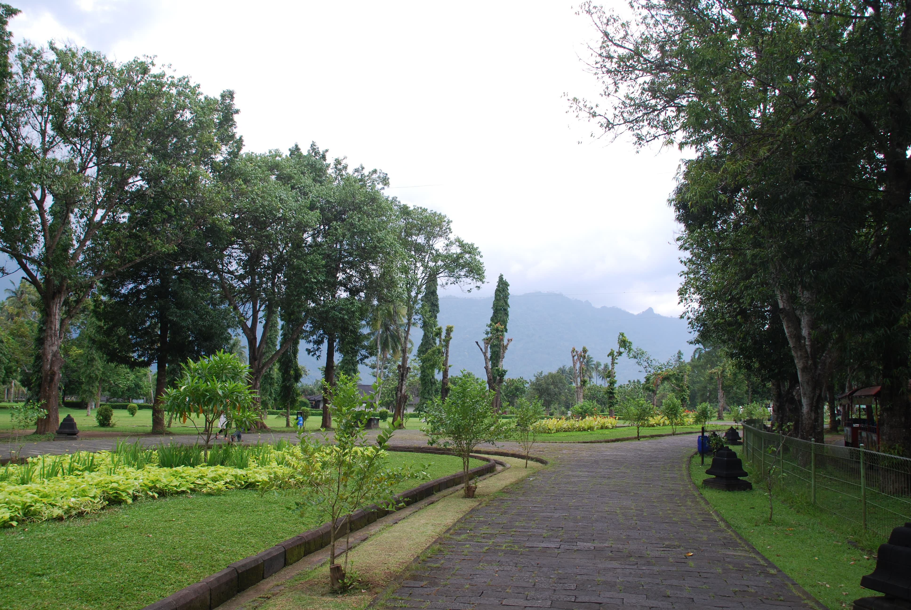
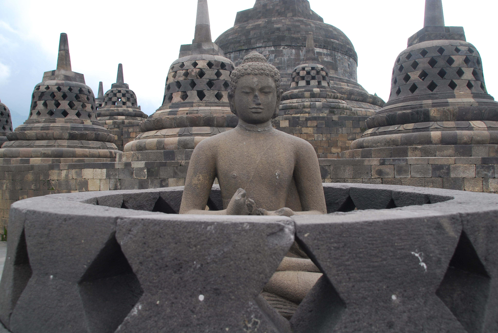
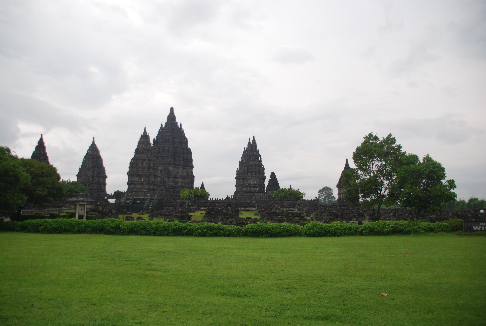
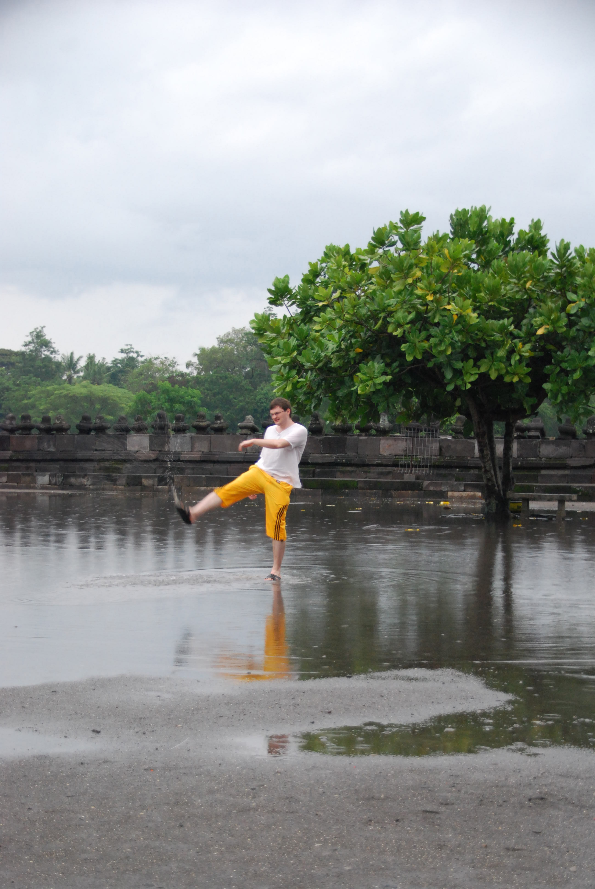
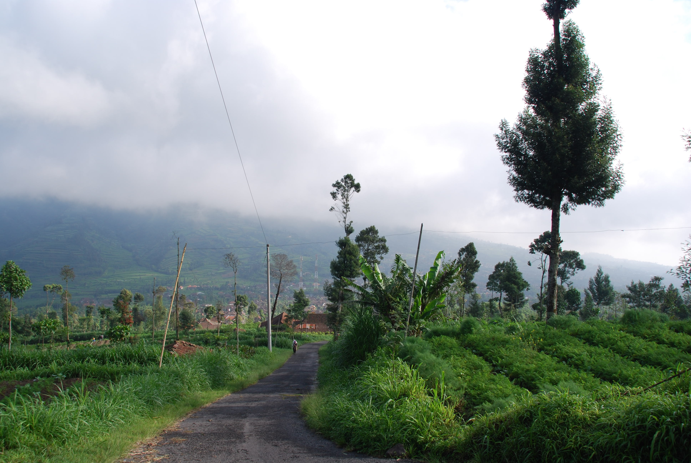
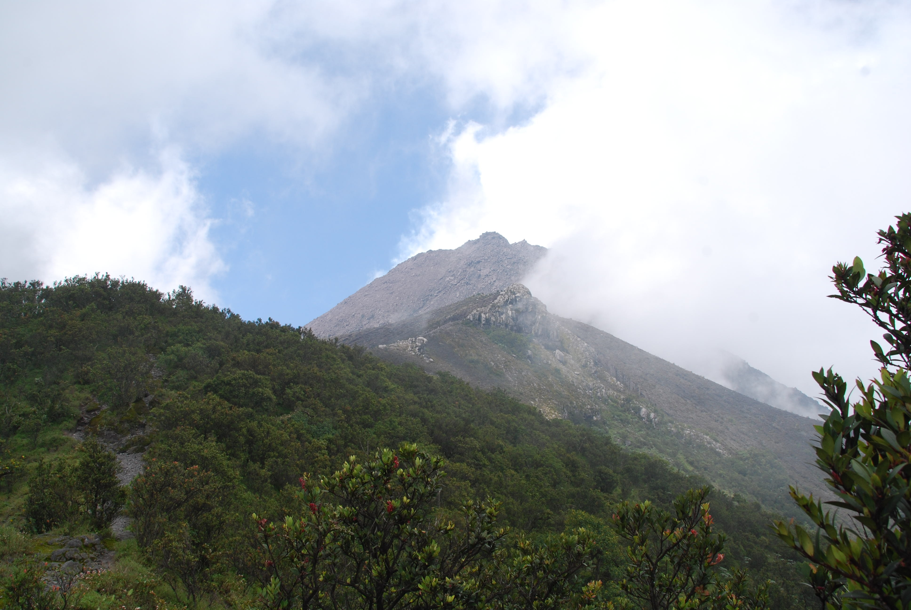
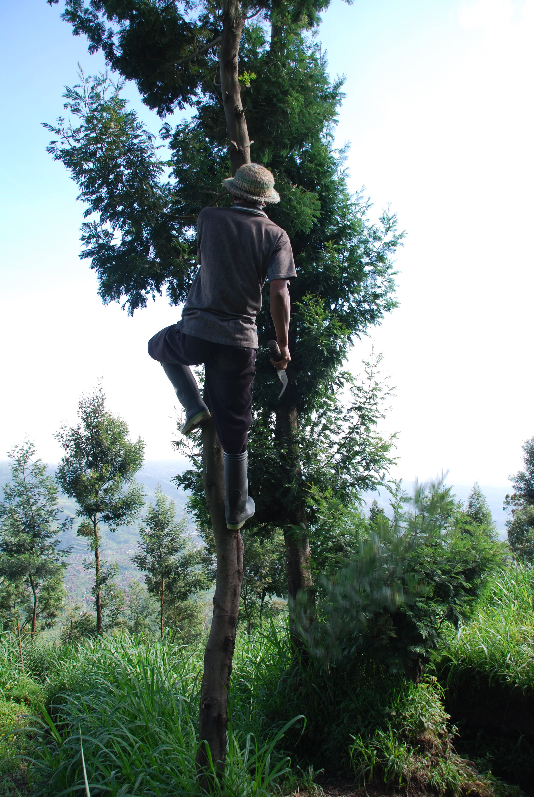
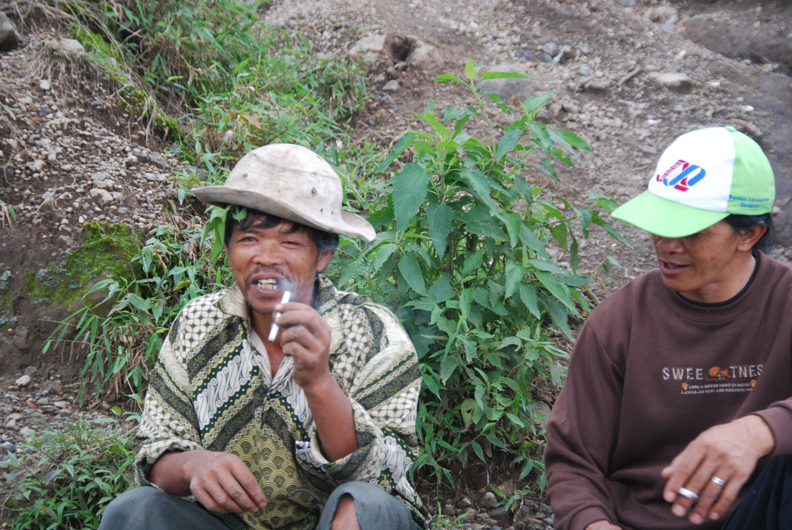
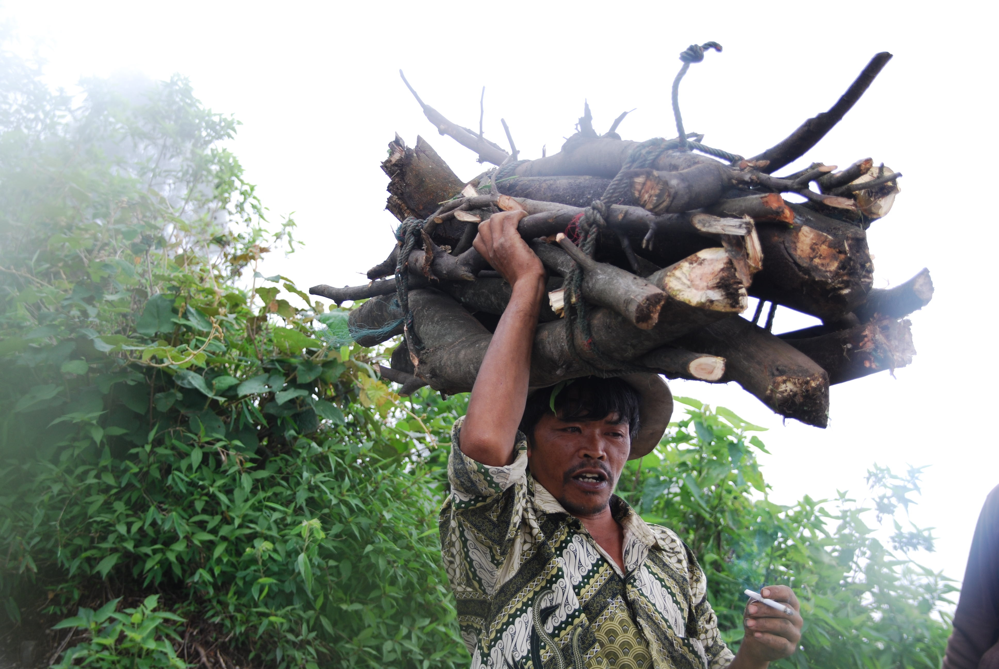

В Джокьякарту поезд прибыл в 12 часов ночи и как только мы вышли за пределы местной железнодорожной платформы (назвать вокзалом это сооружение язык не поворачивается) к нам сразу прицепился местный "френд" по имени Бенни, который пообещал показать нам самый хороший и недорогой отель. Бродить ночью по незнакомому городу в поисках гостиницы желания не было, по этому мы доверились новому другу, который не обманул, привел в достаточно приличный отель, в котором мы оплатили сначала одну ночь, а на следующее утро, пошатавшись по окрестным гостиницам, решили остаться здесь и на вторую ночь. Бенни потом еще ходил за нами тенью целый день и как только мы собирались потратить деньги (пообедать, сдать вещи в прачечную, заказать такси) появлялся возле нас так, будто бы это он нас привел в это заведение. Потом он наверняка брал какой-то свой процент с владельцев посещенных нами кафешек, но зато у нас, в отличии от кубинских френдов, денег за свои услуги никаких не просил, а в конце куда-то пропал даже не попрощавшись. Удивительный дядька.

Практически для всего нашего путешествия мы заранее купили билеты, кроме билетов на поезд Джакарта — Джокьякарта и билетов на самолет с острова Ява (Джокьякарта) до острова Бали (Денпасар). Сделали мы так для того чтобы уже на месте решить сколько времени проведем в Джакарте и Джокьякарте, по этому утром первого дня пребывания в Джокьякарте мы прикинули сколько времени понадобится на осмотр достопримечательностей и купили билеты на самолет до Денпасара. По нашим расчетам в Джокьякарте достаточно было провести всего 2 ночи (с учетом той одной которую мы там уже были): один день потратить на осмотр Боробудура и Прамбанана, а во второй день забраться на вершину вулкана Мерапи (всего-то 2,9 километра высотой) после чего вечером того же дня можно будет улететь на Бали.

За первый день мы осмотрели храмы Прамбанан и Боробудур, которые оказались очень похожими на камбоджийский Ангор Ват. Прогулка по этим местам была очень приятной, но из за того что Индонезия находится в южном полушарии Земли, сейчас там идет не зима, как у нас в северном полушарии, а лето — сезон дождей. В отличии от Таиланда, в котором я два раза бывал в сезон дождей и в котором эти дожди не сильно портят отдых, так как заканчиваются достаточно быстро, в Индонезии дожди длились по много часов, часто выпадали днем и немного подпортили нам осмотр древних храмов.
<!--more-->
Вечером, после осмотра храмов мы заказали экскурсию на вулкан Мерапи. Это один из немногих действующих вулканов, и путеводители обещали, что мы сможем увидеть настоящую кипящую лаву, если сумеем добраться до его кратера. Продавец экскурсий сразу предупредил нас, что подниматься на вулкан придется минимум 4 часа и идти туда лучше в ночь, чтобы встретить рассвет на его вершине. Мы же дядьку не послушали и решили что мы молодые и сильные взберемся по быстрому на вулкан с утра часика за 3, отдохнем там и успеем на самолет, билеты на который купили утром. Как же сильно мы ошибались!

После первых 20 минут подъема в горку стало очевидно, что за 3 часа мы подъем не осилим. Наклон горы изменялся от 45 до 60 градусов, удобных для передвижения тропинок было очень мало, местами дорога то была засыпана мелкими камнями, на которых легко было подскользнуться, то превращалась в кучу ямок, в которых некуда было поставить ногу, то сужалась до таких размеров, что даже компактные местные дядьки с трудом по ней проходили. После первого часа пути мы уже останавливались каждые 100-200 метров чтобы передохнуть и выпить воды.

В общем, за три часа, то есть примерно в 10 часов утра, мы взобрались на высоту примерно в 2,5 километра и дальше решили не подниматься, так как погода стала облачной и проводник сказал что лаву мы уже не увидим. Придется вернуться сюда еще раз но уже более подготовленными морально и физически.

Когда мы спускались с горы вниз, встретили одного очень интересного персонажа. В Индонезии очень много людей таскают различные тяжести не в руках, а на голове. Некоторые для этого используют специальные подставки под голову, а некоторые нет. Так вот на высоте двух с половиной километров мы встретили дядьку, который на голове тащил небольшую связку бревен. Для того чтобы сильно не болела голова он нарвал травы и сделал из нее мягкую подушку, которую подложил под вязанку. Руками бревна дядька не держал и смотреть на то как он перемещается вниз с горы было просто страшно. На всех этих крутых склонах с ухабами, которые мы осторожно прощупывали ногами, прежде чем сделать очередной шаг он бежал вниз как-будто нет всех этих ям и мелких скользящих камней.

Боробудур:

Прамбанан:

Вулкан Мерапи:

После возвращения в Джокьякарту нам пришлось снять еще на один день самый дешевый отель, чтобы принять душ (предыдущий отель был проплачен до 12 часов текущего дня, а за то чтобы арендовать комнату на пару необходимых нам часов там просили цену полного дня, без скидок), после чего мы отправились на остров Бали.

Это вторая часть описания поездки, ссылки на другие части:
- [Зима 2010. Поездка в Тайланд, Индонезию и Сингапур. Часть 1 — Пхукет и Джакарта]()
- [Зима 2010. Поездка в Тайланд, Индонезию и Сингапур. Часть 3 — Бали, Сингапур, Пхукет]()
- [Фотографии из поездки]().