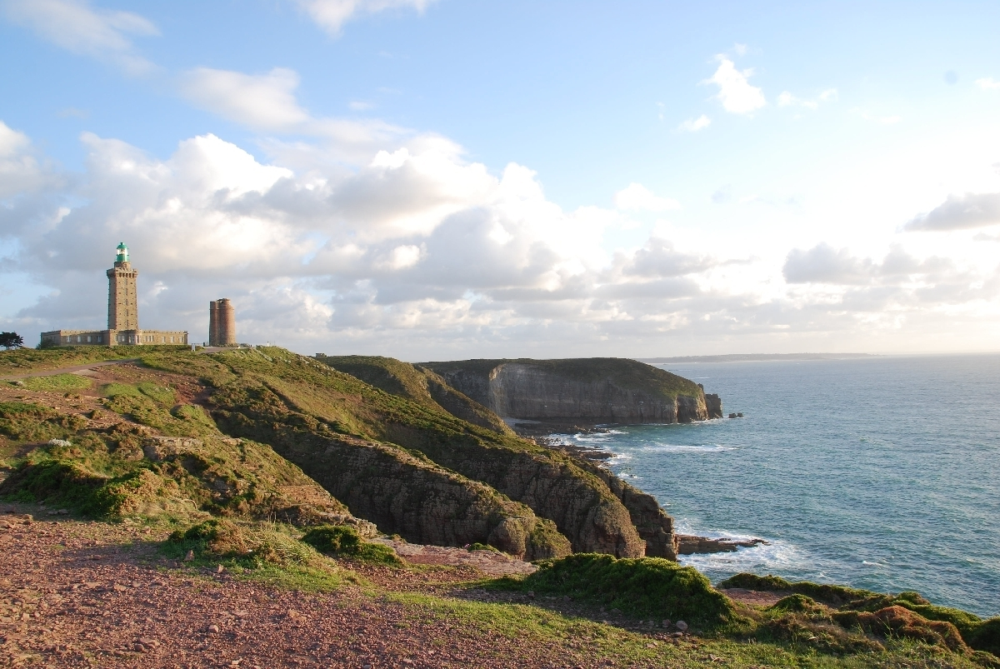

Я уже несколько раз бывал в Европе, но обычно попадал сюда на новогодние каникулы, а в это время погода здесь, как и в России, не самая лучшая, по этому я давно мечтал сгонять в Европу весной, в мае, когда природа расцветает и пейзажи становятся не такими унылыми как зимой.

В этом году в начале мая мне выдалсь возможность на три дня съездить в комадировку в Берлин, после чего я остался в Европе в отпуск на две недели и прокатился по Германии, Франции и Италии с заездом в Люксембург и Монако.

Примерный маршрут был спланирован заранее и выглядел примерно так: сначала 3 дня в Берлине в деловой поездке, затем еду на поезде во Франкфурт, там встречаюсь с другом, кототрый приедет туда из Милана на арендованной машине. Далее едем из Франкфурта через Страсбург и Люксембург в Париж, после пары дней в Париже держим путь на юг Франции в Марсель, из Марселя по Лазурному Побережью в сторону Италии (там это побережье зовется Лигурийским) и затем в Милан, а из Милана самолетом в Москву.

Билет в Берлин мне оплачивала компания, обратно летел за свой счет, но это даже и хорошо, так как я получил возможность лететь обратно откуда мне удобно, а не из Берлина. Билет на поезд в первый класс из Берлина во Франкфурт я купил сильно заранее до поездки и он обошелся мне всего в 65 евро, если бы брал его день в день, то пришлось бы раскошелиться на 145 евро за первый класс или 125 за второй (билет брал тут: http://bahn.de).

<iframe width="700" height="500" frameborder="0" scrolling="no" marginheight="0" marginwidth="0" src="https://maps.google.ru/maps/ms?msa=0&amp;msid=217644409277438667246.0004c2eb9d32b14da3353&amp;ie=UTF8&amp;t=m&amp;ll=47.901614,5.932617&amp;spn=14.739204,30.805664&amp;z=5&amp;output=embed"></iframe>
<!--more-->

В Берлине, первой точке своего маршрута, я провел три дня, но почти все время я сидел на семинаре, ради которого, собственно, сюда и ехал. Погулять по городу в общей сложности удалось часов 5. Посмотрели с коллегой местные достопримечательности: Берлинский собор, Бундехстаг, Бранденбургские ворота, остатки берлинской стены и так далее. Честно говоря, я не большой любитель разглядывать такие, относительно современные рукотворные достопримечательности, уж больно они... однообразные что ли: в каждом большом городе есть свой собор, телебашня, музей... скука. Хочется чего-то более необычного: водопады, [вулканы](), [соляные]() или [серные](http://wikimapia.org/1577738/ru/%D0%92%D1%83%D0%BB%D0%BA%D0%B0%D0%BD-%D0%98%D0%B4%D0%B6%D0%B5%D0%BD) озера, гейзеры или древности типа Мачу-Пикчу или Ангор Вата. По этому в Берлине глаз особо ни за что не зацепился, хотя он и произвел на меня впечатление красивого зеленого и очень спокойного города.

9 мая утром сходили в Трептов-парк, возложили цветы памятнику советскому солдату, в это время здесь было оочень много русских, причем, создавлось впечатление, что это в основном местные русские, а не туристы.

В итоге от Берлина остались впечталения как от одного из самых скучных городов за всю поездку, скучнее будут только Франкфурт и Страсбург.

Вечером 10 мая я сел в поезд до Франкфурта. В вагоне кроме меня был всего лишь один дядька, который сошел на первой же остановке и большую часть пути (4 часа) я в вагоне ехал один. Вагон очень комфотный: интернет (платный wi-fi), бар в соседнем вагоне, кондиционер, из-за которого я в итоге заболел и следующие несколько дней ходил с соплями и температурой. Удивительно, но местные лекарства (попросил в аптеке “самсинг агейнст зе сор сроат энд флю”) поставили меня на ноги за два дня, хотя по ощущениям, я был в таком состоянии, в котором свалиться должен был минимум на неделю.

Франкфурт, как следующая точка после Берлина, был выбран как самое удобное место, чтобы пересечься с моим другом и отправиться дальше в направлении Парижа. В отличии от Берлина, здесь, во Франкфурте, даже и посмотреть было особо не на что: не очень большой не очень чистый безликий город. Запомнился он только палаточным лагерем каких-то хипарей протестующих, как я понял, против политики руководства Евросоюза.

После Франкфурта мы заехали в Страсбург, я надеялся, что это будет интересный город: он находится на границе Франции и Германи и является парламентской столицей Европы. Но и тут оказалось скучно: побродили по городу, сделали несколько фотографий парламента и других административных зданий, затем прокатились на экскурсионном трамвайчике, в котором нам рассказали об истории города. Из рассказа узнали, что здесь раньше, пару веков назад, жили почти одни только мельники, веревочники и кожевенники... что интересного можно ожидать от города с такой историей? :) Хотя, надо отметить, что город очень чистый красивый и спокойный. “Спокойный” в данном контексте равносильно слову “скучный”.

На следующий день поехали в Париж, по пути завернув в Люксембург. Люксембург имеет необычный ландшафт: часть города находится в низине, часть на высоких холмах, в нем много высоких красивых мостов, но все его достопримечательности можно просмотреть не больше чем за полдня-день. Собственно, полдня мы здесь и провели и поехали дальше в Париж.

Началось мое знакомство с Парижем с пробки в центре города и проблем с поиском места для парковки. Вообще, проблема с парковками на улицах присуща почти всем европейским городам: все парковочные места здесь платные, причем дешевую парковку можно найти только на окраине города. За парковку машины в поземном гараже недалеко от отеля в итоге пришлось заплатить около 30 евро в сутки.

Второе впечатление от Парижа, которое оказалось вполне правдивым, — процентов 80 встреченных здесь людей — приезжие, ни в одном из других французских городов посещенных нами в дальнейшем мы не видели, как бы это потолерантнее сказать, столько много национальностей. Но, несмотря ни на что, город производит очень позитивное впечтление и создает хорошее настроение. Самое большое впечталение произвели на меня не достопримечтательности типа Эйфелевой башни и Триумфальной арки, а местные кафешки, особенностью которых является то, что они выставляют столики прямо на тротуары и располагают их так, что посетители сидят лицом к проходящим/проезжающим мимо толпам людей. Очень любопытно сидеть так, как в кинотеатре, и разглядывать лица проходящих мимо людей, местные жители таким образом могут просидеть целый вечер с одной бутылкой вина или бокалом пива.

Город очень удобно рассматривать, воспользоваашись услугами туристических автобусов. Такие автобусы ходят по маршруту, захватывающему все основные достопримечательности города, с интервалом 10-15 минут, в автобусе работает многоязчный аудио-гид (в том числе и на русском языке), который рассказывает о достопримечательностях, мимо которых едет автобус. Турист может купить билет на 1-2 дня на такой автобус (около 20 евро), кататься по городу и выходить хоть на каждой остановке, для того чтобы прогуляться и сделать несколько фотографий, после этого можно пересесть на следующий автобус того же маршрута и поехать к следующей достопримечательности.

Удивительная вещь. В день нашего пребывания в Париже, была иннаугурация французского президента, об этом я узнал вечером из новостей, в городе этот факт ни чем не был отмечен. В Москве примерно в это же время тоже была иннаугурация нашего президента и весь центр Москвы был перекрыт.

_Такая фотка есть у всех туристов :)_

_Вид с Эйфелевой башни_

_В метро удобно то, что на табло показывают через сколько минут приедет следующий поезд, а не сколько минут назад ушел предыдущий_

После двух ночей в Париже отправились на запад Франции. По пути заехали в Версаль — это город недалеко от Парижа, известный своими дворцами. Толпы туристов были тут еще больше чем возле Эйфелевой башни, по этому мы немного потолкались здесь, пофотографировали дворцы снаружи и поехали дальше. Кстати, отдельная очередь была для тех кто регистрировался через госуслуги... ну то есть через интернет можно было забронировать билет и не стоять в километровой очереди полтора часа, чтобы попасть внутрь.

На пути к следующей точке маршрута впервые столкнулись с особенностью присущего европейским странам сервиса: здесь, вне туриситческих маршрутов, невозможно пообедать примерно с часу дня и до семи вечера. Все местные кафешки посто закрываются и остается рассчитывать только на фастфуды, бутербродные на заправках и кебабные.

Первой дейстивтельно интересной дстопримечательностью на нашем пути был замок Ле Монт-Сен-Мишель. Добирались до него от города Авранш, где сняли гостиницу: сначала ехали на машине, но в километрах пяти от замка пришлось оставить машину на парковке и сначала пройтись пешком, потом проехать еще пару километров на “бюсе” (это так смешно по-французски называется автобус :) Замок стоит на острове и представляет из себя полноценный город с домами, магазинами, церковью и садом. Удивительно в древнем каменном замке на высоте несколько десятков метров над землей видеть сад из множества высоченных деревьев.

После замка мы поехали к маяку, расположенному на мысе Фреель (Cap Frehel). Это было первое место за все путешествие, где кроме нас, куда ни посмотри, вообще не было людей: ни местных, ни, тем более, туристов. Осмотрелись, пофоткались и решили закругляться, возвращаться в отель. По пути завернули на ужин в город Эрки. В 9-30 вечера здесь уже пусто: ни людей, ни машин. Также как и днем, после 9 вечера найти здесь открытую кафешку было непросто, а в той которую мы нашли нас накормили каким-то местным аналогом доширака... в общем, если хочешь кататься вне туристических троп, нужно учится подстраиваться под местное расписание, иначе придется или голодать, или мучиться с животом после фастфуда.

В этой кафешке открыл для себя группу Gossip. Смешно то, что дядька-официант (и он же владелец заведения) крутил диск группы еще за неделю до его официального релиза (http://www.amazon.com/A-Joyful-Noise-Gossip/dp/B007IX00Y8/ref=sr_1_1?ie=UTF8&qid=1340221445&sr=8-1&keywords=gossip) неужели спиратил? :)



Любоптыное наблюдение. Я уже говорил, что в Париже, по моим ощущениям, процентов 80 людей — приезжие, здесь, в относительной глубинке, негритянско-арабских лиц практически нет и, как следствие, гораздо больше красивых девушек.

На следующий день поехали на экскурсию на фабрику по производству игристых вин в городе Сомюр (Saumur). В нашем Абрау-Дюрсо такие вина смело называют шампанскими, но здесь, во Франции, к названиям относятся строго и, хотя на вкус обыватель не отличит шампанское из провинции Шампань от игристого вина из Сомюра, использовать слово “шампанское” для напитков произведенных в Сомюре нельзя.

Я уже был однажды на похожей фабрике в Абрау-Дюрсо и обратил внимание на интересное отличие в местном процессе производства. Игристые вина в течение нескольких лет созревают находясь в бутылках, при этом бутылки хранятся в специальных стеллажах горлышком вниз. За эти несколько лет у горлышка скапливается осадок, от которого необходимо избавиться. Раньше производители просто выливали треть бутылки с осадком, аналогичный метод используется и в Абрау-Дюрсо (по крайней мере так было в 2005 году). В Сомюре горлышко бутылки замораживают в специальном устройстве, лед с осадком и небольшим количеством вина примораживается к временной пробке и затем ледяная пробка с осадком просто извлекается из бутылки. Таким образом экономится значительная часть напитка.

Кстати, из этого древнего тех. процесса, связанного с выливанием трети бутылки, пошла традиция заворачивать горлышко бутылки в фольгу, чтобы скрыть, что она не полная. Сейчас, разумеется, бутылку доливают до полного объема, но традиция оборачивать бутылку в фольгу осталась.

Производство вин процесс очень интересный. Первое, что для меня показалось очень необычным, то, что здесь в Сомюре производство вин — это семейный бизнес, которому уже больше ста лет.

Второе — я уже говорил, что некоторые сорта вин “дозревают” в бутылках по несколько лет, при этом в Сомюре каждый год производится несколько десятков тысяч бутылок напитка, для хранения которых под городскими улицами вырублены длинные погреба, в которых нетрудно заблудиться без проводника. В таких погребах, для экономии места, используется необычная конструкция лестниц, ступеньки в них треугольные, широкая сторона у ступенек чередуется через одну. Наступать удобно только на широкую часть ступеньки, и лестница является своеобразным тестом на трезвость :) Ну и такая лестница при одинаковой высоте занимает вдвое меньше места чем обычная.

Здесь, на западе Франции, мы посмотрели все, что удалось уложить в наше двухнедельное путешествие и следующим этапом был Лазурный Берег, по этому из Сомюра мы поехали на юг, а на ночевку остановились в Клермон-Ферране (почти 400 км от Сомюра). Судя по описанию  путеводителе, место это довольно унылое, приехали мы сюда в ночь и рано утром поехали дальше.

Единственное чем запомнился город — это отель F1 (http://hotelf1.com), в котором мы остановились. Стоил он всего 40 евро на двоих, правда душ и туалет были на этаже, но, тем не менее, отель очень чистый и со всеми полагающимися плюшками вроде бесплатного вай-фая и завтраков.

Много раз я сталкивался с мнением: французы — снобы, они все свободно говрят на английском языке, но принципиально его не используют, по этому туристам, не знающим французского, приходится туго. На самом деле это нерпавда. Большинство французов тупо не знают английского языка, и в отеле F1 мы впервые столкнулись с тем, что женщина на ресепшене ни слова не понимала по-английски. Хотя, немотря на это, номер мы сняли без проблем, таки вполне очевидно чего хотят два человека с сумками и усталым видом, которые заваливаются в отель поздно вечером.

После ночи в Клермон-Ферране мы поехали в Марсель, а по пути заехали еще к одной местной достопримечательности: пещере Гуфр-де-Падирак (Gouffre de Padirac). Чтобы войти в эту пещеру нужно сначала на лифте или пешком спуститься вниз, вглубь огромного круглого ущелья, метров 50 глубиной. Сама пещера имеет длину больше 2 километров, в ней течет река, по которой можно прокатиться на лодке, есть множество сталактитов и сталагмитов. Еще в ней очень сыро и много туристов, но это место достойно того, чтобы его посмотреть.

_Измерялка скорости. Если мимо некоторых из них проехать без превышения скорости появляется надпись "Merci", правда, мы ее нечасто встречали._

_Очень вкусный местный яблочный сидр_

Вечером приехали в Марсель. Это портовый город и здесь, как и в Париже, огромное количество людей разных национальностей. Поели шаурмы в арабской кафешке. Официанты здесь тоже не говорили ни слова по английски, но, также как и в прошлый раз, у нас не было никаких поблем со взаимопониманием и нам приготовили самую вкусную шаурму из тех, что мне приходилось пробовать за мою жизнь.

Марсель — не самый красивый и интересный город из тех, что мы успели посетить за эту поездку, но у него есть интересная достопримечательность: здесь на высоченном холме расположена церковь Нотр-Дам-де-Град, с которой весь город виден как на ладони.

Следующими запланированными точками в маршруте после Марселя были Ницца, Канны и Сен-Тропе, в принципе, доехать из Марселя в Ниццу можно было бы и за один день, но мы по пути заехали еще в несколько мест, по этому дорога заняла больше одного дня.

Одним из мест был Fontaine de Vaucluse — живописная долина с горной рекой, вторым — город Гордес. Городом его назвать очень сложно, скорее это большая деревня с каменными небольшими двух-трехэтажными домами, которым на вид лет по 300. Все эти дома утопают в зелени и на город открываются очень красивые виды, но, боюсь, фотографиями не удалось передать всю красоту этих мест.

В Гордесе мы хотели переночевать, но, во-первых, отелей дешевле чем за 150 евро в сутки здесь не было (это за три звезды, а пятизвездочные были от 300 евро в сутки), а во-вторых, свободных мест здесь не было ни в одном отеле и все ресепционисты говорили, что номера распроданы на несколько недель вперед. Видно, очень популярное место.

В итоге переночеваи мы в Каваелоне, утром проехали через Лакост и далее через Вердонское ущелье приехали в Ниццу. В Ниццу мы приехали в день финала Лиги Чемпионов, но найти свободный столик в местных спортбарах не удалось, по этому матч смотрели по телевизору в отеле под пиццу без сыра (не ем я сыр) и бутылку розового вина за 5 евро. Вообще, цены на вина здесь первое время поражали: найти в магазине бутылку местного вина дороже чем за 2-3 евро очень сложно. Импортные итальянские вина стоят по 5 евро за бутылку. К концу путешествия цены удивлять перестали, зато начали они удивлять по возвращении в Москву — минимум 500 рублей за бутылку не самого вкусного вина, от которого потом еще и голова болеть может.

На следующий день прокатились по округе: заехали в Канны, здесь как раз проходил кинофестиваль, потолкались в толпе возле красной ковровой дорожки, затем заехали в Монако, в ближайшие выходные здесь должна была проходить гонка Формулы 1 по этому весь город уже был перегорожен, а дороги превращены в трассы. Вечером доехали до Сен-Тропе — очередной ключевой точки маршрута. Это местный курорт, мы хотели проваляться на его пляжах дня четыре, но в итоге первые два дня не переставая лил дождь и мы уехали отсюда через 2 дня.

Интересной особенностью отеля в Сен-Тропе было то, что ровно в половину девятого вечера здесь пропадал вай-фай, в первый день мы не обратили на это внимания, а во второй поняли, что девочка ресепционист, уходя вечером домой, отключала роутер и обезинтернечивала весь отель. Благодаря этому мы в первый день не смогли досмотреть финал Чемпионата Мира по хоккею: по местным телеканалам его не показывали, по этому пришлось смотреть трансляцию с айпада через интернет, но благодаря этому особому режиму доступа к интернету посмотреть мы смогли только первые полтра периода :)

Находясь в Сен-Тропе покатались по местной округе, поднялись на гору Кол Турини, высота которой 2 километра и температура на вершине была 0 градусов, при том что у поверхности моря было +20. Вершина горы была вся в снегу, в тумане и облаках.

Возвращаясь из Кол Турини заехали в город Фреджус, здесь заехали в какую-то арабскую кафешку (в других, как я уже говорил, с часу дня до семи вечера не кормят). Внутри какие-то местные ребята, 3 человека, рубились в Фифу на Плей Стейшене. Один из них в итоге оторвался от игры, принял у нас заказ и приготовил еду, а затем продолжил играть.

Непривычно дружелюбная атмосфера была в этом заведении: бар столов на 8-10, когда мы в него только пришли, то, кроме играющих в Плей Стейшн, никого здесь не было. За те час-полтора что мы тут просидели почти все столики заполнились посетителями, причем все входящие лично здоровались со всеми присутствующими, даже с нами, и перекидывались парой слов. Наверное это особенность всех небольших городов. Или просто местный менталитет. Не предствляю, чтобы такое кафе с такими посетителями появилось в Москве.

Ребята пытались общаться с нами, но вышло это не сильно плодотворно из-за языкового барьера, хотя это не помешало нам порубиться с ними один матч в приставку :)

Из Сан-Тропе уехали в Геную (недалеко от Генуи пошопились в аутлете, куда уж без этого), а после Генуи решили два сэкономленных в Сен-Тропе дня провести на каком-нибудь местном итальянском курорте. Выбрали деревню Портовенере (недалеко от города Ла Специя), по отзывам на букинг.коме это должно было быть приятное и недорогое место. Так и вышло, правда для купания в море было еще слишком холодно... впрочем, по местным меркам и для купания в бассейне было слишком холодно, по этому мы два дня провалялись на шезлонгах, изредка ныряя в бассйн на несколько минут, местные постояльцы смотрели на нас как на моржей.

Кстати, в отличии от Франции, в Италии погода была ясной и солнечной, хотя расстояние между Сен-Тропе и Портовенере не больше чем километров 300.

Оставил у меня самые лучшие воспоминания о Портовенере ресторан “Тритон”, расположенный километрах в пяти от отеля, нашли его мы через tripadviser.com. Это большой семейный ресторан, по ощущениям работает здесь человек пять. В мае, когда здесь не пик сезона, в ресторане было занято столика три-четыре, по этому мы не были обделены вниманием официанта и повара (но это внимание не было навязчивым). Я заказал гигантских креветок в чесночном соусе и какую-то потрясающе вкусно приготовленную рыбу. Конечно, вкус еде придало не только мастерство повара, но и местные колорит и атмосфера: мы сидели на свежем воздухе на улице под зонтом на берегу моря, официант, свободно говоривший по-английски, детально выспросил наши вкусы, порекомендовал вино, а позже, повар пришла узнать понравились ли нам приготовленные ею блюда.

***

Я еще ни разу не упоминал о дорогах во Франции и Италии. Асфальт на них в идеальном состоянии, это даже и не удивляло, а удивляло то, насколько они чистые. За две недели путешествия мы проехали больше семи тысяч километров: попадали в сильные дожди, бывали облитыми полностью водой из под колес проезжающих мимо фур, катались по горным дорогам, при этом машина осталась идеально чистой.

Еще одна особенность французских и итальянских дорог — платные участки, в день мы могли оставить на них до 75 евро на 500-600 километров пути. Катаясь по Франции мы в основном ездили по равнинным дорогам, а в той части Италии где были мы дороги в основном горные. Очень непривично сначала ехать метров 500 по тоннелю, вырубленному в скале, а сразу за ним выезжать на мост под 100 метров высотой и пару сотен метров длиной. И так несколько раз: тоннель-мост-тоннель-мост.

***

Из Портовенере мы отправились прямиком в Милан. Здесь мы провели всего один вечер: пошатались по центру города, прокатились на метро и поехали паковать чемоданы, готовиться к возвращению домой.

Это было одно из тех путешествий, из которого совершенно не хотелось возвращаться домой, я бы с удовольствием еще покатался по Европе месяц-два.

Больше фотографий можно посмотреть [в фотогалерее]().