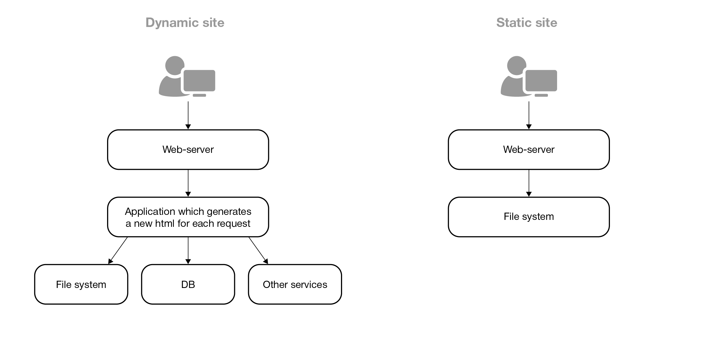

В [предыдущем блогпосте]() я рассказал об основных принципах работы IPFS и базовых возможностях предоставляемых системой. Здесь я рассмотрю немного более продвинутый пример и я расскажу о том, как в IPFS развернуть статический веб-сайт.

Для начала я в двух словах объясню в чём состоит различие между динамическими и статическими веб-сайтами. 

У динамических веб-сайтов за отдачу содержимого отвечает какая-то программа. Обычно такие программы пишутся на одном из языков вроде PHP, JavaScript, Python, Go и других. Запрос от браузера пользователя обслуживается веб-сервером, который перенаправляет его программе, а программа в ответ на лету генерирует какую-то html-страницу, которая возвращается пользователю. В теории, запросы к _одному и тому же_ адресу от _разных_ пользователей могут получать _разные_ ответы. Такой подход оправдан в случае если действительно есть необходимость отдавать разным пользователям разный контент при запросе одних и тех же страниц. Например, в социальных сетях одна и та же страница новостей для разных пользователей содержит разные новости.

В случае статического веб-сайта, все html-файлы заранее созданы и лежат в файловой системе сервера. Все запросы к сайту также обслуживаются веб-сервером, но он, минуя другие программы, отдаёт html-файлы с диска. Таким образом, _все пользователи_ получают абсолютно _одинаковые ответы_ на запросы к _одинаковым адресам_. Это максимально простой, быстрый и надёжный способ раздавать данные, который подходит для блогов вроде этого (хотя есть и куда более сложные сценарии использования статических сайтов).


IPFS -- это распределённое хранилище и оно не способно обслуживать динамические сайты, однако вполне подходит для статических. Фактически, статический веб-сайт это просто директория с набором html-файлов, css, скриптов и картинок. Чтобы разместить такой сайт в IPFS достаточно добавить эти файлы в систему командой вида `ipfs add ...`. Однако есть несколько важных нюансов, о которых я бы хотел рассказать.

Для того чтобы сделать статический веб-сайт доступным в IPFS нужно выполнить 4 шага:
1. запустить _ipfs daemon_,
2. в html-файлах использовать относительные ссылки на локальные ресурсы,
3. добавить _dnslink_,
4. использовать _IPNS_ и включить его автоообновление.

На самом деле, только первые два шага обязательны к выполнению, но последние два сделают доступ к сайту более удобным. Дальше я детальнее расскажу о каждом из шагов.

<!--more-->

### ipfs daemon

Перед тем как переходить к настройке доступа к IPFS-версии сайта следует упомянуть, что на сервере, который будет обслуживать IPFS-запросы к сайту, должен быть запущен _ipfs daemon_ -- программа реализующая поддержку протокола IPFS. Эта программа слушает несколько портов среди которых:
- `4001` -- обслуживает IPFS-запросы,
- `8080` -- это локальный веб-гейт,
- `5001` -- веб UI.

Порт `4001` должен быть открыт для доступа из интернета, без него ваша IPFS-нода не будет доступна другим узлам сети. Порт `8080` лучше тоже оставить доступным, но желательно поставить перед ним реверсивный прокси. Об этом я детальнее расскажу далее. А вот доступ к порту `5001` **обязательно должен быть закрыт для внешних пользователей**!

### Внутренние ссылки
В этом разделе я рассмотрю разные способы того, как в html-страницы могут быть встроены ссылки на локальные ресурсы сайта (картинки, скрипты и т.д). Идея состоит в том, чтобы сгенерировать html-страницы так, чтобы их можно было использовать и для раздачи обычным веб-сервером, и для раздачи в IPFS-сети.

Предположим, у нас есть директория `public` содержащая следующую иерархию файлов:
```bash
public
├── index.html
├── blog
│   └── 2025
│       └── ipfs
│           └── index.html
├── css
│   └── styles.css
├── js
│   └── scripts.js
└── img
    └── logo.png
```

Как будет выглядеть ссылка из `blog/2025/ipfs/index.html` на `img/logo.png`? Есть два способа поставить такую ссылку: 
- сделать её относительно корня сайта `/img/logo.png` или 
- относительно текущей директории `../../../img/logo.png`. 

В общем случае, если речь не идёт о публикации сайта в IPFS, первый способ предпочтительнее, так он более компактный и читабельный. Однако в нашем случае корректно будет работать только ссылка относительно текущей директории. Давайте разберем почему. 

Я уже [рассказывал]() о команде `ipfs add <filename>`, которая может быть использована для добавления файла в IPFS. Чтобы добавить в IPFS сразу всю директорию содержащую сайт нужно использовать флаг `-r`: `ipfs add -r <dirname>`. С этим флагом для каждого файла и каждой поддиректории будет вычислен свой CID и содержимое будет опубликовано в IPFS. 

Важным свойством IPFS является то, что при добавлении в систему целой директории, 

> каждый файл в директории может быть адресован как собственным CID-ом, так и путём относительно CID-а корневой директории! 

Предположим, что после добавления этой директории в IPFS мы получили следующие CID-ы:
|путь|CID|
|----|---|
| `public/img/logo.png`|`qwe456`| 
| `public`|`abc123`|

Используя CLI утилиту, файл `logo.png` можно получить двумя способами:
|CID|команда|
|---|-------|
|используя CID файла|`ipfs get qwe456`|
|используя CID корневой директории|`ipfs get abc123/img/logo.png`|

Если мы используем веб-гейт, скажем, `https://ipfs.io`, то файл будет доступен по адресам:
- `https://ipfs.io/ipfs/qwe456` и
- `https://ipfs.io/ipfs/abc123/img/logo.png`. 

Теперь предположим, что из `blog/2025/ipfs/index.html` ссылка на логотип стоит как `/img/logo.png`. В случае использования веб-гейта абсолютным путём для логотипа станет `https://ipfs.io/img/logo.png`, а такого файла, очевидно, не существует. 

А вот при использовании относительного пути к логотипу `../../../img/logo.png` он превратится в `https://ipfs.io/ipfs/abc123/blog/2025/ipfs/../../../img/logo.png`, что эквивалентно `https://ipfs.io/ipfs/abc123/img/logo.png` и по такому адресу файл будет корректно доступен.

Таким образом, одним из ключевых требований к сайту, публикуемому в IPFS является то, что

> при обращении к локальным ресурсам необходимо использовать исключительно относительные ссылки! 

В контексте IPFS есть еще третий способ поставить ссылку из `blog/2025/ipfs/index.html` на `img/logo.png`. Можно использовать IPFS-путь вида `/ipfs/qwe456`, но его недостаток в том, что такие ссылки не будут работать при раздаче контента обычным веб-сервером, минуя IPFS. С конфигурацией описанной выше

> одни и те же html-файлы могут быть использованы и для раздачи напрямую через web, и для раздачи по IPFS.

В моём случае, я использую генератор статических сайтов Hugo и для включения относительных ссылок мне было достаточно указать опцию `relativeURLs = true` в конфиге. Уверен, что для других генераторов сайтов это должно быть также просто.

В принципе, на этом этапе рассказ можно закончить. Если ваш статический сайт использует относительные ссылки, то вы можете его опубликовать командой `ipfs add -r <dirname>` и он станет доступным в IPFS. Но есть несколько важных оптимизаций, которые могут сделать IPFS-версию сайта менее ресурсоёмкой и более доступной. О них я расскажу далее.

### --nocopy
Теперь давайте рассмотрим еще один принципиально важный аргумент команды `ipfs add`. В предыдущем посте я [упоминал](), что по умолчанию при добавлении файла в IPFS оригинальный файл остаётся на своём месте, но для него в директории с мета-данными IPFS создаётся копия, разбитая на блоки по 256 Кб. Именно эти данные, а не оригинальный файл, раздаёт IPFS. 

Такой подход часто неприемлем. Например, в моём случае файлы сайта весят 10 Гб (_кстати, передаю привет разработчикам Hugo, которые [не считают багом](https://discourse.gohugo.io/t/hugo-creates-a-copy-of-each-image-for-each-translated-version-of-a-page/42922) то, что абсолютно идентичные статические файлы дублируются между разными языковыми версиями сайта_). Дублирование этих данных может увеличить цену хостинга и этого хотелось бы избежать.

Здесь на помощь приходит экспериментальная опция `--nocopy`, которая позволяет использовать оригинальные файлы для раздачи контента. При её использовании, в директории с мета-данными будут сохранены только ссылки на части оригинальных файлов. Эти данные займут какое-то место на диске, но объем данных будет на порядок-два меньше, чем без использования этого флага.

Опция `--nocopy` требует, чтобы файловая система поддерживала _mmap_ и стабильные _inodes_. В стандартных файловых системах Linux (Ext4, XFS, ZFS) она должна работать корректно. Для включения поддержки этой опции необходимо [включить поддержку filestore](https://github.com/ipfs/kubo/blob/ddfd776a99eb585538fcf5de152a9636c1ccb5bd/docs/experimental-features.md#ipfs-filestore):
```bash
romka@laptop:~$ ipfs config --json Experimental.FilestoreEnabled true
```

Теперь полная команда добавления файлов сайта в IPFS будет выглядеть как:
```bash
romka@laptop:~$ ipfs add -r --nocopy <dirname>
```

В моем случае сайт содержит около 13 тысяч файлов и мета-данные занимают около 100 Мб, в то время как оригинальные файлы весят более 10 Гб.

Здесь важно отметить, что без использования опции `--nocopy` удаление оригинального файла не удалит его из IPFS, в то время как с использованием `--nocopy` это не так. 

### Доступ к сайту через локальный веб-гейтвей 
Команда `ipfs add -r --nocopy <dirname>` напечатает в stdout полный список обработанных файлов и их CID-ы. Обработка файлов займет какое-то время, в моём случае около 5 минут. Последней строчкой будет выведен CID корневой директории и это самая важная строчка. Её нужно скопировать и использовать для доступа к сайту через любой веб-гейт. Например, `https://ipfs.io/ipfs/<CID>`.

К сожалению, таким способом работать сайт будет довольно медленно, так как пока контент сайта раздаётся лишь одним IPFS-узлом, поиск в IPFS работает медленно и велика вероятность того, что время от времени запросы к сайту через публичные гейты будут отдавать ошибку _504 Gateway Timeout_. Чтобы решить эту проблему нужно настроить доступ локальному веб-гейту. Я рекомендую не пробрасывать во внешний интернет порт 8080, а настроить поддомен, обслуживаемый nginx, который будет проксировать запросы ipfs daemon.

В моём случае конфигурация nginx довольно примитивна:
```
server {
    listen 80;
    server_name ipfs.romka.eu;
    
    location / {
        proxy_pass http://localhost:8080;
        proxy_set_header Host $host;
        proxy_set_header X-Real-IP $remote_addr;
        proxy_set_header X-Forwarded-For $proxy_add_x_forwarded_for;
        proxy_set_header X-Forwarded-Proto $scheme;
    }
}
```

Имея такую конфигурацию, к IPFS-версии сайта можно получить доступ используя URL вида `http://ipfs.romka.eu/ipfs/<CID>`. Один в один как и в случае с гейтом `https://ipfs.io`, только моему гейту не придётся долго искать файлы моего же сайта, так как они доступны на этом же сервере.

По умолчанию, такой гейт может использоваться для доступа к любому контенту в IPFS-сети, но это не то, чего мне бы хотелось. Я использую дешёвую виртуальную машину для обслуживания сайта и её ресурсов не хватит для того чтобы работать как полноценный IPFS-гейт. Поэтому я ограничил этот гейт [обслуживанием запросов только к локальным данным](https://github.com/ipfs/kubo/blob/ddfd776a99eb585538fcf5de152a9636c1ccb5bd/docs/config.md#gatewaynofetch):
```bash
romka@laptop:~$ ipfs config --json Gateway.NoFetch true
```

### dnslink
С настройками из предыдущего раздела страницы сайта будут доступны через локальный веб-гейтвей по URL вида `http://ipfs.romka.eu/ipfs/<CID>`. Это не очень удобно: юзерам сайта недостаточно набрать имя гейта в адресной строке браузера, им ещё нужно знать CID главной страницы, который будет меняться каждый раз при обновлении контента.

Для решения этой проблемы поможет фича, которая называется [dnslink](https://dnslink.dev/). Изначально dnslink был разработан авторами IPFS, но сейчас он используется в некоторых распределённых системах за пределами IPFS.

Идея dnslink очень проста: в настройки DNS-сервера можно добавить запись типа `TXT` с именем вида `_dnslink.<hostname>` и значением `dnslink=/ipfs/<CID>` или `dnslink=/ipns/<IPNS-hash>`. 

С такими настройками, каждый раз когда ipfs daemon получит запрос к `<hostname>` он автоматом сходит в DNS и прочитает в этой DNS записи какой путь использовать по умолчанию. Как следствие, для посетителей сайта отпадает необходимость знать CID запрашиваемого файла, он автоматически извлекается из DNS-записи.

### IPNS
С dnslink задача по определению CID главной страницы сайта перекладывается с плечей пользователя на плечи разработчика: если в dnslink использована IPFS-ссылка, то DNS-запись придётся обновлять каждый раз после обновления сайта. Это тоже неудобно, поэтому лучше воспользоваться IPNS -- InterPlanetary Name System. Я уже рассказывал об этой фиче в [предыдущем посте](). 

Идея простая: можно создать постоянный IPNS-псевдоним, связанный с криптографическим ключом, уникальным для каждого IPFS-узла. Этот IPNS-псевдоним можно связать с произвольным CID и использовать его в dnslink вместо IPFS-ссылки. Если CID главной страницы сайта поменяется, то достаточно выполнить команду `ipfs name publish /ipfs/<NewCID>`, чтобы обновить IPNS и не придётся менять настройки DNS.  

В моём случае настройки DNS выглядят примерно так:
```
ipfs            CNAME   romka.eu
_dnslink.ipfs   TXT     dnslink=/ipns/k51qzi5uqu5dizn6ymg87i7ni9oieklsqgchw1qk5lnr6ln88abocxg9ifv0cb
```
С ними IPFS-версия этого блога доступна по адресу http://ipfs.romka.eu. Ну, или через публичные веб-гейты по ссылке вида https://ipfs.io/ipns/k51qzi5uqu5dizn6ymg87i7ni9oieklsqgchw1qk5lnr6ln88abocxg9ifv0cb/.

Важно учитывать, что IPNS-записи имеют конечное время жизни, по умолчанию 24 часа, поэтому нужно настроить их автоматическое обновление. Это можно сделать при помощи следующей опции в конфиге IPFS:
```bash
romka@laptop:~$ ipfs config --json Ipns.UsePubsub true
```

### Итог

Собственно, это всё. После выполнения этих четырёх шагов сайт станет доступным по IPFS. 

Как я уже писал в предыдущем посте, на данный момент IPFS остаётся нишевым решением, а его применение в хостинге веб-сайтов скорее любопытный эксперимент, чем массовая практика. Однако, в будущем технология может найти более широкое применение.