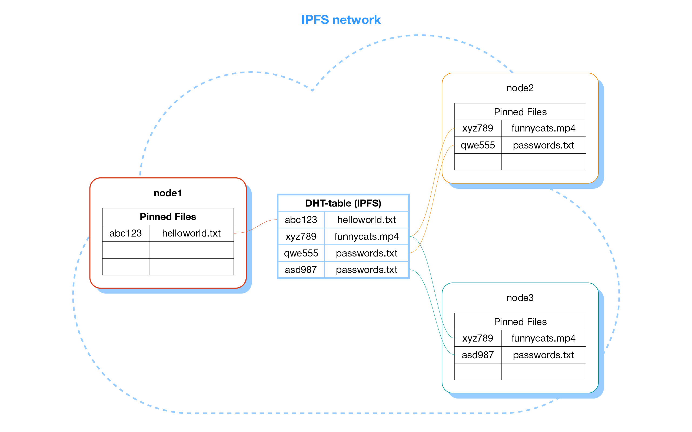
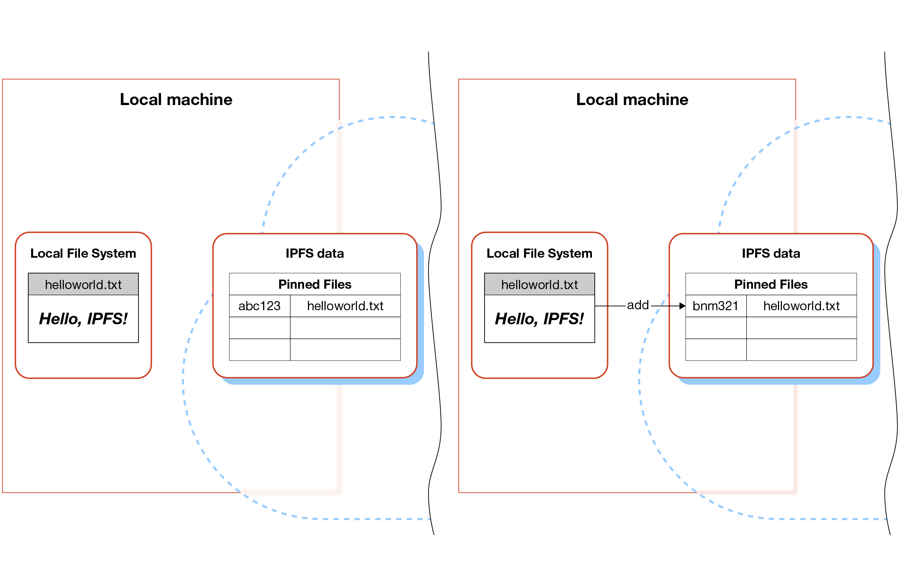

Simply put, **IPFS (InterPlanetary File System)** is a peer-to-peer distributed network designed for file storage and distribution. Anyone can join the network to share their own files and/or help distribute existing ones. The system's architecture was inspired by several other distributed systems, including _BitTorrent_, but unlike it, IPFS provides additional tools. For example, it can be used for hosting static websites.

The project has excellent [documentation](https://docs.ipfs.tech/concepts/), where you can find answers to any questions about the system. For a deeper understanding, I recommend reading this documentation as well as [the original white paper](ipfs-p2p-file-system.pdf) written by the project's authors. In this article, I will do my best to provide all the necessary information in a clear and structured manner to help anyone with no prior knowledge of IPFS understand its basic principles. I will also discuss the practical benefits of using IPFS. In the [next blog post](), I will explain how to deploy your own static website to IPFS.

<!--more-->

## Basic Principles and Content Addressing
In this section, I'm not going to dive deep into the technical details and will try to give a high-level overview of the basic concepts and terminology of IPFS.

### Not a File System

First of all, it's important to note that the _FS_ abbreviation can be misleading. IPFS is not a full-fledged POSIX-compatible file system. It can't be mounted in the OS or transparently used with regular file managers and OS-provided APIs. There is [experimental support](https://github.com/ipfs/kubo/blob/11bfb3c93b9a69031cb536b07916d562e680d5e8/docs/fuse.md) for mounting IPFS as a read-only file system and, with some limitations, as a writable one, but this topic is beyond the scope of this article.

By its nature, IPFS is a distributed key-value storage. In this system, keys represent "file names" and values are the addresses of the computers distributing those files. More precisely, IPFS is a distributed hash table (**DHT**). Simply put, it's a table with two columns: the first contains a key used to look up data, and the second contains information on where that data is stored. Each node holds only part of the table, so together, all nodes can store far more data than a single computer ever could.


All data in IPFS is immutable. If a new version of a file needs to be added, a new row will be inserted into the hash table, and the old one will eventually be removed by the garbage collector. The idea of immutable data goes against how traditional file systems work, where data can be written, modified, and deleted. That’s why building a full-fledged POSIX-compatible file system on top of IPFS is not a trivial task.

### But why is data immutable, and what is a point in it?

Every time a user adds a new file to IPFS, the system calculates a hash of the file (by default, _SHA-256_) and uses it as the file’s address. In IPFS, this hash is called a **CID** — _content identifier_. A key-value pair stored in the DHT is `(CID, node addresses)`. This means that in IPFS, the terms _CID_, _file hash_, and _IPFS address_ are interchangeable. This approach is known as _content-addressed data_.


The image above illustrates the following ideas. The local file `helloworld.txt` isn't automatically available in IPFS. When added to IPFS, its content is hashed -- in this example, `abc123` -- and this hash serves as the file's address. In this image, two nodes are distributing the same file, `funnycats.mp4`. Since they both have the same hash, `xyz789`, this confirms that the content is identical. Apart from that, both nodes are also distributing a file named `passwords.txt`, but these are actually different files, which is why their hashes don't match.

If a user modifies an existing file locally, the updated version won’t be automatically added to IPFS; it must be added manually. When the modified file is added to IPFS, a new CID is computed for it, and with a probability close to 100%, the new hash will differ from the previous one. As a result, the updated file will have a different address. Essentially, from IPFS's perspective, we’re not modifying a file but creating a new one.


And now we’re getting close to answering the question: "Why is data in IPFS immutable?"

> In practice, it's impossible to change the contents of a file in IPFS without changing its address.

This addressing scheme has a useful property: it guarantees that if someone sends you a link to a file and you successfully download it, then it's exactly the same file that was originally added to the system (assuming that the probability of a hash collision is negligible).

However, such an addressing scheme isn't always convenient. For example, when creating a website, it's obvious that the front page file, `index.html`, will be updated quite often. Sending an updated `index.html` CID to all site users isn't what developers want.

For such cases, IPFS provides a mechanism called **IPNS — InterPlanetary Name System**. It resembles DNS: the owner of an IPFS node can create an **IPNS** address linked to a cryptographic key. By default, each IPFS node has one such key, but additional keys can be generated if needed.

Then, the node owner can map an IPNS address to any CID and update this mapping when needed. In this case, there is obviously no guarantee that the same IPNS address will point to the same file today and tomorrow, but in the context of web hosting, it's an acceptable trade-off — the IPNS address of the front page always remains the same.

It's necessary to keep in mind, that IPNS-records have limited time to live (TTL) of 24 hours. To keep it active it's necessary to refresh it before it turns into digital dust.

### How IPFS Stores Data
Here, it's important to highlight another key feature of IPFS. I've already mentioned that when a file is added to IPFS, a hash is computed for it, but that's not the whole story. Each new file added to IPFS is split into 256 KB blocks, and these blocks are _copied_ to IPFS's metadata directory. Instead of serving the original file, IPFS distributes these blocks.

If a file is served by multiple nodes, then a user downloading it, just like in BitTorrent, can fetch different blocks from different nodes, even if those nodes haven’t downloaded the entire file but only some of its blocks. This reduces the load on each node serving the file and, in general, improves the system's reliability and performance.
 
However, this approach has a downside. In fact, an IPFS node stores both the original file and its chunked copy. This means that

> a node serving a file has to use twice as much disk space as the file itself takes!

This issue can be avoided by using the experimental `--nocopy` flag when adding files to IPFS. I'll talk more about this in the [blog post about hosting a static website on IPFS]().

### Network Architecture

The IPFS network consists of independent computers, each running the necessary software. These computers, or simply nodes, share their own files and help search for files requested by network users.

All nodes in the network are peers; there are no privileged nodes with priority over others or the ability to control them. However, some nodes act as bootstrap nodes. These nodes are usually maintained by the creators of the IPFS network, and their addresses are hardcoded into the IPFS client code.

Each time a new IPFS client starts, it connects to one of the bootstrap nodes to retrieve the addresses of a few neighbouring nodes. Bootstrap nodes are not the only way to discover other nodes in the network—more details can be found in the documentation.

So, each IPFS node is aware of a small subset of other nodes in the IPFS network and can send them requests to search for files. Each node maintains a local hash table with pairs `(CID, node addresses)` for files that it distributes. Globally, all nodes together form a distributed hash table. IPFS implements the [Kademlia DHT](https://en.wikipedia.org/wiki/Kademlia) algorithm.


When a node receives a request to find a file with a specific _CID_, it first looks for the file in its own hash table. If it doesn't have the file, it sends search requests to neighboring IPFS nodes. If those nodes also don't have it, they forward the request further.

Kademlia uses an intelligent neighbor selection algorithm to prevent cyclic queries like _A -> B -> C -> A_. In the end, if the requested _CID_ exists in the network, it will be found, and the address of the node hosting the file will be returned to the requesting node. The requesting node then downloads the file directly from the node distributing it, skipping intermediaries.

From this algorithm, it's clear that

> a file search might take a significant amount of time, sometimes up to dozens of seconds!

But what if a file with a non-existent CID is requested? The file search time is limited by the `QueryTimeout` parameter. If the file isn't found within this time, the search will be aborted.

The downloaded file is cached by the node, which can then start distributing it! The more frequently the file is requested by network users, the more nodes will cache it, making it easier and faster for others to find and download.

Typically, the cache lasts no more than 24 hours, but in practice, it can be cleared even sooner if the node owner triggers garbage collection. As a result, unpopular files are quickly removed from other nodes' caches and remain only on the original node that first distributed them.

> This property doesn't allow using IPFS as a permanent backup storage for your data. Most likely, your node will be the only one hosting your files most of the time.

If it's necessary to keep a file available not only on the original node but also on other nodes, those nodes need to pin it. In other words, they must prevent the file from being evicted from the cache during garbage collection.

In simple terms, file pinning means that the node owner allocates disk space for storing the file and dedicates part of their network bandwidth to sharing it.

Apparently, network participants have no incentive to pin random users' files, so they need to be given a reason to do so. Pinning services can be found online that will pin your files for a fee. Unfortunately, I'm not aware of any reliable pinning services with a reasonable pricing policy. Typically, such services charge $20 per month for 1 TB of data, which is comparable to the price of AWS S3, for example.

## How to Interact with IPFS

Let's say someone sends you a CID for a file stored in IPFS. How do you download it? Or maybe you want to upload your own file to IPFS, how do you do that? There are several ways to do this. Let's go over the main ones.

### Using the Official IPFS Client

This is the most universal but also the most complex approach. If you only need to download files from IPFS, it's better to skip this section and go straight to the next one.

The IPFS developers have created and open-sourced a [specification](https://specs.ipfs.tech/architecture/principles/) describing the protocol for IPFS node interaction. Anyone can create their own implementation of this protocol. There are several implementations written in different programming languages. The official one is called [Kubo](https://docs.ipfs.tech/install/command-line/), it includes a command-line tool and a web interface for accessing the IPFS network.

The client installation is trivial, I'm not going to talk about it, you can find the details in the documentation linked above.

With the command-line utility installed, we can easily add a file to IPFS:
```bash
romka@laptop:~/tmp$ echo "Hello, world!" > helloworld.txt
romka@laptop:~/tmp$ ipfs add helloworld.txt 
added QmeeLUVdiSTTKQqhWqsffYDtNvvvcTfJdotkNyi1KDEJtQ helloworld.txt
 14 B / 14 B [============================================] 100.00%
 ```
The string `QmeeLUVdiSTTKQqhWqsffYDtNvvvcTfJdotkNyi1KDEJtQ`, returned as output from the `ipfs add ...` command, is the CID of the added file. Now, this CID can be shared—for example, via messenger or email—allowing anyone with the CID to download the file. Download until the computer, serving this file, is turned on, or until the file remains in the caches of other nodes previously downloaded the file.

A file can be downloaded using the `ipfs get CID` command. For the file in the example above, the command would be:
```bash
romka@laptop:~/tmp$ ipfs get QmeeLUVdiSTTKQqhWqsffYDtNvvvcTfJdotkNyi1KDEJtQ
Saving file(s) to QmeeLUVdiSTTKQqhWqsffYDtNvvvcTfJdotkNyi1KDEJtQ
 14 B / 14 B [=========================================] 100.00% 0s
```
IPFS stores only the content of the added file, not its name. So if the target file name isn't specified, it will be saved with its CID as the filename.

Files added to IPFS with the `ipfs add` command are automatically pinned on the current machine. A list of all pinned files can be retrieved using the `ipfs pin ls` command:
```bash
romka@laptop:~/tmp$ ipfs pin ls
QmeeLUVdiSTTKQqhWqsffYDtNvvvcTfJdotkNyi1KDEJtQ recursive
```

To pin a remote file on your computer, use the command `ipfs pin add CID`.

### IPFS Web Gateways

Interacting with the IPFS network in the way described above is considered canonical, but it's too complicated if all you need is to download a file given its CID. In this case, the easiest and most convenient way is to use web gateways.

A web gateway is a regular web server that can be accessed through a standard web browser or any other HTTP client. The gateway can receive a request to download a file with a given CID, fetch it from IPFS, and return it to the user. This method doesn't require installing any additional software, a user only needs is a browser.

A list of available gateways can be found online. The two most popular ones are https://ipfs.io and https://dweb.link. The first is maintained by the IPFS authors.

To retrieve a file via a gateway using its CID, just open a URL like `https://ipfs.io/ipfs/<CID>` in your browser (for example, `https://ipfs.io/ipfs/QmeeLUVdiSTTKQqhWqsffYDtNvvvcTfJdotkNyi1KDEJtQ` for the file from the previous section). If you have an IPNS address instead of a CID, you can simply request `https://ipfs.io/ipns/<IPNS-hash>`.

### IPFS Companions for Browsers

Besides the methods mentioned above, you can access IPFS data by installing an IPFS Companion browser extension. With this extension, the browser can automatically handle links like `ipfs://<CID>` or `ipns://<IPNS-hash>`. The extension is smart enough to detect whether a local IPFS client is installed. If it's not, requests will be transparently routed to a public IPFS gateway; otherwise, they will be processed by the local client.

The Brave browser developers took it a step further and integrated an IPFS client directly into the browser, allowing it to process IPFS requests without the need for an extension or a local client. However, in my opinion, using a regular browser and an extension is a more practical choice than switching to a completely new browser.

## Practical Benefits of Using IPFS

Unfortunately, I haven't found a single viable example where using IPFS would be worth using. In every use case, there are more reliable, faster, and more convenient alternatives available.

The only scenario that seems useful is bypassing censorship and providing access to content blocked in certain regions. For example, an [IPFS version of Wikipedia](https://ru.wikipedia-on-ipfs.org) was created for this purpose. Since the content is served by dozens or even hundreds of independent nodes, blocking all of them is not easy. However, this scenario is quite niche and only applies to exceptional cases. Besides that, it's easier to bypass restrictions using tools like TOR, VPNs, and similar services. These tools run entirely on the client side and don't require any action from the content distributor.

Content immutability guarantees can be useful in certain cases. For instance, this property is used in Ethereum smart contracts. However, even in such cases, creating a complex ecosystem like IPFS is unnecessary overengineering. It's much simpler to store both a link to the original file and its hash directly in the smart contract.

IPFS doesn't guarantee file availability if the original node that published the file goes offline. So, it can't be used as a reliable mirror for, say, this blog or any other similar website.

Using pinning services isn't cheaper than using regular cloud providers or your own hardware for file storage. That's why building a resilient storage system on top of IPFS is neither cheaper nor more reliable than traditional methods.

[Hosting a static website on IPFS](), which I'm going to describe in the next blog post, is nothing more than a curious toy. Accessing such a site via an external web gateway is painfully slow due to slow content retrieval, so setting up a local gateway is necessary to speed up file delivery. In its turn, this offers no practical advantages over serving a website with a regular web server. Moreover, it's still recommended to place a web server in front of the IPFS web gateway as a reverse proxy.

The IPFS network is designed solely for serving static content. Running dynamic applications on it is fundamentally impossible by design.

In the case of distributing heavy content with sudden spikes in demand, IPFS can be useful, but in this scenario, it's no more convenient than BitTorrent.

Overall, IPFS is quite an interesting project. Maybe in the future, if internet censorship becomes too strict, systems like IPFS could go mainstream. But for now, it's just an amusing toy for IT geeks.