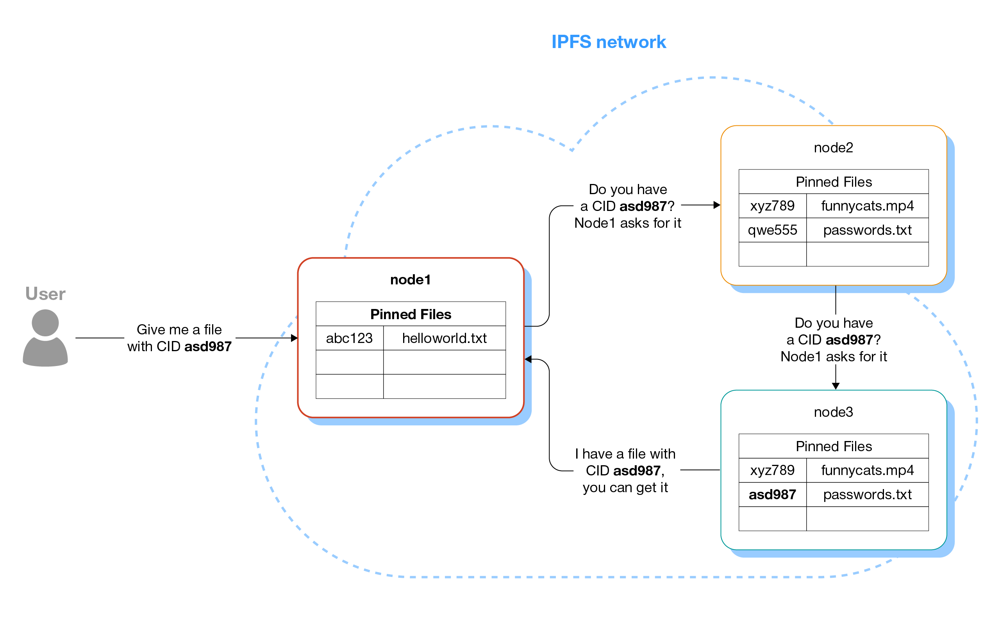

Коротко говоря, <strong>IPFS (InterPlanetary File System)</strong> -- это одноранговая распределённая сеть, позволяющая организовать хранение и распространение файлов. Любой желающий может присоединиться к сети для того чтобы начать распространять собственные данные и/или помочь распространению существующих в сети файлов. Архитектура системы была вдохновлена известными распределенными системами, в том числе _BitTorrent_, но в отличие от него предоставляет дополнительные инструменты. Например, IPFS может быть использована для размещения статических веб-сайтов.

Для проекта написана отличная [документация](https://docs.ipfs.tech/concepts/), в которой можно найти ответы на все интересующие вопросы об этой системе. Для более глубокого понимания системы я рекомендую прочитать эту документацию, а также [оригинальную статью](ipfs-p2p-file-system.pdf) от авторов проекта. В этой статье я постараюсь максимально доступно и последовательно дать всю информацию, необходимую для того, чтобы читатель с нулевыми знаниями об IPFS смог понять основные принципы её работы. Также я здесь порассуждаю о практической пользе от IPFS. В [следующем посте]() я расскажу о том как развернуть в IPFS собственный статический сайт.

<!--more-->

## Основные принципы функционирования сети и способы адресации
В этом разделе я не буду вдаваться в технические подробности и детали реализации, а постараюсь верхнеуровнево объяснить терминологию и основные концепции IPFS. 

### Не файловая система

Первым делом надо отметить, что аббревиатура _FS_ в названии системы может вводить в заблуждение. IPFS не является полноценной POSIX-совместимой файловой системой. Её нельзя примонтировать в ОС и прозрачно использовать через привычные файловые менеджеры или API операционной системы. Есть [экспериментальная поддержка](https://github.com/ipfs/kubo/blob/11bfb3c93b9a69031cb536b07916d562e680d5e8/docs/fuse.md) работы IPFS как файловой системы доступной на чтение и, с некоторыми ограничениями, на запись, но эта тема выходит за рамки этой статьи.

По своей природе IPFS -- это распределённое хранилище типа ключ-значение, где ключами являются "имена файлов", а значениями -- адреса компьютеров, раздающих этот файл. Если быть еще точнее, то IPFS -- это распределённая хеш-таблица (distributed hash table, **DHT**). Другими словами, это таблица, состоящая из двух колонок, в первой колонке хранится ключ, по которому данные ищутся, во второй -- информация где эти данные можно найти. Каждый из узлов системы хранит только часть таблицы, поэтому все узлы вместе могут хранить объем данных значительно превышающий ресурсы одного компьютера.


Все данные хранящиеся в IPFS неизменяемы. Если нужно добавить в систему обновлённую версию файла, то в хеш-таблицу будет добавлена новая строка, а старая со временем будет удалена сборщиком мусора. Идея неизменяемости данных противоречит идеям привычных файловых систем, где данные могут быть записаны, изменены, удалены, поэтому это нетривиально реализовать полноценную POSIX файловую систему поверх IPFS.

### Но почему данные неизменяемы и в чём смысл этого?

Каждый раз, когда пользователь добавляет новый файл в IPFS, система вычисляет хеш-сумму этого файла (по умолчанию используется алгоритм _sha-256_) и полученный хеш становится адресом файла. Вычисленный хеш файла в контексте IPFS называется **CID** -- _content identifier_. Пара ключ-значение, которая записывается в DHT -- это пара: `(CID, адреса узлов)`. Таким образом, в IPFS термины _CID_, _хеш файла_ и _IPFS-адрес файла_ являются синонимами. Эта концепция получила название _контентно-адресуемые данные_ (_content-addressed data_).


Картинка выше иллюстрирует следующие идеи. Локальный файл `helloworld.txt` не попадает автоматически в IPFS. После добавления файла в IPFS для его содержимого вычисляется хеш, в данном примере `abc123`, и этот хеш используется как адрес файла. Две ноды на схеме распространяют один и тот же файл `funnycats.mp4`, одинаковость контента отражается тем, что у файлов одинаковый хеш `xyz789`. Также, каждая из двух нод выше распространяет файл `passwords.txt`, но это два разных файла, что приводит к тому, что у файлов разные адреса.

 Если пользователь локально меняет существующий файл, то, обновлённый файл не будет автоматически добавлен в IPFS, его нужно добавить заново. При добавлении в IPFS изменённого файла для него опять будет посчитан CID, который почти со 100% вероятностью будет отличаться от старого. Как следствие, изменится и "адрес" обновлённого файла. Фактически, с точки зрения IPFS, мы не меняем существующий файл, а просто создаём новый.
 

И здесь мы подходим к ответу на вопрос "почему данные в IPFS неизменяемы?":

> На практике невозможно изменить содержимое файла в IPFS не изменив его адрес.

Такая адресация удобна тем, что система гарантирует, что если вам прислали ссылку на файл и его удалось скачать, то это совершенно точно тот же файл, который изначально был загружен в систему (в данном случае я исхожу из того, что вероятность коллизий при подсчете хеша ничтожно мала).

Однако, такой подход не всегда приемлем. Например, в контексте создания веб-сайта очевидно, что файл главной страницы `index.html` будет обновляться довольно часто. Рассылать всем пользователям сайта новый CID изменённого index.html это явно не то чего хотят разработчики. Для таких случаев в IPFS предусмотрен механизм, называемый **IPNS -- InterPlanetary Name System**. Этот механизм схож с DNS: владелец IPFS-узла может создать **IPNS**-адрес, связанный с криптографическим ключом. По умолчанию каждый IPFS-узел имеет один такой ключ, но можно создавать дополнительные.

Далее владелец узла может указать, какой CID должен быть доступен через этот IPNS-адрес, и при необходимости обновлять его. В этом случае, очевидно, пропадает гарантия того, что сегодя и завтра по одному и тому же IPNS-адресу будет доступен один и тот же файл, но в контексте веб-хостинга это приемлемый компромисс -- IPNS-адрес главной страницы сайта всегда остаётся неизменным.

Важно учитывать, что IPNS-запись имеет время жизни (time to live, TTL) в 24 часа. Чтобы поддерживать её в работоспособном состоянии её необходимо обновлять прежде чем она "протухнет".

### Как IPFS хранит раздаваемые данные

Здесь важно отметить ещё одну ключевую особенность IPFS. Ранее я упоминал, что при добавлении файла из локальной файловой системы в IPFS, для него вычисляется CID, но это еще не всё. Каждый новый добавленный файл разбивается на блоки по 256 Кб и эти блоки _копируются_ в директорию с мета-данными IPFS. Далее IPFS раздаёт другим пользователям сети не оригинальный файл, а созданные блоки.

Если один файл распространяется несколькими узлами IPFS, то пользователь скачивающий файл, прямо как в BitTorrent, имеет возможность скачать разные блоки с разных узлов, даже если эти узлы сами скачали не весь файл, а только часть его блоков. Это снижает нагрузку с каждого отдельного узла раздающего файл и в целом повышает надёжность и скорость системы.

Однако такое решение имеет и обратную сторону. Фактически, IPFS узел хранит и оригинальный файл, и его копию разбитую на блоки. Это означает, что 

> узлу, раздащему файл, нужно потратить вдвое больше места на диске чем занимает файл. 

Эта проблема может быть устранена использованием экспериментального флага `--nocopy` при добавлении файлов в IPFS. Я расскажу об этом в [блог посте про разворачивание статического сайта в IPFS]().

### Архитектура сети

IPFS-сеть представляет собой множество независимых компьютеров, на каждом из которых установлено необходимое программное обеспечение. Каждый из компьютеров, или другими словами узлов сети (nodes), раздает свои файлы и может участвовать в раздаче и поиске файлов, запрашиваемых пользователями сети.

Все узлы сети равнозначны, среди них нет привелигированных узлов имеющих приоритет перед другими или имеющих возможность управлять остальными узлами. Однако часть узлов выполняют роль bootstrap-узлов. Такие узлы обычно поддерживаются создателями IPFS-сети и их адреса зашиты в код IPFS-клиентов. Каждый раз, когда запускается новый IPFS-клиент, он подключается к одному из бутстрап-узлов, чтобы получить адреса нескольких соседних узлов. Бутстрап-узлы это не единственный способ узнать адреса других компьютеров в сети, подробности можно найти в документации.

Итак, каждый IPFS-узел осведомлён о небольшом подмножестве других узлов IPFS-сети и может посылать им запросы на поиск файлов. Каждый узел поддерживает локальную хеш-таблицу с парами `(CID, адреса узлов)` для файлов, раздаваемых текущим узлом. Глобально все узлы вместе поддерживают распределенную хеш-таблицу, в IPFS используется реализация алгоритма [Kademlia DHT](https://en.wikipedia.org/wiki/Kademlia).



Когда узел получает запрос на файл с определённым _CID_, то он сначала пытается найти файл с таким адресом у себя. Если файла нет, то узел рассылает запросы на поиск файла соседним IPFS-нодам. Если и у них файла нет, они передадут запрос дальше. Причем в Kademlia реализован алгоритм выбора соседей достаточно умный, чтобы избежать циклических запросов вида _A -> B -> C -> A_. В конечном итоге, если файл с запрошенным CID действительно существует на одном из узлов сети, то он будет найден и адрес узла, раздающего этот файл, будет передан узлу запросившему файл. Далее исходный узел скачает файл напрямую с узла раздающего файл, минуя соседей.

Из этой схемы очевидно, что 

> поиск файла может занять существенное время, иногда десятки секунд!

Но что если запрошен несуществующий CID? Время поиска файла ограничивается параметром `QueryTimeout` и если файл не был найден за указанное время, то поиск будет прерван.

Скачанный файл попадёт в кеш ноды скачавшей файл и теперь эта нода также сможет раздавать его! Чем чаще запрашивается файл пользователями разных узлов сети, тем в кешах большего числа нод он осядет и тем проще и быстрее его будет найти и скачать другим пользователям! Обычно, кеш хранится не дольше 24 часов, но может просуществовать и того меньше, если владелец узла запустит процедуру сборки мусора (garbage collection, gc). Таким образом, непопулярные файлы будут быстро вычищены из кешей других узлов и останутся только на оригинальной ноде, начавшей раздачу файла. 

> Это свойство не позволяет использовать IPFS как постоянное хранилище резервной копии ваших данных. Скорее всего, ваша нода большую часть времени будет единственным узлом распространяющим ваши файлы.

Если есть необходимость сделать так, чтобы файл раздавался не только нодой опубликовавшей его, но и другими, нужно чтобы другие ноды запинили (pin) этот файл, то есть отметили файл, чтобы он не удалялся при очистке кеша. Фактически, пинниг файла означает, что владелец ноды, запинившей файл, выделяет на своём компьютере место на жестком диске для хранения этого файла и часть своего сетевого трафика для его раздачи.

Очевидно, у участников сети нет мотивации бесплатно пинить файлы случайных пользователей и им нужно дать такую мотивацию. В интернете можно найти pinning-сервисы, которые за плату готовы пинить и раздавать ваши файлы вместо вас. К сожалению, мне неизвестны надёжные пиннинг сервисы со сколько-нибудь адекватной ценовой политикой. Обычно, речь идёт о минимальной стоимости в 20 долларов в месяц за терабайт данных, что, например, сравнимо с ценой AWS S3. 

## Как взаимодействовать с IPFS

Предположим, кто-то прислал вам CID файла, расположенного в IPFS, как скачать этот файл? Или вы хотите разместить свой файл в IPFS, как это сделать? Есть несколько способов, рассмотрим основные. 

### Использование официального клиента IPFS

Этот способ самый универсальный, но и самый сложный. Если вам нужно только скачивать файлы из IPFS, то лучше сразу перейти к следующему разделу.

Разработчики IPFS создали [открытую спецификацию](https://specs.ipfs.tech/architecture/principles/) описывающую протокол взаимодействия узлов сети, поэтому любой желающий может создать свою реализацию этого протокола. Cуществует несколько реализаций протокола написанных на разных языках программирования. Официальная реализация называется [Kubo](https://docs.ipfs.tech/install/command-line/), она содержит утилиту командной строки (CLI tool) и веб-интерфейс для доступа к IPFS-сети.

Установка клиента тривиальна, я не буду останавливаться на этом подробнее, детали можно найти в документации по ссылке выше.

Имея установленную утилиту командной строки, мы можем легко добавить файл в IPFS:
```bash
romka@laptop:~/tmp$ echo "Hello, world!" > helloworld.txt
romka@laptop:~/tmp$ ipfs add helloworld.txt 
added QmeeLUVdiSTTKQqhWqsffYDtNvvvcTfJdotkNyi1KDEJtQ helloworld.txt
 14 B / 14 B [============================================] 100.00%
 ```
Строка `QmeeLUVdiSTTKQqhWqsffYDtNvvvcTfJdotkNyi1KDEJtQ`, полученная в ответ на `ipfs add ...` это и есть CID добавленного файла. Теперь этим CID можно как-то поделиться, например через мессенджер или электронную почту, и любой желающий сможет скачать этот файл. Скачать до тех пор пока включен компьютер, раздающий этот файл, или пока этот файл не удалён из кешей узлов, скачавших файл.

Скачать файл из сети можно с помощью команды вида `ipfs get CID`, в примере с файлом выше команда будет иметь следующий вид:
```bash
romka@laptop:~/tmp$ ipfs get QmeeLUVdiSTTKQqhWqsffYDtNvvvcTfJdotkNyi1KDEJtQ
Saving file(s) to QmeeLUVdiSTTKQqhWqsffYDtNvvvcTfJdotkNyi1KDEJtQ
 14 B / 14 B [=========================================] 100.00% 0s
```

В IPFS сохраняется содержимое добавляемого файла, но не его имя, поэтому если при скачивании файла явно не указать имя, с которым его нужно сохранить, то по умолчанию в качестве имени будет использован CID.

Файлы, добавленные в IPFS с помощью команды `ipfs add`, автоматически пинятся на текущей машине. Список запиненых файлов можно посмотреть с помощью команды `ipfs pin ls`:
```bash
romka@laptop:~/tmp$ ipfs pin ls
QmeeLUVdiSTTKQqhWqsffYDtNvvvcTfJdotkNyi1KDEJtQ recursive
```

Запинить чужой файл на своем компьютере можно с помощью команды `ipfs pin add CID`.

### Веб-гейтвеи

Взаимодействие с IPFS-сетью способом описанным выше можно считать каноническим, но он слишком сложен в случае если вам всего-лишь нужно скачать файл, зная его CID. В таком случае самым простым и удобным способом является использование веб-гейтвеев (web gateway). 

Веб-гейтвей -- это обычный веб-сервер, с которым можно взаимодействовать барузером или любым другим http-клиентом. Гейт может принять от браузера запрос на скачивание файла с заданным CID, сходить за этим фалом в IPFS и вернуть его пользователю. Таким образом, этот способ не требует от пользователя установки дополнительного софта, достаточно иметь только браузер.

Список гейтов можно найти в интернете, два самых популярных это https://ipfs.io и https://dweb.link. Первый поддерживается авторами IPFS.

Чтобы получить доступ к файлу через гейт имея CID этого файла, достаточно в браузере открыть адрес вида `https://ipfs.io/ipfs/<CID>` (например, `https://ipfs.io/ipfs/QmeeLUVdiSTTKQqhWqsffYDtNvvvcTfJdotkNyi1KDEJtQ` для файла из предыдущего раздела). Если вместо CID у вас есть IPNS-адрес, то достаточно запросить `https://ipfs.io/ipns/<IPNS-hash>`.

### IPFS компаньоны для браузеров

Помимо способов выше, для доступа к данным в IPFS можно установить IPFS companion расширение к браузеру. С этим расширением браузер сможет автоматически обрабатывать ссылки вида `ipfs://<CID>` и `ipns://<IPNS-hash>`. При этом расширение достаточно умное для того чтобы понять установлен ли у вас локальный IPFS-клиент или нет. Если не установлен, то запросы будут перенаправлены на один из публичных гейтов. Если установлен, то запрос будет обработан локальным клиентом.

Разработчики браузера Brave пошли дальше и интегрировали в него IPFS-клиент, поэтому он может обрабатывать запросы к IPFS-сети без установки плагина и локального клиента. Но, лично мне, связка "привычный браузер + плагин" кажется более разумной чем установка нового браузера. 

## Практическая польза от использования IPFS

К сожалению, для себя я не нашел ни одного примера, в котором использование IPFS было бы оправданым. В любом сценарии использования есть более надёжные быстрые и удобные альтернативы.

Единственный сценарий, который кажется полезным -- это обход цензуры и предоставление доступа к контенту заблокированному в тех или иных регионах. Например, с такой целью создана [ipfs-версия Википедии](https://ru.wikipedia-on-ipfs.org). Так как контент раздаётся с десятков и сотен независимых друг от друга узлов, заблокировать все их непросто. Но конкретно этот сценарий нельзя назвать общим, он подходит только для исключительных случаев. Кроме того, для обхода блокировок проще использовать инструменты вроде TOR, VPN и других. Эти инструменты полностью работают на клиенте и не требуют никаких действий от распространителя контента.

Гарантия неизменяемости загруженных данных может быть полезной в некоторых случаях. Например, это свойство используется в смарт-контрактах в Etherium. Но даже для таких случаев изобретение такой сложной экосистемы как IPFS это избыточное переусложнение. Достаточно вместе с ссылкой на оригинальный файл положить в смарт-контракт его хеш.

IPFS не даёт гарантий сохранности файлов в случае если исходная нода опубликовавшая файл становится недоступной. Поэтому её нельзя использовать как надёжное зеркало, например, для этого или другого подобного блога.

Использование pinning сервисов не дешевле использования привычных облачных провайдеров или собственного оборудования для хранения данных. Поэтому создание отказоустойчивого хранилища данных поверх IPFS не дешевле и не надёжнее использования классических методов.

[Хостинг статического сайта на IPFS](), о котором я расскажу в следующем посте, это не более чем любопытная игрушка. При доступе через внешние веб гейты система работает дико медленно, из-за медленно работающего поиска, и нужно настраивать доступ через собственный гейт, чтобы ускорить раздачу своего контента. Это в свою очередь не имеет абсолютно никаких практических преимуществ перед раздачей контента обычным веб-сервером. Более того, веб-сервер всё равно лучше поставить перед IPFS веб гейтом как реверсивный прокси.

IPFS-сеть предназначена только для раздачи статического контента, создание динамических сервисов работющих в сети невозможно by design.

В случае распространения тяжеловесного контента и взрывной его востребованности IPFS может быть полезным, но в этом сценарии это решение не более удобно чем тот же BitTorrent.

В целом, IPFS это довольно интересный проект, возможно, в будущем, если цензура в интернете станет слишком жесткой, системы вроде IPFS смогут стать мейнстримом, но пока это всего лишь забавная игрушка для IT-гиков.